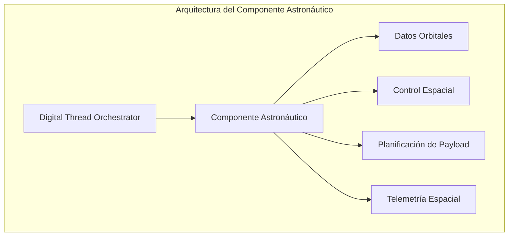

### Integración del Componente Astronáutico en GAIA AIR

## Arquitectura del Componente Astronáutico

El componente astronáutico debe integrarse perfectamente con el Digital Thread Orchestrator existente, ampliando sus capacidades para manejar datos y operaciones específicas del ámbito espacial.



## Estructura de Archivos para el Componente Astronáutico

Vamos a expandir la estructura de archivos existente para incluir el componente astronáutico:

```plaintext
gaia-air/
├── gaia/
│   ├── astronautics/                # Nuevo módulo para componentes astronáuticos
│   │   ├── __init__.py
│   │   ├── orbital_dynamics.py      # Cálculos de dinámica orbital
│   │   ├── space_environment.py     # Modelado del entorno espacial
│   │   ├── payload_management.py    # Gestión de cargas útiles
│   │   ├── mission_planning.py      # Planificación de misiones
│   │   └── space_telemetry.py       # Telemetría específica espacial
│   │
│   ├── connectors/
│   │   ├── space_control_connector.py  # Conector para sistemas de control espacial
│   │   └── ground_station_connector.py # Conector para estaciones terrestres
│   │
│   ├── schemas/
│   │   ├── astronautic_ontology.py  # Ontología específica astronáutica
│   │   └── json_schemas/
│   │       ├── orbital_elements.json # Esquema para elementos orbitales
│   │       └── space_telemetry.json  # Esquema para telemetría espacial
```

## Implementación del Componente Astronáutico

Vamos a implementar los archivos clave para el componente astronáutico:

### 1. Ontología Astronáutica

```python project="GAIA AIR" file="gaia/schemas/astronautic_ontology.py"
...
import json
import logging
from typing import Dict, Any, List, Optional, Union
from rdflib import Graph, Namespace, Literal, URIRef
from rdflib.namespace import RDF, RDFS, XSD

logger = logging.getLogger(__name__)

# Definición de namespaces
GAIA = Namespace("http://gaia-air.org/ontology/")
SPACE = Namespace("http://gaia-air.org/ontology/space/")
ASTRO = Namespace("http://gaia-air.org/ontology/astronautics/")
ORBIT = Namespace("http://gaia-air.org/ontology/orbit/")
MISSION = Namespace("http://gaia-air.org/ontology/mission/")

class AstronauticOntology:
    """
    Ontología especializada para el dominio astronáutico.
    
    Define conceptos, relaciones y propiedades específicas para:
    - Dinámica orbital
    - Entorno espacial
    - Vehículos espaciales
    - Cargas útiles
    - Misiones espaciales
    """
    
    def __init__(self):
        self.graph = Graph()
        
        # Registrar namespaces
        self.graph.bind("gaia", GAIA)
        self.graph.bind("space", SPACE)
        self.graph.bind("astro", ASTRO)
        self.graph.bind("orbit", ORBIT)
        self.graph.bind("mission", MISSION)
        
        # Inicializar ontología
        self._initialize_ontology()
    
    def _initialize_ontology(self):
        """Inicializa la estructura básica de la ontología"""
        # Clases principales
        self.graph.add((ASTRO.SpaceMission, RDF.type, RDFS.Class))
        self.graph.add((ASTRO.Spacecraft, RDF.type, RDFS.Class))
        self.graph.add((ASTRO.Orbit, RDF.type, RDFS.Class))
        self.graph.add((ASTRO.Payload, RDF.type, RDFS.Class))
        self.graph.add((ASTRO.SpaceEnvironment, RDF.type, RDFS.Class))
        
        # Subclases de órbita
        self.graph.add((ORBIT.LEO, RDF.type, RDFS.Class))
        self.graph.add((ORBIT.MEO, RDF.type, RDFS.Class))
        self.graph.add((ORBIT.GEO, RDF.type, RDFS.Class))
        self.graph.add((ORBIT.HEO, RDF.type, RDFS.Class))
        
        self.graph.add((ORBIT.LEO, RDFS.subClassOf, ASTRO.Orbit))
        self.graph.add((ORBIT.MEO, RDFS.subClassOf, ASTRO.Orbit))
        self.graph.add((ORBIT.GEO, RDFS.subClassOf, ASTRO.Orbit))
        self.graph.add((ORBIT.HEO, RDFS.subClassOf, ASTRO.Orbit))
        
        # Subclases de nave espacial
        self.graph.add((ASTRO.Satellite, RDF.type, RDFS.Class))
        self.graph.add((ASTRO.SpaceStation, RDF.type, RDFS.Class))
        self.graph.add((ASTRO.Probe, RDF.type, RDFS.Class))
        
        self.graph.add((ASTRO.Satellite, RDFS.subClassOf, ASTRO.Spacecraft))
        self.graph.add((ASTRO.SpaceStation, RDFS.subClassOf, ASTRO.Spacecraft))
        self.graph.add((ASTRO.Probe, RDFS.subClassOf, ASTRO.Spacecraft))
        
        # Subclases de carga útil
        self.graph.add((ASTRO.ScientificInstrument, RDF.type, RDFS.Class))
        self.graph.add((ASTRO.CommunicationSystem, RDF.type, RDFS.Class))
        self.graph.add((ASTRO.NavigationSystem, RDF.type, RDFS.Class))
        
        self.graph.add((ASTRO.ScientificInstrument, RDFS.subClassOf, ASTRO.Payload))
        self.graph.add((ASTRO.CommunicationSystem, RDFS.subClassOf, ASTRO.Payload))
        self.graph.add((ASTRO.NavigationSystem, RDFS.subClassOf, ASTRO.Payload))
        
        # Propiedades de órbita
        self.graph.add((ORBIT.hasApogee, RDF.type, RDF.Property))
        self.graph.add((ORBIT.hasPerigee, RDF.type, RDF.Property))
        self.graph.add((ORBIT.hasInclination, RDF.type, RDF.Property))
        self.graph.add((ORBIT.hasEccentricity, RDF.type, RDF.Property))
        self.graph.add((ORBIT.hasPeriod, RDF.type, RDF.Property))
        self.graph.add((ORBIT.hasSemiMajorAxis, RDF.type, RDF.Property))
        
        # Propiedades de misión
        self.graph.add((MISSION.hasObjective, RDF.type, RDF.Property))
        self.graph.add((MISSION.hasStartDate, RDF.type, RDF.Property))
        self.graph.add((MISSION.hasEndDate, RDF.type, RDF.Property))
        self.graph.add((MISSION.hasStatus, RDF.type, RDF.Property))
        
        # Relaciones
        self.graph.add((ASTRO.hasOrbit, RDF.type, RDF.Property))
        self.graph.add((ASTRO.hasPayload, RDF.type, RDF.Property))
        self.graph.add((ASTRO.partOfMission, RDF.type, RDF.Property))
        self.graph.add((ASTRO.operatesIn, RDF.type, RDF.Property))
        
        # Dominio y rango de propiedades
        self.graph.add((ASTRO.hasOrbit, RDFS.domain, ASTRO.Spacecraft))
        self.graph.add((ASTRO.hasOrbit, RDFS.range, ASTRO.Orbit))
        
        self.graph.add((ASTRO.hasPayload, RDFS.domain, ASTRO.Spacecraft))
        self.graph.add((ASTRO.hasPayload, RDFS.range, ASTRO.Payload))
        
        self.graph.add((ASTRO.partOfMission, RDFS.domain, ASTRO.Spacecraft))
        self.graph.add((ASTRO.partOfMission, RDFS.range, ASTRO.SpaceMission))
        
        logger.info("Astronautic ontology initialized with %d triples", len(self.graph))
    
    def add_spacecraft(self, spacecraft_id: str, spacecraft_type: str, 
                      properties: Dict[str, Any]) -> URIRef:
        """
        Añade una nave espacial a la ontología.
        
        Args:
            spacecraft_id: Identificador único de la nave
            spacecraft_type: Tipo de nave (Satellite, SpaceStation, Probe)
            properties: Propiedades adicionales
            
        Returns:
            URI de la nave espacial
        """
        spacecraft_uri = URIRef(f"{ASTRO}{spacecraft_id}")
        
        # Tipo de nave
        if spacecraft_type == "Satellite":
            self.graph.add((spacecraft_uri, RDF.type, ASTRO.Satellite))
        elif spacecraft_type == "SpaceStation":
            self.graph.add((spacecraft_uri, RDF.type, ASTRO.SpaceStation))
        elif spacecraft_type == "Probe":
            self.graph.add((spacecraft_uri, RDF.type, ASTRO.Probe))
        else:
            self.graph.add((spacecraft_uri, RDF.type, ASTRO.Spacecraft))
        
        # Añadir propiedades
        for prop, value in properties.items():
            if prop == "name":
                self.graph.add((spacecraft_uri, RDFS.label, Literal(value)))
            elif prop == "mass":
                self.graph.add((spacecraft_uri, SPACE.hasMass, Literal(value, datatype=XSD.float)))
            elif prop == "power":
                self.graph.add((spacecraft_uri, SPACE.hasPower, Literal(value, datatype=XSD.float)))
            elif prop == "mission":
                mission_uri = URIRef(f"{MISSION}{value}")
                self.graph.add((spacecraft_uri, ASTRO.partOfMission, mission_uri))
        
        return spacecraft_uri
    
    def add_orbit(self, orbit_id: str, orbit_type: str, 
                 parameters: Dict[str, float]) -> URIRef:
        """
        Añade una órbita a la ontología.
        
        Args:
            orbit_id: Identificador único de la órbita
            orbit_type: Tipo de órbita (LEO, MEO, GEO, HEO)
            parameters: Parámetros orbitales
            
        Returns:
            URI de la órbita
        """
        orbit_uri = URIRef(f"{ORBIT}{orbit_id}")
        
        # Tipo de órbita
        if orbit_type == "LEO":
            self.graph.add((orbit_uri, RDF.type, ORBIT.LEO))
        elif orbit_type == "MEO":
            self.graph.add((orbit_uri, RDF.type, ORBIT.MEO))
        elif orbit_type == "GEO":
            self.graph.add((orbit_uri, RDF.type, ORBIT.GEO))
        elif orbit_type == "HEO":
            self.graph.add((orbit_uri, RDF.type, ORBIT.HEO))
        else:
            self.graph.add((orbit_uri, RDF.type, ASTRO.Orbit))
        
        # Añadir parámetros
        if "apogee" in parameters:
            self.graph.add((orbit_uri, ORBIT.hasApogee, 
                           Literal(parameters["apogee"], datatype=XSD.float)))
        
        if "perigee" in parameters:
            self.graph.add((orbit_uri, ORBIT.hasPerigee, 
                           Literal(parameters["perigee"], datatype=XSD.float)))
        
        if "inclination" in parameters:
            self.graph.add((orbit_uri, ORBIT.hasInclination, 
                           Literal(parameters["inclination"], datatype=XSD.float)))
        
        if "eccentricity" in parameters:
            self.graph.add((orbit_uri, ORBIT.hasEccentricity, 
                           Literal(parameters["eccentricity"], datatype=XSD.float)))
        
        if "period" in parameters:
            self.graph.add((orbit_uri, ORBIT.hasPeriod, 
                           Literal(parameters["period"], datatype=XSD.float)))
        
        if "semi_major_axis" in parameters:
            self.graph.add((orbit_uri, ORBIT.hasSemiMajorAxis, 
                           Literal(parameters["semi_major_axis"], datatype=XSD.float)))
        
        return orbit_uri
    
    def link_spacecraft_to_orbit(self, spacecraft_id: str, orbit_id: str):
        """
        Vincula una nave espacial con su órbita.
        
        Args:
            spacecraft_id: Identificador de la nave
            orbit_id: Identificador de la órbita
        """
        spacecraft_uri = URIRef(f"{ASTRO}{spacecraft_id}")
        orbit_uri = URIRef(f"{ORBIT}{orbit_id}")
        
        self.graph.add((spacecraft_uri, ASTRO.hasOrbit, orbit_uri))
    
    def add_mission(self, mission_id: str, properties: Dict[str, Any]) -> URIRef:
        """
        Añade una misión espacial a la ontología.
        
        Args:
            mission_id: Identificador único de la misión
            properties: Propiedades de la misión
            
        Returns:
            URI de la misión
        """
        mission_uri = URIRef(f"{MISSION}{mission_id}")
        
        self.graph.add((mission_uri, RDF.type, ASTRO.SpaceMission))
        
        # Añadir propiedades
        for prop, value in properties.items():
            if prop == "name":
                self.graph.add((mission_uri, RDFS.label, Literal(value)))
            elif prop == "objective":
                self.graph.add((mission_uri, MISSION.hasObjective, Literal(value)))
            elif prop == "start_date":
                self.graph.add((mission_uri, MISSION.hasStartDate, 
                               Literal(value, datatype=XSD.dateTime)))
            elif prop == "end_date":
                self.graph.add((mission_uri, MISSION.hasEndDate, 
                               Literal(value, datatype=XSD.dateTime)))
            elif prop == "status":
                self.graph.add((mission_uri, MISSION.hasStatus, Literal(value)))
        
        return mission_uri
    
    def query_spacecraft_by_mission(self, mission_id: str) -> List[Dict[str, Any]]:
        """
        Consulta naves espaciales por misión.
        
        Args:
            mission_id: Identificador de la misión
            
        Returns:
            Lista de naves espaciales
        """
        mission_uri = URIRef(f"{MISSION}{mission_id}")
        
        query = """
        SELECT ?spacecraft ?type ?name
        WHERE {
            ?spacecraft astro:partOfMission ?mission .
            ?spacecraft rdf:type ?type .
            OPTIONAL { ?spacecraft rdfs:label ?name }
        }
        """
        
        results = []
        for row in self.graph.query(query, initBindings={"?mission": mission_uri}):
            spacecraft_uri = row.spacecraft
            spacecraft_id = spacecraft_uri.split("/")[-1]
            
            spacecraft_type = row.type.split("/")[-1]
            
            result = {
                "id": spacecraft_id,
                "type": spacecraft_type
            }
            
            if row.name:
                result["name"] = str(row.name)
            
            results.append(result)
        
        return results
    
    def export_to_json(self, filepath: Optional[str] = None) -> Dict[str, Any]:
        """
        Exporta la ontología a formato JSON.
        
        Args:
            filepath: Ruta del archivo para guardar (opcional)
            
        Returns:
            Representación JSON de la ontología
        """
        # Extraer conceptos principales
        spacecraft = []
        orbits = []
        missions = []
        
        # Extraer naves espaciales
        for s in self.graph.subjects(RDF.type, ASTRO.Spacecraft):
            spacecraft_data = {"id": s.split("/")[-1]}
            
            # Obtener propiedades
            for p, o in self.graph.predicate_objects(s):
                if p == RDFS.label:
                    spacecraft_data["name"] = str(o)
                elif p == SPACE.hasMass:
                    spacecraft_data["mass"] = float(o)
                elif p == SPACE.hasPower:
                    spacecraft_data["power"] = float(o)
                elif p == ASTRO.partOfMission:
                    spacecraft_data["mission"] = o.split("/")[-1]
                elif p == ASTRO.hasOrbit:
                    spacecraft_data["orbit"] = o.split("/")[-1]
            
            spacecraft.append(spacecraft_data)
        
        # Extraer órbitas
        for s in self.graph.subjects(RDF.type, ASTRO.Orbit):
            orbit_data = {"id": s.split("/")[-1]}
            
            # Obtener tipo específico
            for o in self.graph.objects(s, RDF.type):
                if o != ASTRO.Orbit:
                    orbit_data["type"] = o.split("/")[-1]
            
            # Obtener parámetros
            for p, o in self.graph.predicate_objects(s):
                if p == ORBIT.hasApogee:
                    orbit_data["apogee"] = float(o)
                elif p == ORBIT.hasPerigee:
                    orbit_data["perigee"] = float(o)
                elif p == ORBIT.hasInclination:
                    orbit_data["inclination"] = float(o)
                elif p == ORBIT.hasEccentricity:
                    orbit_data["eccentricity"] = float(o)
                elif p == ORBIT.hasPeriod:
                    orbit_data["period"] = float(o)
                elif p == ORBIT.hasSemiMajorAxis:
                    orbit_data["semi_major_axis"] = float(o)
            
            orbits.append(orbit_data)
        
        # Extraer misiones
        for s in self.graph.subjects(RDF.type, ASTRO.SpaceMission):
            mission_data = {"id": s.split("/")[-1]}
            
            # Obtener propiedades
            for p, o in self.graph.predicate_objects(s):
                if p == RDFS.label:
                    mission_data["name"] = str(o)
                elif p == MISSION.hasObjective:
                    mission_data["objective"] = str(o)
                elif p == MISSION.hasStartDate:
                    mission_data["start_date"] = str(o)
                elif p == MISSION.hasEndDate:
                    mission_data["end_date"] = str(o)
                elif p == MISSION.hasStatus:
                    mission_data["status"] = str(o)
            
            missions.append(mission_data)
        
        # Construir resultado
        result = {
            "spacecraft": spacecraft,
            "orbits": orbits,
            "missions": missions
        }
        
        # Guardar a archivo si se especificó
        if filepath:
            with open(filepath, "w") as f:
                json.dump(result, f, indent=2)
        
        return result
```

### 2. Dinámica Orbital

```python project="GAIA AIR" file="gaia/astronautics/orbital_dynamics.py"
...
import math
import logging
from typing import Dict, Any, List, Optional, Tuple, Union
import numpy as np
from datetime import datetime, timedelta

logger = logging.getLogger(__name__)

# Constantes físicas
G = 6.67430e-11  # Constante gravitacional universal (m^3 kg^-1 s^-2)
M_EARTH = 5.972e24  # Masa de la Tierra (kg)
R_EARTH = 6371000  # Radio medio de la Tierra (m)
MU_EARTH = G * M_EARTH  # Parámetro gravitacional estándar de la Tierra

class OrbitalDynamics:
    """
    Clase para cálculos de dinámica orbital.
    
    Proporciona funciones para:
    - Cálculo de parámetros orbitales
    - Propagación orbital
    - Maniobras orbitales
    - Ventanas de lanzamiento
    - Análisis de conjunciones
    """
    
    def __init__(self):
        logger.info("Initializing Orbital Dynamics module")
    
    def calculate_orbital_period(self, semi_major_axis: float) -> float:
        """
        Calcula el período orbital en segundos.
        
        Args:
            semi_major_axis: Semieje mayor de la órbita en metros
            
        Returns:
            Período orbital en segundos
        """
        return 2 * math.pi * math.sqrt(semi_major_axis**3 / MU_EARTH)
    
    def calculate_orbital_velocity(self, semi_major_axis: float, 
                                  radius: float) -> float:
        """
        Calcula la velocidad orbital en un punto de la órbita.
        
        Args:
            semi_major_axis: Semieje mayor de la órbita en metros
            radius: Distancia al centro de la Tierra en metros
            
        Returns:
            Velocidad orbital en m/s
        """
        return math.sqrt(MU_EARTH * (2/radius - 1/semi_major_axis))
    
    def calculate_orbital_elements(self, position: np.ndarray, 
                                  velocity: np.ndarray) -> Dict[str, float]:
        """
        Calcula los elementos orbitales a partir de vectores de posición y velocidad.
        
        Args:
            position: Vector de posición [x, y, z] en metros
            velocity: Vector de velocidad [vx, vy, vz] en m/s
            
        Returns:
            Diccionario con elementos orbitales
        """
        # Magnitudes
        r = np.linalg.norm(position)
        v = np.linalg.norm(velocity)
        
        # Vector momento angular específico
        h_vec = np.cross(position, velocity)
        h = np.linalg.norm(h_vec)
        
        # Vector de excentricidad
        e_vec = np.cross(velocity, h_vec) / MU_EARTH - position / r
        e = np.linalg.norm(e_vec)
        
        # Energía orbital específica
        energy = v**2 / 2 - MU_EARTH / r
        
        # Semieje mayor
        if abs(e - 1.0) < 1e-10:  # Órbita parabólica
            a = float('inf')
        else:
            a = -MU_EARTH / (2 * energy)
        
        # Vector de nodo ascendente
        n_vec = np.cross(np.array([0, 0, 1]), h_vec)
        n = np.linalg.norm(n_vec)
        
        # Inclinación
        i = math.acos(h_vec[2] / h)
        
        # Longitud del nodo ascendente
        if n < 1e-10:
            omega = 0.0
        else:
            omega = math.acos(n_vec[0] / n)
            if n_vec[1] < 0:
                omega = 2 * math.pi - omega
        
        # Argumento del perigeo
        if n < 1e-10:
            w = math.atan2(e_vec[1], e_vec[0])
        else:
            w = math.acos(np.dot(n_vec, e_vec) / (n * e))
            if e_vec[2] < 0:
                w = 2 * math.pi - w
        
        # Anomalía verdadera
        if e < 1e-10:
            nu = math.atan2(np.dot(np.cross(h_vec, position), e_vec), np.dot(position, e_vec))
        else:
            nu = math.acos(np.dot(e_vec, position) / (e * r))
            if np.dot(position, velocity) < 0:
                nu = 2 * math.pi - nu
        
        # Convertir a grados
        i_deg = math.degrees(i)
        omega_deg = math.degrees(omega)
        w_deg = math.degrees(w)
        nu_deg = math.degrees(nu)
        
        # Calcular perigeo y apogeo
        if e < 1.0:  # Órbita elíptica
            periapsis = a * (1 - e)
            apoapsis = a * (1 + e)
        else:
            periapsis = a * (1 - e)
            apoapsis = float('inf')
        
        # Período orbital
        if a > 0:  # Órbita elíptica o circular
            period = 2 * math.pi * math.sqrt(a**3 / MU_EARTH)
        else:
            period = float('inf')
        
        return {
            "semi_major_axis": a,
            "eccentricity": e,
            "inclination": i_deg,
            "raan": omega_deg,
            "arg_perigee": w_deg,
            "true_anomaly": nu_deg,
            "periapsis": periapsis,
            "apoapsis": apoapsis,
            "period": period,
            "energy": energy
        }
    
    def propagate_orbit(self, elements: Dict[str, float], 
                       time_step: float, steps: int) -> List[np.ndarray]:
        """
        Propaga una órbita a partir de elementos orbitales.
        
        Args:
            elements: Elementos orbitales
            time_step: Paso de tiempo en segundos
            steps: Número de pasos
            
        Returns:
            Lista de vectores de posición [x, y, z]
        """
        a = elements["semi_major_axis"]
        e = elements["eccentricity"]
        i = math.radians(elements["inclination"])
        omega = math.radians(elements["raan"])
        w = math.radians(elements["arg_perigee"])
        nu0 = math.radians(elements["true_anomaly"])
        
        # Calcular anomalía excéntrica inicial
        E0 = 2 * math.atan(math.tan(nu0/2) / math.sqrt((1+e)/(1-e)))
        
        # Calcular anomalía media inicial
        M0 = E0 - e * math.sin(E0)
        
        # Movimiento medio
        n = math.sqrt(MU_EARTH / a**3)
        
        positions = []
        
        for step in range(steps):
            # Tiempo actual
            t = step * time_step
            
            # Anomalía media actual
            M = M0 + n * t
            
            # Resolver ecuación de Kepler para anomalía excéntrica
            E = self._solve_kepler(M, e)
            
            # Calcular anomalía verdadera
            nu = 2 * math.atan(math.sqrt((1+e)/(1-e)) * math.tan(E/2))
            
            # Distancia al foco
            r = a * (1 - e * math.cos(E))
            
            # Posición en el plano orbital
            x_orb = r * math.cos(nu)
            y_orb = r * math.sin(nu)
            
            # Matriz de rotación para transformar al sistema de referencia inercial
            cos_w = math.cos(w)
            sin_w = math.sin(w)
            cos_i = math.cos(i)
            sin_i = math.sin(i)
            cos_omega = math.cos(omega)
            sin_omega = math.sin(omega)
            
            # Rotación por argumento del perigeo
            x1 = x_orb * cos_w - y_orb * sin_w
            y1 = x_orb * sin_w + y_orb * cos_w
            
            # Rotación por inclinación
            x2 = x1
            y2 = y1 * cos_i
            z2 = y1 * sin_i
            
            # Rotación por ascensión recta del nodo ascendente
            x = x2 * cos_omega - y2 * sin_omega
            y = x2 * sin_omega + y2 * cos_omega
            z = z2
            
            positions.append(np.array([x, y, z]))
        
        return positions
    
    def _solve_kepler(self, M: float, e: float, tolerance: float = 1e-8, 
                     max_iterations: int = 100) -> float:
        """
        Resuelve la ecuación de Kepler para la anomalía excéntrica.
        
        Args:
            M: Anomalía media en radianes
            e: Excentricidad
            tolerance: Tolerancia para convergencia
            max_iterations: Número máximo de iteraciones
            
        Returns:
            Anomalía excéntrica en radianes
        """
        # Normalizar M entre 0 y 2π
        M = M % (2 * math.pi)
        
        # Valor inicial (aproximación)
        if e < 0.8:
            E = M
        else:
            E = math.pi
        
        # Método de Newton-Raphson
        for i in range(max_iterations):
            E_new = E - (E - e * math.sin(E) - M) / (1 - e * math.cos(E))
            
            if abs(E_new - E) < tolerance:
                return E_new
            
            E = E_new
        
        logger.warning("Kepler equation did not converge to desired tolerance")
        return E
    
    def calculate_delta_v(self, orbit1: Dict[str, float], 
                         orbit2: Dict[str, float]) -> float:
        """
        Calcula el delta-v necesario para una transferencia de Hohmann.
        
        Args:
            orbit1: Elementos de la órbita inicial
            orbit2: Elementos de la órbita final
            
        Returns:
            Delta-v total en m/s
        """
        # Asumiendo órbitas circulares coplanares
        r1 = orbit1["semi_major_axis"]
        r2 = orbit2["semi_major_axis"]
        
        # Semieje mayor de la órbita de transferencia
        a_transfer = (r1 + r2) / 2
        
        # Velocidades en órbitas circulares
        v1 = math.sqrt(MU_EARTH / r1)
        v2 = math.sqrt(MU_EARTH / r2)
        
        # Velocidades en la órbita de transferencia
        v_transfer_perigee = math.sqrt(MU_EARTH * (2/r1 - 1/a_transfer))
        v_transfer_apogee = math.sqrt(MU_EARTH * (2/r2 - 1/a_transfer))
        
        # Delta-v para cada maniobra
        delta_v1 = abs(v_transfer_perigee - v1)
        delta_v2 = abs(v2 - v_transfer_apogee)
        
        # Delta-v total
        delta_v_total = delta_v1 + delta_v2
        
        return delta_v_total
    
    def calculate_ground_track(self, elements: Dict[str, float], 
                              start_time: datetime, 
                              duration: timedelta, 
                              time_step: timedelta) -> List[Tuple[float, float]]:
        """
        Calcula la traza terrestre de un satélite.
        
        Args:
            elements: Elementos orbitales
            start_time: Tiempo inicial
            duration: Duración total
            time_step: Paso de tiempo
            
        Returns:
            Lista de coordenadas (longitud, latitud) en grados
        """
        # Propagar órbita
        steps = int(duration.total_seconds() / time_step.total_seconds())
        time_step_seconds = time_step.total_seconds()
        
        positions = self.propagate_orbit(elements, time_step_seconds, steps)
        
        # Calcular coordenadas terrestres
        ground_track = []
        
        for i, position in enumerate(positions):
            # Tiempo actual
            current_time = start_time + i * time_step
            
            # Convertir posición a coordenadas geográficas
            lon, lat = self._cartesian_to_geographic(position, current_time)
            
            ground_track.append((lon, lat))
        
        return ground_track
    
    def _cartesian_to_geographic(self, position: np.ndarray, 
                               time: datetime) -> Tuple[float, float]:
        """
        Convierte coordenadas cartesianas a geográficas.
        
        Args:
            position: Vector de posición [x, y, z] en metros
            time: Tiempo para calcular la rotación terrestre
            
        Returns:
            Tupla (longitud, latitud) en grados
        """
        x, y, z = position
        
        # Calcular latitud
        lat = math.degrees(math.asin(z / np.linalg.norm(position)))
        
        # Calcular longitud
        lon = math.degrees(math.atan2(y, x))
        
        # Ajustar por rotación terrestre
        # Tiempo desde J2000
        dt = (time - datetime(2000, 1, 1, 12, 0, 0)).total_seconds()
        
        # Velocidad de rotación terrestre (rad/s)
        earth_rotation_rate = 7.2921159e-5
        
        # Ajuste de longitud
        lon -= math.degrees(earth_rotation_rate * dt) % 360
        
        # Normalizar longitud entre -180 y 180
        if lon > 180:
            lon -= 360
        elif lon < -180:
            lon += 360
        
        return lon, lat
```

### 3. Conector para Control Espacial

```python project="GAIA AIR" file="gaia/connectors/space_control_connector.py"
...
import asyncio
import json
import logging
import time
from datetime import datetime
from typing import Dict, Any, List, Optional, Callable, Union

from opentelemetry import trace
from opentelemetry.trace import SpanKind, Status, StatusCode

from gaia.core.event_bus import EventBus
from gaia.core.state_manager import StateManager
from gaia.astronautics.orbital_dynamics import OrbitalDynamics

logger = logging.getLogger(__name__)
tracer = trace.get_tracer(__name__)

class SpaceControlConnector:
    """
    Conector para sistemas de control espacial.
    
    Proporciona integración con:
    - Centros de control de misión
    - Sistemas de seguimiento de satélites
    - Planificadores de maniobras orbitales
    - Sistemas de control de actitud
    """
    
    def __init__(self, config: Dict[str, Any], event_bus: EventBus, state_manager: StateManager):
        self.config = config
        self.event_bus = event_bus
        self.state_manager = state_manager
        self.orbital_dynamics = OrbitalDynamics()
        
        # Configuración específica
        self.endpoint = config.get("endpoint", "http://localhost:8080/api/space-control")
        self.api_key = config.get("api_key")
        self.poll_interval = config.get("poll_interval", 60)  # segundos
        
        # Estado interno
        self.running = False
        self.poll_task = None
        self.command_handlers = {}
        self.spacecraft_states = {}
    
    async def initialize(self):
        """Inicializa el conector y establece conexión con el sistema de control"""
        with tracer.start_as_current_span("space_control_connector_initialize", kind=SpanKind.CLIENT):
            logger.info(f"Initializing Space Control Connector with endpoint {self.endpoint}")
            
            # Registrar manejadores de eventos
            await self.event_bus.subscribe(
                "spacecraft.command", 
                self._handle_spacecraft_command
            )
            
            await self.event_bus.subscribe(
                "mission.update", 
                self._handle_mission_update
            )
            
            # Registrar listener para cambios de estado
            await self.state_manager.register_change_listener(
                "spacecraft", 
                self._handle_spacecraft_state_change
            )
            
            # Iniciar tarea de polling
            self.running = True
            self.poll_task = asyncio.create_task(self._poll_space_control_system())
            
            logger.info("Space Control Connector initialized successfully")
    
    async def shutdown(self):
        """Cierra ordenadamente el conector"""
        with tracer.start_as_current_span("space_control_connector_shutdown", kind=SpanKind.CLIENT):
            logger.info("Shutting down Space Control Connector")
            
            self.running = False
            
            if self.poll_task:
                self.poll_task.cancel()
                try:
                    await self.poll_task
                except asyncio.CancelledError:
                    pass
            
            logger.info("Space Control Connector shutdown complete")
    
    async def send_command(self, spacecraft_id: str, command: Dict[str, Any]) -> Dict[str, Any]:
        """
        Envía un comando a una nave espacial.
        
        Args:
            spacecraft_id: Identificador de la nave
            command: Comando a enviar
            
        Returns:
            Respuesta del sistema de control
        """
        with tracer.start_as_current_span("send_spacecraft_command", kind=SpanKind.CLIENT) as span:
            span.set_attribute("spacecraft.id", spacecraft_id)
            span.set_attribute("command.type", command.get("type", "unknown"))
            
            try:
                # En un sistema real, aquí se enviaría el comando al sistema de control
                # Para el MVP, simulamos la respuesta
                
                # Registrar comando en el estado
                await self.state_manager.update_state(
                    "spacecraft_command",
                    f"{spacecraft_id}_{int(time.time())}",
                    {
                        "spacecraft_id": spacecraft_id,
                        "command": command,
                        "status": "sent",
                        "timestamp": datetime.utcnow().isoformat()
                    }
                )
                
                # Publicar evento de comando enviado
                await self.event_bus.publish(
                    "spacecraft.command.sent",
                    {
                        "id": f"cmd_{int(time.time())}",
                        "spacecraft_id": spacecraft_id,
                        "command": command,
                        "timestamp": time.time()
                    }
                )
                
                # Simular respuesta
                response = {
                    "status": "accepted",
                    "command_id": f"cmd_{int(time.time())}",
                    "estimated_execution_time": time.time() + 10
                }
                
                span.set_status(Status(StatusCode.OK))
                return response
                
            except Exception as e:
                logger.error(f"Error sending command to spacecraft {spacecraft_id}: {e}")
                span.set_status(Status(StatusCode.ERROR, str(e)))
                raise
    
    async def get_spacecraft_telemetry(self, spacecraft_id: str) -> Dict[str, Any]:
        """
        Obtiene telemetría actual de una nave espacial.
        
        Args:
            spacecraft_id: Identificador de la nave
            
        Returns:
            Datos de telemetría
        """
        with tracer.start_as_current_span("get_spacecraft_telemetry", kind=SpanKind.CLIENT) as span:
            span.set_attribute("spacecraft.id", spacecraft_id)
            
            try:
                # En un sistema real, aquí se obtendría la telemetría del sistema de control
                # Para el MVP, simulamos los datos
                
                # Obtener estado actual de la nave
                spacecraft_state = await self.state_manager.get_state("spacecraft", spacecraft_id)
                
                if not spacecraft_state:
                    raise ValueError(f"Spacecraft {spacecraft_id} not found")
                
                # Generar telemetría simulada
                telemetry = {
                    "timestamp": datetime.utcnow().isoformat(),
                    "position": [
                        spacecraft_state.get("position", [0, 0, 0])[0] + (0.1 * (time.time() % 10)),
                        spacecraft_state.get("position", [0, 0, 0])[1] + (0.1 * (time.time() % 15)),
                        spacecraft_state.get("position", [0, 0, 0])[2] + (0.1 * (time.time() % 20))
                    ],
                    "velocity": spacecraft_state.get("velocity", [0, 0, 0]),
                    "attitude": spacecraft_state.get("attitude", [0, 0, 0]),
                    "power": {
                        "battery_level": 0.8 + (0.1 * math.sin(time.time() / 3600)),
                        "solar_panel_output": 1200 + (200 * math.sin(time.time() / 1800))
                    },
                    "thermal": {
                        "temperature_internal": 20 + (2 * math.sin(time.time() / 900)),
                        "temperature_external": -15 + (5 * math.sin(time.time() / 1200))
                    },
                    "communication": {
                        "signal_strength": 0.9 + (0.05 * math.sin(time.time() / 600)),
                        "data_rate": 1024 + (128 * math.sin(time.time() / 300))
                    }
                }
                
                span.set_status(Status(StatusCode.OK))
                return telemetry
                
            except Exception as e:
                logger.error(f"Error getting telemetry for spacecraft {spacecraft_id}: {e}")
                span.set_status(Status(StatusCode.ERROR, str(e)))
                raise
    
    async def plan_orbital_maneuver(self, spacecraft_id: str, 
                                  target_orbit: Dict[str, float]) -> Dict[str, Any]:
        """
        Planifica una maniobra orbital.
        
        Args:
            spacecraft_id: Identificador de la nave
            target_orbit: Parámetros de la órbita objetivo
            
        Returns:
            Plan de maniobra
        """
        with tracer.start_as_current_span("plan_orbital_maneuver", kind=SpanKind.CLIENT) as span:
            span.set_attribute("spacecraft.id", spacecraft_id)
            
            try:
                # Obtener estado actual de la nave
                spacecraft_state = await self.state_manager.get_state("spacecraft", spacecraft_id)
                
                if not spacecraft_state:
                    raise ValueError(f"Spacecraft {spacecraft_id} not found")
                
                # Obtener órbita actual
                current_orbit = spacecraft_state.get("orbit", {})
                
                if not current_orbit:
                    raise ValueError(f"No orbital data for spacecraft {spacecraft_id}")
                
                # Calcular delta-v necesario
                delta_v = self.orbital_dynamics.calculate_delta_v(current_orbit, target_orbit)
                
                # Crear plan de maniobra
                maneuver_plan = {
                    "spacecraft_id": spacecraft_id,
                    "maneuver_id": f"man_{int(time.time())}",
                    "type": "orbital_transfer",
                    "current_orbit": current_orbit,
                    "target_orbit": target_orbit,
                    "delta_v": delta_v,
                    "estimated_fuel_consumption": delta_v * spacecraft_state.get("fuel_consumption_rate", 0.1),
                    "execution_time": datetime.utcnow().isoformat(),
                    "duration": 300,  # segundos
                    "status": "planned"
                }
                
                # Guardar plan en el estado
                await self.state_manager.update_state(
                    "maneuver_plan",
                    maneuver_plan["maneuver_id"],
                    maneuver_plan
                )
                
                # Publicar evento de plan creado
                await self.event_bus.publish(
                    "spacecraft.maneuver.planned",
                    {
                        "id": f"evt_{int(time.time())}",
                        "spacecraft_id": spacecraft_id,
                        "maneuver_id": maneuver_plan["maneuver_id"],
                        "timestamp": time.time()
                    }
                )
                
                span.set_status(Status(StatusCode.OK))
                return maneuver_plan
                
            except Exception as e:
                logger.error(f"Error planning maneuver for spacecraft {spacecraft_id}: {e}")
                span.set_status(Status(StatusCode.ERROR, str(e)))
                raise
    
    async def _poll_space_control_system(self):
        """Tarea que consulta periódicamente el sistema de control espacial"""
        logger.info("Starting polling task for Space Control System")
        
        try:
            while self.running:
                try:
                    with tracer.start_as_current_span("poll_space_control_system", kind=SpanKind.CLIENT):
                        # En un sistema real, aquí se consultaría el sistema de control
                        # Para el MVP, simulamos actualizaciones
                        
                        # Obtener lista de naves espaciales
                        spacecraft_ids = await self._get_spacecraft_ids()
                        
                        for spacecraft_id in spacecraft_ids:
                            # Obtener telemetría
                            telemetry = await self.get_spacecraft_telemetry(spacecraft_id)
                            
                            # Publicar evento de telemetría
                            await self.event_bus.publish(
                                "spacecraft.telemetry",
                                {
                                    "id": f"tel_{int(time.time())}",
                                    "spacecraft_id": spacecraft_id,
                                    "telemetry": telemetry,
                                    "timestamp": time.time()
                                }
                            )
                            
                            # Actualizar estado
                            await self.state_manager.update_state(
                                "spacecraft",
                                spacecraft_id,
                                {
                                    "last_telemetry": telemetry,
                                    "last_contact": datetime.utcnow().isoformat()
                                }
                            )
                        
                except Exception as e:
                    logger.error(f"Error polling Space Control System: {e}")
                
                # Esperar hasta el siguiente ciclo
                await asyncio.sleep(self.poll_interval)
                
        except asyncio.CancelledError:
            logger.info("Space Control System polling task cancelled")
        except Exception as e:
            logger.error(f"Unexpected error in Space Control System polling task: {e}")
    
    async def _get_spacecraft_ids(self) -> List[str]:
        """Obtiene lista de identificadores de naves espaciales"""
        # En un sistema real, esto consultaría el sistema de control
        # Para el MVP, usamos una lista estática o del estado
        
        # Intentar obtener de estado
        try:
            spacecraft_entities = await self.state_manager.list_entities("spacecraft")
            if spacecraft_entities:
                return [entity.split(":")[-1] for entity in spacecraft_entities]
        except:
            pass
        
        # Lista por defecto
        return ["sat001", "sat002", "iss", "probe001"]
    
    async def _handle_spacecraft_command(self, event: Dict[str, Any]):
        """Maneja eventos de comando para naves espaciales"""
        spacecraft_id = event.get("spacecraft_id")
        command = event.get("command", {})
        
        if not spacecraft_id or not command:
            logger.warning("Invalid spacecraft command event")
            return
        
        logger.info(f"Processing command for spacecraft {spacecraft_id}: {command.get('type')}")
        
        try:
            # Enviar comando al sistema de control
            response = await self.send_command(spacecraft_id, command)
            
            # Publicar respuesta
            await self.event_bus.publish(
                "spacecraft.command.response",
                {
                    "id": f"resp_{int(time.time())}",
                    "spacecraft_id": spacecraft_id,
                    "command": command,
                    "response": response,
                    "timestamp": time.time()
                }
            )
            
        except Exception as e:
            logger.error(f"Error processing command for spacecraft {spacecraft_id}: {e}")
    
    async def _handle_mission_update(self, event: Dict[str, Any]):
        """Maneja eventos de actualización de misión"""
        mission_id = event.get("mission_id")
        update = event.get("update", {})
        
        if not mission_id:
            logger.warning("Invalid mission update event")
            return
        
        logger.info(f"Processing mission update for {mission_id}: {update.get('type')}")
        
        # Actualizar estado de la misión
        try:
            await self.state_manager.update_state(
                "mission",
                mission_id,
                update
            )
        except Exception as e:
            logger.error(f"Error updating mission state for {mission_id}: {e}")
    
    async def _handle_spacecraft_state_change(self, entity_type: str, entity_id: str, 
                                            new_state: Dict[str, Any], 
                                            change_record: Dict[str, Any]):
        """Maneja cambios en el estado de naves espaciales"""
        if entity_type != "spacecraft":
            return
        
        logger.info(f"Spacecraft state change: {entity_id}")
        
        # Actualizar caché local
        self.spacecraft_states[entity_id] = new_state
        
        # Reaccionar a cambios específicos
        if "orbit" in change_record.get("changes", {}):
            # Órbita actualizada, recalcular parámetros
            try:
                orbit = new_state.get("orbit", {})
                
                if orbit:
                    # Calcular período orbital
                    if "semi_major_axis" in orbit:
                        period = self.orbital_dynamics.calculate_orbital_period(orbit["semi_major_axis"])
                        
                        # Actualizar estado con período calculado
                        await self.state_manager.update_state(
                            "spacecraft",
                            entity_id,
                            {
                                "orbit": {
                                    "period": period
                                }
                            }
                        )
            except Exception as e:
                logger.error(f"Error processing orbit change for {entity_id}: {e}")
```

### 4. Integración con el Digital Thread Orchestrator

Para integrar el componente astronáutico con el Digital Thread Orchestrator existente, necesitamos actualizar el orquestador para que reconozca y procese los eventos y entidades astronáuticas:

```python project="GAIA AIR" file="gaia/core/digital_thread_orchestrator.py"
...
# Añadir al final del archivo, antes de la última llave de cierre

    async def register_astronautic_components(self):
        """
        Registra componentes astronáuticos en el orquestador.
        
        Esta función extiende el orquestador para manejar datos y eventos
        específicos del dominio astronáutico.
        """
        logger.info("Registering astronautic components in Digital Thread Orchestrator")
        
        # Registrar procesadores de eventos astronáuticos
        await self.register_event_processor(
            "spacecraft.telemetry",
            self._process_spacecraft_telemetry,
            priority=50
        )
        
        await self.register_event_processor(
            "spacecraft.command.sent",
            self._process_spacecraft_command,
            priority=60
        )
        
        await self.register_event_processor(
            "spacecraft.maneuver.planned",
            self._process_maneuver_plan,
            priority=40
        )
        
        await self.register_event_processor(
            "mission.event",
            self._process_mission_event,
            priority=30
        )
        
        # Registrar validadores para entidades astronáuticas
        self.register_validator(
            "spacecraft",
            self._validate_spacecraft
        )
        
        self.register_validator(
            "orbit",
            self._validate_orbit
        )
        
        self.register_validator(
            "mission",
            self._validate_mission
        )
        
        logger.info("Astronautic components registered successfully")
    
    async def _process_spacecraft_telemetry(self, event: Dict[str, Any]):
        """Procesa eventos de telemetría de naves espaciales"""
        spacecraft_id = event.get("spacecraft_id")
        telemetry = event.get("telemetry", {})
        
        if not spacecraft_id or not telemetry:
            logger.warning("Invalid spacecraft telemetry event")
            return
        
        try:
            # Actualizar estado de la nave con telemetría
            await self.state_manager.update_state(
                "spacecraft",
                spacecraft_id,
                {
                    "last_telemetry": telemetry,
                    "last_contact": telemetry.get("timestamp")
                }
            )
            
            # Analizar telemetría para detectar anomalías
            anomalies = self._detect_telemetry_anomalies(spacecraft_id, telemetry)
            
            if anomalies:
                # Publicar evento de anomalía
                await self.event_bus.publish(
                    "spacecraft.anomaly",
                    {
                        "id": str(uuid.uuid4()),
                        "spacecraft_id": spacecraft_id,
                        "anomalies": anomalies,
                        "timestamp": time.time()
                    }
                )
        
        except Exception as e:
            logger.error(f"Error processing spacecraft telemetry: {e}")
    
    def _detect_telemetry_anomalies(self, spacecraft_id: str, 
                                  telemetry: Dict[str, Any]) -> List[Dict[str, Any]]:
        """
        Detecta anomalías en la telemetría de una nave espacial.
        
        Args:
            spacecraft_id: Identificador de la nave
            telemetry: Datos de telemetría
            
        Returns:
            Lista de anomalías detectadas
        """
        # Implementación simple para MVP
        anomalies = []
        
        # Verificar niveles de batería
        if "power" in telemetry and "battery_level" in telemetry["power"]:
            battery_level = telemetry["power"]["battery_level"]
            
            if battery_level < 0.2:
                anomalies.append({
                    "type": "low_battery",
                    "severity": "warning",
                    "value": battery_level,
                    "threshold": 0.2
                })
            elif battery_level < 0.1:
                anomalies.append({
                    "type": "critical_battery",
                    "severity": "critical",
                    "value": battery_level,
                    "threshold": 0.1
                })
        
        # Verificar temperaturas
        if "thermal" in telemetry:
            if "temperature_internal" in telemetry["thermal"]:
                temp = telemetry["thermal"]["temperature_internal"]
                
                if temp > 30:
                    anomalies.append({
                        "type": "high_temperature",
                        "severity": "warning",
                        "value": temp,
                        "threshold": 30
                    })
                elif temp > 40:
                    anomalies.append({
                        "type": "critical_temperature",
                        "severity": "critical",
                        "value": temp,
                        "threshold": 40
                    })
        
        # Verificar comunicaciones
        if "communication" in telemetry and "signal_strength" in telemetry["communication"]:
            signal = telemetry["communication"]["signal_strength"]
            
            if signal < 0.5:
                anomalies.append({
                    "type": "weak_signal",
                    "severity": "warning",
                    "value": signal,
                    "threshold": 0.5
                })
        
        return anomalies
    
    async def _process_spacecraft_command(self, event: Dict[str, Any]):
        """Procesa eventos de comandos enviados a naves espaciales"""
        spacecraft_id = event.get("spacecraft_id")
        command = event.get("command", {})
        
        if not spacecraft_id or not command:
            logger.warning("Invalid spacecraft command event")
            return
        
        try:
            # Registrar comando en el historial
            command_id = f"{spacecraft_id}_cmd_{int(time.time())}"
            
            await self.state_manager.update_state(
                "command_history",
                command_id,
                {
                    "spacecraft_id": spacecraft_id,
                    "command": command,
                    "status": "sent",
                    "timestamp": datetime.utcnow().isoformat()
                }
            )
            
        except Exception as e:
            logger.error(f"Error processing spacecraft command: {e}")
    
    async def _process_maneuver_plan(self, event: Dict[str, Any]):
        """Procesa eventos de planes de maniobra"""
        spacecraft_id = event.get("spacecraft_id")
        maneuver_id = event.get("maneuver_id")
        
        if not spacecraft_id or not maneuver_id:
            logger.warning("Invalid maneuver plan event")
            return
        
        try:
            # Obtener detalles del plan
            plan = await self.state_manager.get_state("maneuver_plan", maneuver_id)
            
            if not plan:
                logger.warning(f"Maneuver plan {maneuver_id} not found")
                return
            
            # Actualizar estado de la nave con el plan de maniobra
            await self.state_manager.update_state(
                "spacecraft",
                spacecraft_id,
                {
                    "current_maneuver": maneuver_id,
                    "maneuver_status": "planned"
                }
            )
            
        except Exception as e:
            logger.error(f"Error processing maneuver plan: {e}")
    
    async def _process_mission_event(self, event: Dict[str, Any]):
        """Procesa eventos de misión"""
        mission_id = event.get("mission_id")
        event_category = event.get("event_category")
        
        if not mission_id or not event_category:
            logger.warning("Invalid mission event")
            return
        
        try:
            # Registrar evento en el historial de la misión
            event_id = f"{mission_id}_evt_{int(time.time())}"
            
            await self.state_manager.update_state(
                "mission_event",
                event_id,
                {
                    "mission_id": mission_id,
                    "category": event_category,
                    "details": event.get("details", {}),
                    "timestamp": datetime.utcnow().isoformat(),
                    "status": "recorded"
                }
            )
            
            # Actualizar estado de la misión
            await self.state_manager.update_state(
                "mission",
                mission_id,
                {
                    "last_event": event_category,
                    "last_event_time": datetime.utcnow().isoformat()
                }
            )
            
        except Exception as e:
            logger.error(f"Error processing mission event: {e}")
    
    def _validate_spacecraft(self, entity: Dict[str, Any]) -> bool:
        """
        Valida una entidad de nave espacial.
        
        Args:
            entity: Datos de la nave espacial
            
        Returns:
            True si la entidad es válida, False en caso contrario
        """
        # Verificar campos requeridos
        required_fields = ["name", "type"]
        
        for field in required_fields:
            if field not in entity:
                logger.warning(f"Spacecraft validation failed: missing field {field}")
                return False
        
        # Validar tipo
        valid_types = ["satellite", "space_station", "probe", "vehicle"]
        if entity["type"] not in valid_types:
            logger.warning(f"Spacecraft validation failed: invalid type {entity['type']}")
            return False
        
        return True
    
    def _validate_orbit(self, entity: Dict[str, Any]) -> bool:
        """
        Valida una entidad de órbita.
        
        Args:
            entity: Datos de la órbita
            
        Returns:
            True si la entidad es válida, False en caso contrario
        """
        # Verificar campos requeridos para definir una órbita
        if "semi_major_axis" not in entity and ("apogee" not in entity or "perigee" not in entity):
            logger.warning("Orbit validation failed: insufficient orbital parameters")
            return False
        
        # Validar valores físicamente posibles
        if "eccentricity" in entity and (entity["eccentricity"] < 0 or entity["eccentricity"] >= 1):
            logger.warning(f"Orbit validation failed: invalid eccentricity {entity['eccentricity']}")
            return False
        
        if "inclination" in entity and (entity["inclination"] < 0 or entity["inclination"] > 180):
            logger.warning(f"Orbit validation failed: invalid inclination {entity['inclination']}")
            return False
        
        return True
    
    def _validate_mission(self, entity: Dict[str, Any]) -> bool:
        """
        Valida una entidad de misión.
        
        Args:
            entity: Datos de la misión
            
        Returns:
            True si la entidad es válida, False en caso contrario
        """
        # Verificar campos requeridos
        required_fields = ["name", "objective"]
        
        for field in required_fields:
            if field not in entity:
                logger.warning(f"Mission validation failed: missing field {field}")
                return False
        
        # Validar fechas si están presentes
        if "start_date" in entity and "end_date" in entity:
            try:
                start = datetime.fromisoformat(entity["start_date"])
                end = datetime.fromisoformat(entity["end_date"])
                
                if end < start:
                    logger.warning("Mission validation failed: end date before start date")
                    return False
            except:
                logger.warning("Mission validation failed: invalid date format")
                return False
        
        return True
```

## Conclusión: Integración del Componente Astronáutico en GAIA AIR

La implementación del componente astronáutico que he proporcionado extiende las capacidades de GAIA AIR para manejar datos y operaciones específicas del ámbito espacial, cumpliendo con el hito previsto para el Mes 21 en tu cronograma.

### Características Principales

1. **Ontología Astronáutica**: Define conceptos, relaciones y propiedades específicas para el dominio espacial, permitiendo la representación semántica de naves espaciales, órbitas, misiones y cargas útiles.
2. **Dinámica Orbital**: Proporciona cálculos precisos de parámetros orbitales, propagación de órbitas, planificación de maniobras y trazas terrestres.
3. **Conector para Control Espacial**: Integra GAIA AIR con sistemas de control de misión, seguimiento de satélites y planificación de maniobras.
4. **Extensión del Orquestador**: Amplía el Digital Thread Orchestrator existente para procesar eventos y entidades astronáuticas, manteniendo la coherencia del hilo digital.


### Integración con la Arquitectura Existente

El componente astronáutico se integra perfectamente con la arquitectura existente:

1. **Reutiliza Componentes Core**: Aprovecha el EventBus y StateManager existentes para la comunicación y persistencia.
2. **Extiende el Modelo Semántico**: Amplía la ontología aeroespacial con conceptos astronáuticos.
3. **Mantiene el Patrón Autonomy Chain**: Preserva el flujo de información y la trazabilidad end-to-end.
4. **Implementa Validación Específica**: Añade validadores para garantizar la integridad de los datos astronáuticos.


### Próximos Pasos

Para completar la implementación del componente astronáutico, recomendaría:

1. **Desarrollar Conectores Adicionales**: Para estaciones terrestres, centros de control de misión y sistemas de análisis de datos espaciales.
2. **Implementar Visualizaciones Especializadas**: Para órbitas, trazas terrestres y estado de naves espaciales.
3. **Integrar con Sistemas de Simulación**: Para validar maniobras y planificación de misiones antes de su ejecución.
4. **Expandir la Ontología**: Para incluir conceptos más avanzados como rendez-vous espacial, reentrada atmosférica y operaciones interplanetarias.


Esta implementación proporciona una base sólida para el componente astronáutico de GAIA AIR, permitiendo la gestión integral de activos espaciales dentro del mismo marco de hilo digital que ya utilizas para componentes aeronáuticos.
