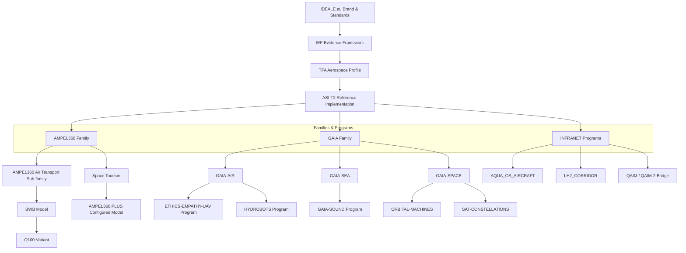

# IDEALE.eu — Intelligence • Defense • Energy • Aerospace • Logistics • ESG

[](https://github.com/Robbbo-T/IDEALE-IEF/actions/workflows/verify.yml)
[](https://spdx.dev/specifications/)


[**IDEALE.eu**](https://ideale.eu) is a federated **brand & standards** program for **verifiable critical systems**. We prioritize **evidence over assertions** and publish portable formats and vendor-neutral CI hooks.

> **Principle:** If it didn’t run in **CI**, it doesn’t count as **evidence**.

* **Public framework:** [**IDEALE Evidence Framework (IEF)**](#ideale-evidence-framework-ief)
* **Primary sector profile:** [**TFA (Aerospace)**](#tfa--aerospace-domain-profile)
* **Reference implementation (code/templates):** [**ASI-T2**](#asi-t2-reference-implementation)

---

## 📚 Quick Nav

* [What is IDEALE?](#what-is-ideale)
* [Naming Canon](#naming-canon)
* [IDEALE Evidence Framework (IEF)](#ideale-evidence-framework-ief)
* [Visual Overview](#visual-overview)
* [Sector Profiles](#sector-profiles)
* [ASI-T2 (Reference Implementation)](#asi-t2-reference-implementation)
* [Programs & Families (Aerospace-first)](#programs--families-aerospace-first)
* [Evidence Objects](#evidence-objects)
* [Conformance Ladder](#conformance-ladder)
* [Roadmap Phases](#roadmap-phases)
* [Contact & Pilots](#contact--pilots)
* [Link Map](#link-map-for-clustered-keywords)

---

## What is IDEALE?

### Open standards for verifiable European industry
####  IDEALE.eu lets Europe’s strategic sectors—Intelligence, Defense, Energy, Aerospace, Logistics, and ESG—produce verifiable, portable artifacts that move across tools and organizations without vendor lock-in. Teams can participate, contribute, and earn via a selectable tokenomics mark (team, cross-org, or ad-hoc clusters). The roadmap adds high-quality generative design graphics cryptographically tied to inputs, models, and approvals—transparent from concept to operation.

> **Bridge flow (TFA canon):** **QS→FWD→UE→FE→CB→QB**.

---

## Naming Canon

**Entity types**

* **Family** — related products sharing a common baseline (**GAIA**, **AMPEL360**). Families are grouped into **Manned Vehicles**, **Unmanned Vehicles**, and **Infrastructure Systems (INFRANET)**.
* **Model** — the product baseline within a family (e.g., **BWB** under AMPEL360: Blended-Wing-Body, hydrogen-hybrid baseline).
* **Variant** — a **configured model** (mission/capacity configuration of a model; e.g., **Q100** under BWB for ~100 passengers, quantum-enhanced).
* **Program** — a sustained line of work or capability stream (e.g., **LH2_CORRIDOR**, **GAIA-AIR/DRONES**, **GAIA-SEA/HYDROBOTS**, **GAIA-SPACE/IDENTITY**).

---

## IDEALE Evidence Framework (IEF)

A reusable **evidence & verification layer** adoptable in stages.

* **Manifests:** **UTCS** (UiX Threading Context/Content/Cache & Structure/Style/Sheet) / **CXP** (Context Exchange Profile)
* **SBOM:** **SPDX 2.3 JSON**
* **Verify & Replay:** policy-pinned verification, hash-chained logs, reproducibility
* **Badges:** human-readable status + machine endpoints for procurement/regulatory portals

**Open evidence flow (UTCS → SPDX → Verify → Badge)**

1. **UTCS/CXP** anchor who/what/where/when/why.
2. **SPDX SBOM** records components & licenses.
3. **Verify (CI)** enforces policy and emits a replayable log.
4. **Badge** publishes status and links to evidence blobs.

---

## Visual Overview



---

## Sector Profiles

Profiles specialize IEF per regulatory domain. First up:

### TFA — Aerospace Domain Profile

* Aligns **UTCS** fields to aviation semantics (ATA, safety, maintainability)
* Adds aerospace-specific **policy pins** and **conformance gates**
* Ships **reference badges** and **regulatory report layouts**

---

## ASI-T2 (Reference Implementation)

**ASI-T2** is the **reference repository** showing how to wire IEF in a real organization (templates, workflows, examples).

* **Bundle:** `UTCS_BUNDLE/` (manifests, attestations)
* **Docs:** `WHITEPAPERS/` (architecture & interfaces)
* **Profiles:** TFA (aerospace)
* **Evidence:** `sbom/`, `badges/`, `.github/workflows/` (Verify)

> Treat it as a **living reference**: copy what you need; keep your own governance.

---

## Programs & Families (Aerospace-first)

* <a id="ampel360"></a>**AMPEL360 — Family of aircraft models**
  **Sub-family & model:** **AMPEL360 Air Transport** → **BWB** (model).
  **Variant:** **Q100** — configured model for ~100 passengers (quantum-enhanced).
  **Additional configured model:** **AMPEL360 PLUS** for Space-Tourism.
  Evidence wiring: **UTCS → SPDX → Verify → Badge** aligned to **ATA**.

* <a id="gaia-systems"></a>**GAIA — Family of multi-domain robotic systems**
  **Sub-families:** **GAIA-AIR** (UAV/UAM; includes **ETHICS-EMPATHY-UAV**, **HYDROBOTS**), **GAIA-SEA** (e.g., **GAIA-SOUND**), **GAIA-SPACE** (e.g., **ORBITAL-MACHINES**, **SAT-CONSTELLATIONS**). All expose **IEF badges** for readiness and safety lifecycle states.

* <a id="qaim-2"></a>**QAIM-2 — CAx ↔ QOx bridge**
  Integrates classical engineering pipelines with quantum/hybrid optimization and generates **signed attestations** for **UTCS/CXP** replay.

* <a id="hydrobots"></a>**HYDROBOTS — under GAIA-AIR**
  Program for autonomous platforms with **evidence-first** maintenance, safety logs, and provenance manifests (`GAIA-AIR/HYDROBOTS`).

* **INFRANET — Infrastructure & OS**
  Includes **AQUA_OS_AIRCRAFT** (ARINC/IMA partitions, AFDX/TSN/TTE, UTCS/QS sealing) and **LH2_CORRIDOR** (H₂ infrastructure). **QAIM** also lives here as a cross-cutting bridge.

---

## Evidence Objects

* **UTCS / CXP** — machine-readable context (e.g., `UTCS/context.manifest.json`)
* **SPDX SBOM** — generated on build/release (`sbom/`)
* **Verify (CI)** — policy-pinned workflows under `.github/workflows/`
* **Badge + Replay** — status + links to replayable logs (`badges/`)

<details>
  <summary><strong>UTCS manifest skeleton (YAML)</strong></summary>

```yaml
id: UTCS-MI:v5.0:<PRODUCT>:<CAX|QOX|PAX>:<DOMAIN>:<ATA>:<artifact-id>
llc: SYSTEMS
framework: IDEALE.eu
bridge: QS→FWD→UE→FE→CB→QB      # TFA canon
source:
  repo_path: <relative/path/to/artifact>
  commit: <git-sha>
  created_at: <iso8601>
context:
  who:
    org: <org-name>
    team: <team-name>
    owner: <contact@domain>
  what:
    product_family: <AMPEL360|GAIA|INFRANET>
    product_model: <e.g., BWB>
    variant: <e.g., Q100|PLUS|NULL>
  where:
    env: <OB|OFF|SIM|LAB|FLIGHT>
    region: <EU|US|...>
  when:
    ts_build: <iso8601>
    ts_verify: <iso8601>
  why:
    objective: <design|safety|compliance|maintenance|...>
    ticket_ref: <issue-id or URL>
inputs:
  - path: <path/to/input>
    digest: <sha256>
outputs:
  - type: <mesh|report|package|run|sbom>
    path: <path/to/output>
    digest: <sha256>
evidence:
  ata_dm_refs:
    - <DMC-...-EN-US>
  sbom:
    format: SPDX-2.3
    path: <sbom/<artifact>.spdx.json>
  verify_log: <.evidence/logs/<run-id>.jsonl>
provenance:
  signatures:
    qs_anchor: <sha256>
    sigstore_bundle: <path/to/intoto.jsonl>
ethics_guard: MAL-EEM
classification: INTERNAL–EVIDENCE-REQUIRED
```

</details>

---

## Conformance Ladder

| Level | Name           | Requirements (summary)                                                    |
| ----: | -------------- | ------------------------------------------------------------------------- |
|     1 | **Baseline**   | Valid **UTCS** + one **SPDX** per release + visible **Badge**             |
|     2 | **Replayable** | Policy-pinned **Verify** + hash-chained logs + retention policy           |
|     3 | **Assured**    | Third-party attestation + sector **profile** (e.g., **TFA**) + revocation |
|     4 | **Certified**  | **IDEALE Trust Mark** aligned to EU frameworks                            |

> Progress is **evidence-driven**; each level adds traceability without lock-in.

---

## Roadmap Phases

1. **Standards** — freeze **MVS v0.1** (UTCS/CXP schema, SPDX baseline, Verify action, Badge endpoint)
2. **Services** — Verification-as-a-Service (SaaS), data residency, signed attestations
3. **Trust Mark** — Levels, controls, assessor marketplace, revocation
4. **Policy Alignment** — Map primitives to EU requirements; public-sector pilots

---

## Contact & Pilots

Interested in a 2-week pilot (Aerospace/Energy/Defense/Logistics)?

* Email: **[pilots@ideale.eu](mailto:pilots@ideale.eu)**
* Issues: **[Open a Pilot request](https://github.com/Robbbo-T/IDEALE-IEF/issues/new?title=Pilot%3A%20Org)**

---

## Link Map (for clustered keywords)

* **IDEALE.eu** → [https://ideale.eu](https://ideale.eu)
* **What is IDEALE?** → #what-is-ideale
* **Naming Canon** → #naming-canon
* **IEF (IDEALE Evidence Framework)** → #ideale-evidence-framework-ief
* **Visual Overview** → #visual-overview
* **Sector Profiles** → #sector-profiles
* **TFA (Aerospace Domain Profile)** → #tfa--aerospace-domain-profile
* **ASI-T2 (Reference Implementation)** → #asi-t2-reference-implementation
* **Programs & Families** → #programs--families-aerospace-first

  * **AMPEL360** → #ampel360
  * **GAIA** → #gaia-systems
  * **QAIM-2** → #qaim-2
  * **HYDROBOTS** → #hydrobots
* **Evidence Objects** → #evidence-objects

  * **UTCS (manifest skeleton)** → #utcs-manifest-skeleton-yaml
  * **CXP** → #evidence-objects
  * **SBOM** → #evidence-objects
  * **Verify / Badge** → #evidence-objects
* **Conformance Ladder** → #conformance-ladder
* **Roadmap** → #roadmap-phases
* **Contact & Pilots** → #contact--pilots
* **SPDX** → [https://spdx.dev](https://spdx.dev)


