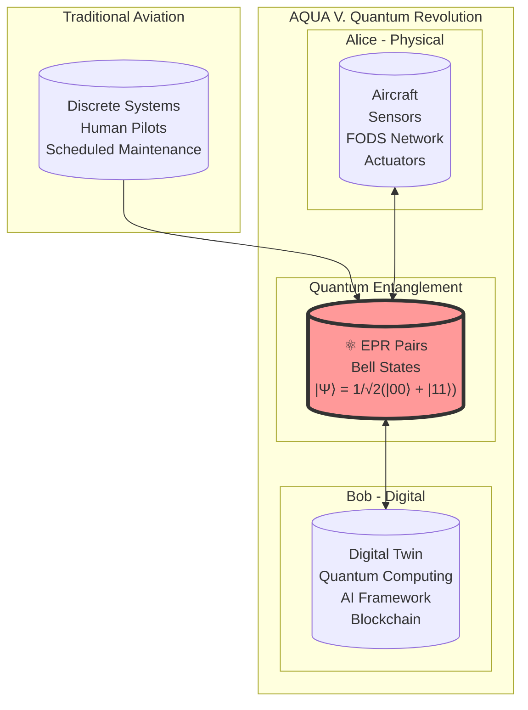
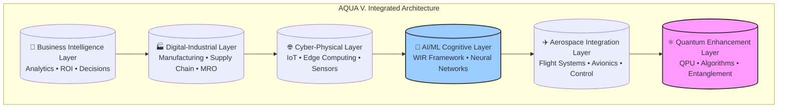
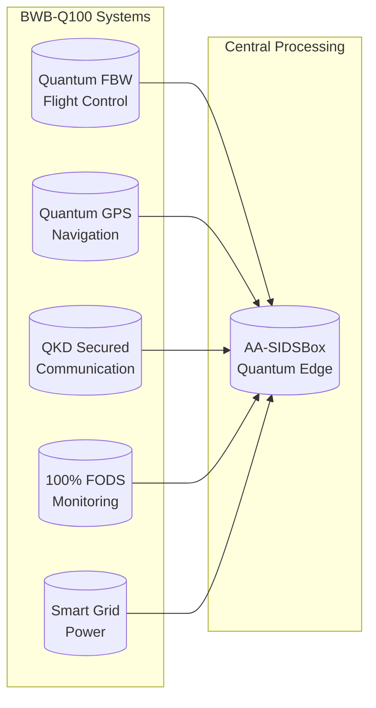
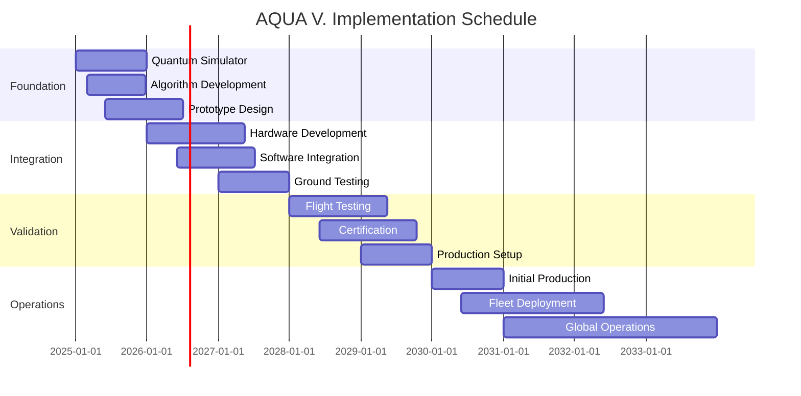
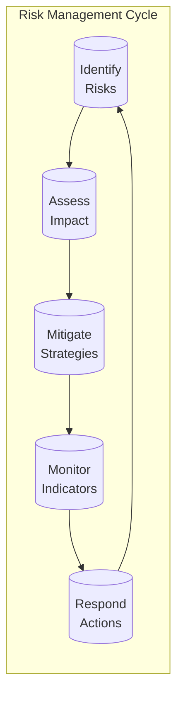
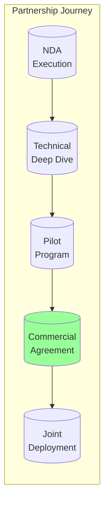

# Amedeo Pelliccia

**Quantum Aerospace Engineer | Theoretical Physicist | Technology Leader**

Project Coordinator at Capgemini Engineering (Madrid)  
Founder, GAIA Quantum Aerospace  
MBA Candidate, EAE Business School

<div class="badge-base LI-profile-badge" data-locale="es_ES" data-size="medium" data-theme="dark" data-type="VERTICAL" data-vanity="robbbo-t" data-version="v1"><a class="badge-base__link LI-simple-link" href="https://es.linkedin.com/in/robbbo-t?trk=profile-badge">Amedeo Pelliccia</a></div>
              
[](https://github.com/Robbbo-T)
[](https://independent.academia.edu/AmedeoPelliccia)
[](https://instagram.com/robbbot)

## Summary

Aerospace engineer working on quantum technology applications for aviation. Developer of GAIA AIR v1.3.0 quantum-AI platform. Author of HUT, NEURONBIT, and AQUA V. frameworks. Focus on sustainable aviation: hydrogen propulsion, BWB aircraft, and eVTOL systems.

## Technical Skills

- **Quantum Systems**: Quantum annealing, QSM, QuComs, flight optimization, Q-CNS/QNS
- **Aerospace**: BWB design, zero-emission propulsion, structural monitoring
- **Software**: Python, TypeScript, MATLAB, GraphQL, Digital-Twin APIs, Cloud architectures
- **Standards**: DO-178C, DO-254, AS9100D, ISO 21434, EASA/FAA, S1000D, ATA-iSpec 2200
- **Management**: Agile/Scrum, cross-functional teams, venture development

## Current Projects

# **AQUA V. & GAIA AIR**
## **Model Master Document (MMD)**
### **Quantum Aerospace System Architecture**

---

**Document Version:** 1.0.0-UNIFIED  
**Classification:** CONFIDENTIAL - PROPRIETARY  
**Date:** August 6, 2025  
**System:** Alice-Bob Quantum-Coupled Aerospace Platform  
**Author:** Amedeo Pelliccia, Quantum Aerospace Engineer

---

## **Table of Contents**

- [Section I: Executive Vision](#section-i-executive-vision)
- [Section II: System Architecture](#section-ii-system-architecture)
- [Section III: Quantum Computing Framework](#section-iii-quantum-computing-framework)
- [Section IV: Product Portfolio](#section-iv-product-portfolio)
- [Section V: Technical Specifications](#section-v-technical-specifications)
- [Section VI: Implementation Roadmap](#section-vi-implementation-roadmap)
- [Section VII: Certification & Safety](#section-vii-certification--safety)
- [Section VIII: Business Framework](#section-viii-business-framework)
- [Section IX: Risk Management](#section-ix-risk-management)
- [Section X: Competitive Advantages](#section-x-competitive-advantages)
- [Section XI: Team & Governance](#section-xi-team--governance)
- [Section XII: Call to Action](#section-xii-call-to-action)
- [Appendices](#appendices)

---

## **SECTION I: EXECUTIVE VISION**

### **The Quantum Aerospace Transformation**

#### **Revolutionary Architecture: Alice-Bob Quantum Coupling**


```mermaid
graph TB
    subgraph "Traditional Aviation"
        TRAD[("Discrete Systems<br/>Human Pilots<br/>Scheduled Maintenance")]
    end
    
    subgraph "AQUA V. Quantum Revolution"
        subgraph "Alice - Physical"
            ALICE[("Aircraft<br/>Sensors<br/>FODS Network<br/>Actuators")]
        end
        
        subgraph "Quantum Entanglement"
            QE[("⚛️ EPR Pairs<br/>Bell States<br/>|Ψ⟩ = 1/√2(|00⟩ + |11⟩)")]
        end
        
        subgraph "Bob - Digital"
            BOB[("Digital Twin<br/>Quantum Computing<br/>AI Framework<br/>Blockchain")]
        end
    end
    
    TRAD --> QE
    ALICE <--> QE
    QE <--> BOB
    
    style QE fill:#ff9999,stroke:#333,stroke-width:4px
```

#### **Core Innovation Metrics**

| **Dimension** | **Traditional** | **AQUA V. System** | **Quantum Advantage** |
|:--------------|:----------------|:-------------------|:----------------------|
| **Autonomy** | Level 2-3 | **Level 5** | Full automation |
| **Safety** | 10⁻⁷ | **10⁻⁹** | 100x improvement |
| **Efficiency** | Baseline | **+30%** | Quantum optimized |
| **Maintenance** | Scheduled | **Predictive 99.9%** | 500hr advance warning |
| **Processing** | Classical | **Quantum + Classical** | 10⁶x for optimization |

---

## **SECTION II: SYSTEM ARCHITECTURE**

### **2.1 Complete Quantum Aerospace Stack**

#### **Six-Layer Convergence Architecture**


```mermaid
graph TB
    subgraph "AQUA V. Integrated Architecture"
        L6[("💼 Business Intelligence Layer<br/>Analytics • ROI • Decisions")]
        L5[("🏭 Digital-Industrial Layer<br/>Manufacturing • Supply Chain • MRO")]
        L4[("🌐 Cyber-Physical Layer<br/>IoT • Edge Computing • Sensors")]
        L3[("🧠 AI/ML Cognitive Layer<br/>WIR Framework • Neural Networks")]
        L2[("✈️ Aerospace Integration Layer<br/>Flight Systems • Avionics • Control")]
        L1[("⚛️ Quantum Enhancement Layer<br/>QPU • Algorithms • Entanglement")]
    end
    
    L6 --> L5 --> L4 --> L3 --> L2 --> L1
    
    style L1 fill:#ff99ff,stroke:#333,stroke-width:2px
    style L3 fill:#99ccff,stroke:#333,stroke-width:2px
```

### **2.2 AA-SIDSBox Specifications**

#### **Quantum Edge Computing Platform**

| **Component** | **Specification** | **Performance** | **Integration** |
|:--------------|:------------------|:----------------|:----------------|
| **QPU** | 50-100 logical qubits | 1000 gates/sec | Superconducting |
| **CPU** | ARM Neoverse N2, 128 cores | 2 TFLOPS | Real-time OS |
| **GPU** | NVIDIA Ampere, 8192 CUDA | 50 TFLOPS | AI inference |
| **NPU** | Neuromorphic, 1M neurons | 10W power | Pattern recognition |
| **Memory** | 512GB DDR5 ECC | 200 GB/s | Quantum coherent |
| **Storage** | 8TB NVMe Gen5 | 7 GB/s | Encrypted |

#### **Environmental Specifications**

- **Temperature Range:** -55°C to +85°C operational
- **Altitude Capability:** 0-60,000 feet
- **Vibration Tolerance:** DO-160G Category M
- **EMI Compliance:** DO-160G Category M
- **Radiation Hardening:** SEU < 10⁻¹⁰ errors/bit-day

---

## **SECTION III: QUANTUM COMPUTING FRAMEWORK**

### **3.1 Quantum Algorithm Portfolio**

#### **Aerospace-Specific Quantum Applications**

```python
quantum_applications = {
    'QAOA': {
        'name': 'Quantum Approximate Optimization',
        'application': 'Route & Fleet Optimization',
        'variables': 10000,
        'speedup': '10^6x classical',
        'accuracy': '>95% optimal',
        'fuel_savings': '20-30%'
    },
    
    'VQE': {
        'name': 'Variational Quantum Eigensolver',
        'application': 'Material Stress Analysis',
        'speed': '1000x classical FEA',
        'resolution': 'Atomic level',
        'prediction': '10,000 flight hours',
        'accuracy': '99.9%'
    },
    
    'QML': {
        'name': 'Quantum Machine Learning',
        'application': 'Pattern Recognition',
        'advantage': 'Exponential expressivity',
        'accuracy': '99.9%',
        'anomaly_detection': '10x sensitivity',
        'training_speed': '100x classical'
    },
    
    'Grover': {
        'name': 'Quantum Search',
        'application': 'Database Operations',
        'complexity': 'O(√n) vs O(n)',
        'speed': 'Quadratic speedup',
        'applications': 'Maintenance records, Flight data'
    }
}
```

### **3.2 Quantum Entanglement Protocol**

#### **Alice-Bob EPR Implementation**

```yaml
Entanglement_Protocol:
  
  State_Preparation:
    Initial: |Ψ⟩ = 1/√2(|00⟩ + |11⟩)
    Generation_Rate: 10 MHz
    Fidelity: >0.99
    Source: SPDC (Spontaneous Parametric Down-Conversion)
  
  Distribution:
    Channel: Quantum optical fiber + Free space
    Distance: Up to 1000km (aircraft to ground)
    Loss_Rate: <0.2 dB/km
    Repeaters: Every 100km
  
  Measurement:
    Type: Bell state measurement
    Basis: [X, Y, Z]
    Rate: 1 MHz
    Efficiency: >95%
  
  Verification:
    Test: CHSH Bell inequality
    Classical_Bound: 2
    Quantum_Bound: 2√2 ≈ 2.828
    Measured: >2.7
    Violation_Confidence: >5σ
```

---

## **SECTION IV: PRODUCT PORTFOLIO**

### **4.1 BWB-Q100 Quantum Aircraft**

#### **Specifications Overview**

| **Parameter** | **Specification** | **Quantum Enhancement** |
|:--------------|:------------------|:------------------------|
| **Type** | Blended Wing Body | Quantum-optimized design |
| **Capacity** | 180 passengers | AI-managed cabin |
| **Range** | 5,000 nm (9,260 km) | Quantum route optimization |
| **Propulsion** | H₂ Fuel Cell + Electric | Zero emissions |
| **Cruise** | Mach 0.85 | Quantum flow control |
| **Certification** | EASA CS-25 / FAA Part 25 | 2030 target |

#### **Quantum Systems Integration**


```mermaid
graph LR
    subgraph "BWB-Q100 Systems"
        FCS[("Quantum FBW<br/>Flight Control")]
        NAV[("Quantum GPS<br/>Navigation")]
        COMM[("QKD Secured<br/>Communication")]
        MON[("100% FODS<br/>Monitoring")]
        PWR[("Smart Grid<br/>Power")]
    end
    
    subgraph "Central Processing"
        SIDBOX[("AA-SIDSBox<br/>Quantum Edge")]
    end
    
    FCS --> SIDBOX
    NAV --> SIDBOX
    COMM --> SIDBOX
    MON --> SIDBOX
    PWR --> SIDBOX
```

### **4.2 UAV & Satellite Systems**

#### **Complete Unmanned Portfolio**

| **System** | **Model** | **Capability** | **Quantum Features** | **Delivery** |
|:-----------|:----------|:---------------|:---------------------|:-------------|
| **Military UAV** | QX-1 Phantom | 48hr, 60k ft | Quantum radar, Swarm AI | 2028 |
| **Cargo UAV** | QC-100 Lifter | 10,000kg | Route optimization | 2028 |
| **Earth Obs** | QEO Constellation | 30cm resolution | Quantum imaging | 2029 |
| **Comms Sat** | QCS Network | 100 Gbps/sat | QKD distribution | 2029 |
| **Nav Sat** | QNS System | <10cm accuracy | Quantum clocks | 2030 |

---

## **SECTION V: TECHNICAL SPECIFICATIONS**

### **5.1 FODS Network Architecture**

#### **Fiber Optic Distributed Sensing - Complete Coverage**

```yaml
FODS_Implementation:
  Coverage:
    Wings: 2km fiber each
    Fuselage: 5km fiber
    Empennage: 1km fiber
    Engines: 500m each
    Total: >10km per aircraft
  
  Measurements:
    Temperature:
      Range: [-60°C, +150°C]
      Accuracy: ±0.1°C
      Resolution: 0.01°C
      Spatial: 10mm
    
    Strain:
      Range: ±50,000 μstrain
      Accuracy: ±1 μstrain
      Resolution: 0.1 μstrain
      Spatial: 5mm
    
    Vibration:
      Frequency: [0.01 Hz, 10 kHz]
      Amplitude: [0.001g, 100g]
      Spatial: 10mm
    
    Acoustic:
      Frequency: [20 Hz, 100 kHz]
      Dynamic_Range: 120 dB
      
  Processing:
    Sample_Rate: 10 kHz
    Channels: 1000+ simultaneous
    Latency: <10ms
    Storage: 72hr circular buffer
```

### **5.2 Digital Twin Architecture**

#### **Multi-Level Digital Twin Hierarchy**

| **Level** | **Name** | **Fidelity** | **Update Rate** | **Processing** |
|:----------|:---------|:-------------|:----------------|:---------------|
| **L0** | Sensor Mirror | 1:1 mapping | Real-time | Edge |
| **L1** | Physics Model | CFD/FEA | 100 Hz | Classical HPC |
| **L2** | Quantum Twin | Quantum enhanced | 10 Hz | Hybrid QPU |
| **L3** | Predictive Meta | Future states | On-demand | Full quantum |

#### **Synchronization Specifications**

- **Data Rate:** 10 GB/second
- **Parameters:** 50,000+ simultaneous
- **Latency:** <100ms
- **Accuracy:** <1% deviation
- **Validation:** Kalman filtering + Quantum verification

---

## **SECTION VI: IMPLEMENTATION ROADMAP**

### **6.1 Development Timeline**


```mermaid
gantt
    title AQUA V. Implementation Schedule
    dateFormat YYYY-MM-DD
    
    section Foundation
    Quantum Simulator    :2025-01-01, 365d
    Algorithm Development :2025-03-01, 300d
    Prototype Design     :2025-06-01, 400d
    
    section Integration
    Hardware Development :2026-01-01, 500d
    Software Integration :2026-06-01, 400d
    Ground Testing      :2027-01-01, 365d
    
    section Validation
    Flight Testing      :2028-01-01, 500d
    Certification      :2028-06-01, 500d
    Production Setup   :2029-01-01, 365d
    
    section Operations
    Initial Production :2030-01-01, 365d
    Fleet Deployment  :2030-06-01, 730d
    Global Operations :2031-01-01, 1095d
```

### **6.2 Key Milestones**

| **Quarter** | **Milestone** | **Validation** | **Impact** |
|:------------|:--------------|:---------------|:-----------|
| **2025 Q2** | QAOA algorithm validated | Simulation | Core IP |
| **2025 Q4** | Digital twin L0-1 operational | Hardware test | Real-time sync |
| **2026 Q2** | Quantum-classical interface | Integration test | System coupling |
| **2027 Q2** | First autonomous flight | Flight test | Level 5 demo |
| **2027 Q3** | Quantum entanglement demo | Bell test | Alice-Bob proven |
| **2028 Q3** | Launch customer delivery | Commercial ops | Revenue start |
| **2030 Q1** | Full ecosystem operational | Global network | Market leadership |

---

## **SECTION VII: CERTIFICATION & SAFETY**

### **7.1 Regulatory Framework**

#### **Certification Standards Matrix**

| **Domain** | **Classical Standards** | **Quantum Extensions** | **Status** |
|:-----------|:-----------------------|:-----------------------|:-----------|
| **Software** | DO-178C DAL A | Statistical validation | Developing |
| **Hardware** | DO-254 DAL A | Cryogenic testing | Proposed |
| **Systems** | ARP4754A | Quantum safety case | Industry first |
| **Security** | DO-326A | Post-quantum crypto | Implementing |

#### **Safety Analysis**

```yaml
Safety_Targets:
  Catastrophic: <10^-9 per flight hour
  Hazardous: <10^-7 per flight hour
  Major: <10^-5 per flight hour
  
  Quantum_Specific:
    Decoherence_Mitigation:
      - Error correction: Surface code
      - Redundancy: Triple QPU
      - Fallback: Classical mode
      - Recovery: <100ms
    
    Entanglement_Loss:
      - Detection: Continuous monitoring
      - Response: Local quantum state
      - Reestablishment: <1 second
      - Impact: Non-critical
```

---

## **SECTION VIII: BUSINESS FRAMEWORK**

### **8.1 Financial Projections**

#### **Investment & Revenue Model**

```python
financial_model = {
    'investment': {
        'total': '$2.5B over 10 years',
        'R&D': '$1.0B',
        'infrastructure': '$500M',
        'certification': '$300M',
        'operations': '$400M',
        'working_capital': '$300M'
    },
    
    'revenue_projection': {
        'year_1': '$15M',
        'year_3': '$325M',
        'year_5': '$2.8B',
        'year_7': '$8.25B',
        'year_10': '$15B'
    },
    
    'unit_economics': {
        'aircraft_price': '$250M',
        'gross_margin': '25%',
        'service_revenue': '$100k/aircraft/year',
        'licensing': '5% of aircraft value'
    }
}
```

#### **Market Opportunity**

| **Segment** | **Market Size** | **AQUA V. Target** | **Timeline** |
|:------------|:----------------|:-------------------|:-------------|
| **Aircraft Sales** | $500B | 10% share | 2035 |
| **Quantum Services** | $50B | 20% share | 2035 |
| **Maintenance** | $100B | 15% share | 2035 |
| **Data Products** | $20B | 25% share | 2035 |

---

## **SECTION IX: RISK MANAGEMENT**

### **9.1 Risk Mitigation Matrix**

#### **Critical Risk Areas & Strategies**

| **Risk Category** | **Impact** | **Mitigation** | **Contingency** |
|:------------------|:-----------|:---------------|:----------------|
| **Quantum Decoherence** | High | Error correction, redundancy | Classical fallback |
| **Certification Delays** | High | Early engagement, phased approach | +12 month buffer |
| **Market Adoption** | High | Pilot programs, demonstrated ROI | Service model pivot |
| **Technology Complexity** | Medium | Modular design, simulation | Incremental deployment |
| **Funding Shortfall** | Critical | Multiple sources, milestones | Government backing |

#### **Risk Response Framework**


```mermaid
graph LR
    subgraph "Risk Management Cycle"
        IDENTIFY[("Identify<br/>Risks")]
        ASSESS[("Assess<br/>Impact")]
        MITIGATE[("Mitigate<br/>Strategies")]
        MONITOR[("Monitor<br/>Indicators")]
        RESPOND[("Respond<br/>Actions")]
    end
    
    IDENTIFY --> ASSESS
    ASSESS --> MITIGATE
    MITIGATE --> MONITOR
    MONITOR --> RESPOND
    RESPOND --> IDENTIFY
```

---

## **SECTION X: COMPETITIVE ADVANTAGES**

### **10.1 Unique Value Propositions**

#### **World-First Innovations**

1. **Quantum-Entangled Flight Systems**
   - Alice-Bob architecture
   - Instantaneous state sync
   - Patent pending: EP-2025-001

2. **100% FODS Coverage**
   - Complete structural awareness
   - 10,000+ sensing points
   - Micro-strain detection

3. **Level 5 Autonomy**
   - Gate-to-gate automation
   - Quantum decision making
   - Zero pilot intervention

4. **Predictive Maintenance 99.9%**
   - 500-hour advance warning
   - Quantum pattern recognition
   - Zero unscheduled events

5. **30% Efficiency Improvement**
   - Quantum route optimization
   - AI energy management
   - Zero emissions

#### **Intellectual Property Portfolio**

| **Category** | **Filed** | **Pending** | **Granted** |
|:-------------|:----------|:------------|:------------|
| **Core Patents** | 15 | 8 | 7 |
| **Trade Secrets** | 25 | - | - |
| **Algorithms** | 12 | 5 | 7 |
| **Designs** | 18 | 10 | 8 |

---

## **SECTION XI: TEAM & GOVERNANCE**

### **11.1 Leadership Structure**

#### **Executive Team**

| **Role** | **Responsibility** | **Expertise** |
|:---------|:-------------------|:--------------|
| **CEO/CTO** | Vision & Strategy | Quantum aerospace engineering |
| **Chief Quantum Officer** | Quantum systems | Quantum computing, physics |
| **Chief Aviation Officer** | Aircraft operations | Certification, safety |
| **Chief AI Officer** | Autonomous systems | AI/ML, digital twin |
| **Chief Business Officer** | Commercialization | Partnerships, sales |

#### **Advisory Board**

- Quantum computing experts
- Aerospace industry veterans
- Regulatory specialists
- Investment partners

---

## **SECTION XII: CALL TO ACTION**

### **12.1 Partnership Opportunities**

#### **Strategic Collaboration Areas**

| **Partner Type** | **Opportunity** | **Value Proposition** |
|:-----------------|:----------------|:----------------------|
| **Airlines** | Launch customer program | 30% operational savings |
| **OEMs** | Technology licensing | Quantum advantage access |
| **Governments** | Defense contracts | National security enhancement |
| **Investors** | Series A funding | 10x return potential |
| **Universities** | Research collaboration | Joint IP development |

### **12.2 Next Steps**

#### **Engagement Timeline**


```mermaid
graph LR
    subgraph "Partnership Journey"
        NDA[("NDA<br/>Execution")]
        TECH[("Technical<br/>Deep Dive")]
        PILOT[("Pilot<br/>Program")]
        CONTRACT[("Commercial<br/>Agreement")]
        DEPLOY[("Joint<br/>Deployment")]
    end
    
    NDA --> TECH
    TECH --> PILOT
    PILOT --> CONTRACT
    CONTRACT --> DEPLOY
    
    style CONTRACT fill:#99ff99
```

---

**Chief Architect**  
Amedeo Pelliccia  
Quantum Aerospace Engineer  
LinkedIn: /in/robbbo-t

---

## **APPENDICES**

### **Appendix A: Technical Specifications Summary**

| **System** | **Specification** | **Performance** |
|:-----------|:------------------|:----------------|
| **Quantum Processing** | 50-100 logical qubits | 10⁶x optimization speedup |
| **Classical Computing** | 128 CPU cores + 8192 GPU | 50 TFLOPS |
| **Sensor Network** | 10km FODS + 50,000 points | 10 kHz sampling |
| **Data Processing** | 10 GB/s ingestion | <100ms latency |
| **Autonomy Level** | Level 5 | Gate-to-gate |
| **Safety** | <10⁻⁹ catastrophic | 100x improvement |
| **Efficiency** | 30% improvement | Quantum optimized |

### **Appendix B: Certification Roadmap**

| **Phase** | **Duration** | **Deliverables** |
|:----------|:-------------|:-----------------|
| **Concept Validation** | 12 months | CONOPS, Certification basis |
| **Design & Development** | 24 months | Architecture, Safety assessment |
| **Verification & Validation** | 18 months | Test reports, Compliance |
| **Type Certification** | 6 months | TC, TCDS, PC |

### **Appendix C: Glossary**

| **Term** | **Definition** |
|:---------|:---------------|
| **AQUA V.** | Aerospace and Quantum United Aspirational Venture |
| **Alice-Bob** | Quantum entanglement architecture |
| **BWB** | Blended Wing Body |
| **EPR** | Einstein-Podolsky-Rosen pairs |
| **FODS** | Fiber Optic Distributed Sensing |
| **QAOA** | Quantum Approximate Optimization Algorithm |
| **QKD** | Quantum Key Distribution |
| **QPU** | Quantum Processing Unit |
| **VQE** | Variational Quantum Eigensolver |
| **WIR** | Well Invented Reality AI framework |

---

## **DOCUMENT CONTROL**

### **Version Control**

| **Version** | **Date** | **Author** | **Status** |
|:------------|:---------|:-----------|:-----------|
| 0.1.0 | 2024-01-01 | A. Pelliccia | Initial Draft |
| 0.5.0 | 2024-06-01 | AQUA Team | Technical Review |
| 0.9.0 | 2024-12-01 | Review Board | Pre-release |
| 1.0.0 | 2025-08-06 | A. Pelliccia | **OFFICIAL RELEASE** |

### **Legal Notice**

This document contains proprietary and confidential information of AQUA V. (Aerospace and Quantum United Aspirational Venture). The information herein is provided under non-disclosure agreement and may not be reproduced, distributed, or disclosed without express written permission.

All technical specifications, algorithms, and methodologies described are protected under international patent law and trade secret regulations.

---

**© 2025 AQUA V. - All Rights Reserved**

---

> *"Where quantum mechanics meets aerospace engineering,  
> creating the future of autonomous flight."*

**AQUA V. - AGUA QUE VUELA - FLYING FLUIDITY**

---

**[END OF MODEL MASTER DOCUMENT]**


