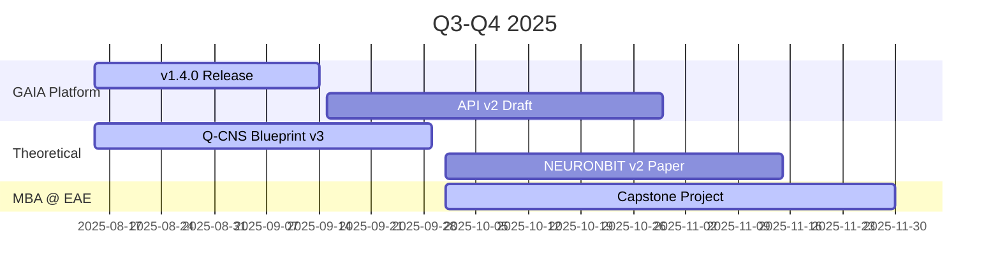

<!--
█▀▀ █▀█ █▄▄ █▄▄ █▀▀ ▀█▀ █▄▄ █ █▀█ █▄░█ █▀
█▄▄ █▄█ █▄█ █▄█ █▄▄ ░█░ █▄█ █ █▄█ █░▀█ ▄█
Amedeo “Robbbo-T” Pelliccia — Quantum-Aerospace Engineer, Theoretical Physicist & Tech Leader
-->

<div align="center">

# Amedeo Pelliccia · **Robbbo-T** ✈️🔬👾  
**Quantum Aerospace Pioneer | Theoretical Physicist | Technology Leader**

Project Coordinator **Capgemini Engineering (Madrid)** • Founder, **GAIA Quantum Aerospace** • MBA Candidate, **EAE Business School**

</div>

<div align="center">

[](https://www.linkedin.com/in/amedeo-pelliccia-94154435/)
[](https://github.com/Robbbo-T)
[](https://independent.academia.edu/AmedeoPelliccia)
[](https://instagram.com/robbbot)


</div>

---

## 🚀 TL;DR

• Aerospace engineer turned **quantum-tech evangelist**  
• Architect of **GAIA AIR v1.3.0** — quantum-AI, digital-twin platform for zero-emission aircraft  
• Author of **HUT, NEURONBIT, AQUA V.** and other cross-disciplinary frameworks  
• Champion of sustainable aviation: hydrogen fuel-cell turbofans, BWB-Q100, eVTOL roadmaps  
• Polyglot coder (Python | TypeScript | MATLAB) & documentation nerd (S1000D, ATA-iSpec 2200)

---

## 🛠️ Core Expertise

| Domain | Tools & Concepts | 2025 Focus |
| ------ | ---------------- | ---------- |
| Quantum-Aerospace | Quantum annealing, QSM, QuComs, flight-route optimisation | Quantum Navigation Systems (Q-CNS, QNS) |
| Aircraft Engineering | BWB design, zero-emission propulsion, structural monitoring | **BWB-Q100** prototype refinement |
| Software & Data | Python, TypeScript, GraphQL, Digital-Twin APIs, Cloud-native | **GAIA v1.4** micro-services |
| Standards & Certs | DO-178C, DO-254, AS9100D, ISO 21434, EASA/FAA regs | Drafting *WG-122 Quantum Annex* |
| Leadership | Agile/Scrum, €40 Bn venture cases, cross-functional teams | Scaling “Q-Divisions” model |

---

## 🔭 Flagship Projects

| Project | Status / Version | Quick Pitch |
| ------- | --------------- | ----------- |
| **GAIA AIR** |  | Quantum-AI optimisation platform (⭡ 30 % route efficiency, real-time digital twin) |
| **BWB-Q100** |  | 180-seat blended-wing, H₂ fuel-cell hybrid, quantum energy mgmt |
| **AQUA V.** |  | €40 Bn blueprint: 12 “Q-Divisions”, 2050 revenue 🌟 |
| **Q-CNS Blueprint** |  | ≤ 1 × 10⁻⁹ rad/s drift quantum-classical nav system |
| **Hyperbolic Universe Theory** |  | Negative-curvature cosmos; 150 + citations in 6 mo |

> Detailed docs & repos pinned on profile ➜

---

## 🧠 Selected Publications

```
2025 · “Quantum Entanglement in Aerospace Navigation Systems” (pre-print)
2025 · AQUA V. – Aerospace & Quantum United Advanced Venture v9.0
2024 · “Hyperbolic Universe Theory” (HUT)
2024 · “Sustainable Industrial Optimisation Algorithm”
```

Full list in  ➜  `RESEARCH.md`

---

## 🌍 2025 Roadmap (live)


```mermaid
gantt
  title Q3-Q4 2025
  dateFormat YYYY-MM-DD
  section GAIA Platform
    v1.4.0 Release        :active, 2025-08-15, 30d
    API v2 Draft          :        2025-09-15, 45d
  section Theoretical
    Q-CNS Blueprint v3    :active, 2025-08-15, 45d
    NEURONBIT v2 Paper    :        2025-10-01, 45d
  section MBA @ EAE
    Capstone Project      :active, 2025-10-01, 60d
```

---

## 📈 GitHub Analytics

<p align="center">
  
  
</p>

---

## 🤝 Let’s Collaborate

| Need | Looking For | Contact |
| ---- | ----------- | ------- |
| **Quantum Nav Theory** | Physicists & Aero Eng. | [Open Issue](https://github.com/Robbbo-T/QNS-Research/issues/new?template=collaboration.md) |
| **BWB-Q100** | Partners / Investors |
| **GAIA Open Source** | Full-stack & DevOps | GitHub Issues |
| **Guest Lectures** | Universities & Confs | LinkedIn DM |

---

> “Design aircraft that respect the planet, write code that respects the engineer, and craft theories that respect the cosmos.”
> # AQUA V. - Aerospace and Quantum United Advanced Venture

## AGUA QUE VUELA - FLYING FLUIDITY

<div align="center">
  
</div>

<div align="center">
Made with hydrogen, qubits & espresso in Madrid 🇪🇸
</div>
