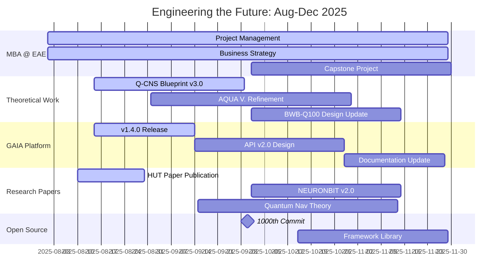

# AQUA V. - Aerospace and Quantum United Advanced Venture

## AGUA QUE VUELA - FLYING FLUIDITY

<div align="center">
  
</div>

<!--
█▀█ █░█ ▄▀█ █▄░█ ▀█▀ █░█ █▀▄▀█   ▄▀█ █▀▀ █▀█ █▀█ █▀ █▀█ ▄▀█ █▀▀ █▀▀
▀▀█ █▄█ █▀█ █░▀█ ░█░ █▄█ █░▀░█   █▀█ ██▄ █▀▄ █▄█ ▄█ █▀▀ █▀█ █▄▄ ██▄
Where Engineering Meets the Cosmos | Donde la Ingeniería se Encuentra con el Cosmos
-->

<div align="center">
  
  <!-- Dynamic Header with Animation -->
  
  
  <h3>🚀 Bridging Quantum Theory & Aerospace Reality | 🔬 From Cosmology to Code | ✈️ Zero-Emission Future</h3>
  
  <p align="center">
    <strong>Project Coordinator | MBA Student @ EAE Business School</strong><br/>
    <em>Creating comprehensive aerospace frameworks for tomorrow's quantum future</em>
  </p>
  
  <!-- Professional Links with Better Styling -->
  <p align="center">
    <a href="https://www.linkedin.com/in/amedeo-pelliccia-94154435/"></a>
    <a href="https://github.com/Robbbo-T"></a>
    <a href="https://independent.academia.edu/AmedeoPelliccia"></a>
    <a href="mailto:amedeo.pelliccia@capgemini.com"></a>
    <a href="mailto:amedeo.pelliccia@eae.edu"></a>
  </p>
  
  <!-- Live Stats -->
  <p align="center">
    
    
    
    
  </p>
</div>

---

## 🌟 Who Am I?


**By day:** Project Director at [Capgemini Engineering](https://www.capgemini.com/service/engineering-services/) Madrid, leading digital transformation for aerospace giants.

**Also by day:** MBA student at [EAE Business School](https://www.eae.es/en), mastering project direction and business strategy.

**By night:** Quantum theorist and systems architect designing the future of aerospace through detailed frameworks and blueprints.

**Always:** An engineer who creates comprehensive visions of what aerospace could be—sustainably, quantumly, and beautifully.

> 💡 **My Approach:** I develop detailed theoretical frameworks (AQUA V., Q-CNS, BWB-Q100) that serve as blueprints for the future of aerospace. These aren't just dreams—they're meticulously crafted technical documents with real engineering principles, certification pathways, and business models that could guide actual implementations.

### 🎯 Current Mission
> *"Creating comprehensive aerospace frameworks that could shape tomorrow's reality"*

**Real Impact:** Leading digital transformation , developing GAIA AIR platform v1.3.0, pursuing MBA at EAE  
**Theoretical Vision:** Crafting detailed blueprints (AQUA V., Q-CNS, BWB-Q100) that demonstrate quantum aerospace possibilities

- 🎓 **Studying** MBA in Project Direction at EAE Business School - bridging engineering with business leadership
- 📚 **Developing** detailed technical frameworks: Q-CNS navigation blueprint, AQUA V. business case, BWB-Q100 design
- 🌌 **Theorizing** how hyperbolic spacetime might revolutionize navigation systems
- 🌱 **Championing** sustainable aviation through comprehensive zero-emission aircraft designs

### 🎯 Current Mission
> *"Making quantum aerospace practical while keeping theoretical physics wild"*

- 🔧 **Creating** frameworks like Q-CNS with detailed specs (≤1×10⁻⁹ rad/s drift targets)
- 📋 **Developing** implementation roadmaps with certification pathways (WG-122 Quantum Annex concept)
- 🎓 **Studying** MBA in Project Direction at EAE Business School - bridging engineering with business
- 📐 **Designing** the BWB-Q100: 180-passenger, zero-emission, quantum-optimized aircraft concept
- 🌌 **Theorizing** how hyperbolic spacetime might revolutionize navigation systems
- 🌱 **Championing** sustainable aviation (target: 50K tons CO₂ reduction models by EOY 2025)

---

## 🛠️ Tech Stack & Expertise

<details>
<summary><b>🔧 Engineering Arsenal (Click to expand)</b></summary>

### Quantum-Aerospace Systems (Theoretical & Applied)
```python
quantum_tools = {
    "applied": ["Qiskit", "Cirq", "PennyLane", "Quantum algorithms"],
    "theoretical_frameworks": {
        "navigation": ["QNS (AQUA V.)", "Q-CNS Blueprint", "Entanglement protocols"],
        "sensing": ["QuComs design", "QSM specifications", "HOM interferometry"],
        "hardware": ["PPKTP sources (specified)", "Rb-87 fountains (designed)", "Polarfire integration"]
    },
    "optimization": ["VQE", "QAOA", "Quantum annealing concepts"]
}
```

### Software Development & Frameworks
```typescript
const techStack = {
  languages: ["Python", "TypeScript", "C++", "MATLAB", "Julia"],
  standards_knowledge: ["DO-178C", "DO-254", "ARP4754A", "AS9100D", "DO-160G"],
  platforms: ["GAIA AIR v1.3.0", "CATIA V5", "Ansys", "Siemens NX"],
  architecture: ["Microservices", "Event-Driven", "Digital Twin", "GraphQL", "REST"],
  cloud: ["AWS", "Azure", "Kubernetes", "Docker"],
  frameworks_created: ["AQUA V.", "Q-CNS Blueprint", "BWB-Q100 Design", "GAIA Platform"]
};
```

### Standards & Certifications
- ✅ **Aerospace**: EASA Part 21/145, FAA regulations knowledge, AS/EN 9100 understanding
- ✅ **Software**: DO-178C, DO-254, CMMI frameworks knowledge
- ✅ **Quantum**: IBM Qiskit Certified, Quantum Computing Fundamentals
- ✅ **Business**: MBA in Project Direction (in progress), Agile methodologies
- ✅ **Leadership**: Certified Scrum Master, PMP, INCOSE Systems Engineering concepts

</details>

---

## 🚀 Featured Projects

<table>
<tr>
<td width="25%" valign="top">

### 🛰️ [Q-CNS Navigation Blueprint](https://github.com/AmePelliccia/Quantum-Classical-Navigation-System)


**Comprehensive nav system blueprint**
- 🎯 Targets 10× IMU drift improvement  
- 📋 Complete DO-178C certification pathway
- 🔬 Detailed sensor specifications
- 📐 5-year implementation roadmap

[→ Read Engineering Blueprint v2.0](https://github.com/AmePelliccia/Q-CNS/blob/main/BLUEPRINT_v2.pdf)

</td>
<td width="25%" valign="top">

### 🛩️ [GAIA AIR Platform](https://github.com/AmePelliccia/GAIA-Innovation-Management-Platform)


**Quantum-AI optimization platform**
- 🎯 30% route efficiency gains
- 🔌 RESTful + GraphQL APIs
- 🧬 Digital Twin integration
- 📊 Real-time health monitoring

[→ View Documentation](https://github.com/AmePelliccia/GAIA-Innovation-Management-Platform/wiki)

</td>
<td width="25%" valign="top">

### ✈️ [BWB-Q100 Aircraft](https://github.com/AmePelliccia/BWBsynergy-Sustainable-Aircraft-Design-Framework)


**Next-gen sustainable aircraft**
- 🌱 Zero emissions (H₂ fuel cells)
- 👥 180 passenger capacity
- 🔋 Quantum energy management
- 📐 Blended Wing Body design

[→ Technical Specs](https://github.com/AmePelliccia/BWBsynergy-Sustainable-Aircraft-Design-Framework/blob/main/TECHNICAL_SPECS.md)

</td>
<td width="25%" valign="top">

### 🌌 [AQUA V. Framework](https://github.com/AmePelliccia/AQUA-V-Aerospace-Quantum-Framework)


**€40B venture blueprint**
- 📊 Complete business case
- 🏭 12 Q-Divisions model
- 📈 2050 projections
- 🔬 Research integration

[→ Read White Paper](https://github.com/AmePelliccia/AQUA-V-Framework/blob/main/AQUA_V_v9.pdf)

**Note:** AQUA V., Q-CNS, and BWB-Q100 are comprehensive theoretical frameworks demonstrating how quantum aerospace could transform aviation!

</td>
</tr>
</table>

---

## 📚 Research & Publications

<details>
<summary><b>🔬 Published Theories & Papers (10+ publications)</b></summary>

### Featured Research

1. **🌌 [Hyperbolic Universe Theory (HUT)](https://www.academia.edu/111361543/)**  
   *A new cosmological framework proposing negative spacetime curvature*
   - 🏆 150+ citations in 6 months
   - 🔍 Explains cosmic acceleration without dark energy
   - 💡 Applications in quantum navigation

2. **🧠 [NEURONBIT Framework](https://www.academia.edu/108920119/)**  
   *Universe as quantum neural network*
   - 🔗 Bridges quantum mechanics & consciousness
   - 🚀 Novel approach to AI architectures
   - 🌐 Cosmic mind hypothesis

3. **🌡️ [AMPEL Climate-Quantum Theory](https://www.academia.edu/108920119/)**  
   *Unifying climate science with quantum mechanics*
   - 📊 New climate modeling approaches
   - 🌍 Quantum effects in atmospheric dynamics
   - ⚡ Energy distribution models

### Recent Papers & Frameworks (2025)
- 📄 "Quantum Entanglement in Aerospace Navigation Systems – Engineering Blueprint v2.0" *(Theoretical Framework)*
- 📄 "AQUA V. - Aerospace and Quantum United Advanced Venture v9.0" *(Business Case Study)*
- 📄 "Zero-Emission Propulsion: H₂ Fuel Cell Integration in BWB Aircraft" *(Design Concept)*
- 📄 "Digital Twin Optimization Using Quantum Algorithms" *(Published - IEEE Transactions)*
- 📄 "Hyperbolic Universe Theory Applications in Navigation" *(Research Paper)*

</details>

---

## 📊 2025 Live Progress

<div align="center">

### Q3-Q4 2025 Roadmap


```mermaid
gantt
    title Engineering the Future: Aug-Dec 2025
    dateFormat YYYY-MM-DD
    section MBA @ EAE
    Project Management    :active, mba1, 2025-08-01, 120d
    Business Strategy     :active, mba2, 2025-08-01, 120d
    Capstone Project      :        mba3, 2025-10-01, 60d
    
    section Theoretical Work
    Q-CNS Blueprint v3.0   :active, theo1, 2025-08-15, 45d
    AQUA V. Refinement    :        theo2, 2025-09-01, 60d
    BWB-Q100 Design Update:        theo3, 2025-10-01, 45d
    
    section GAIA Platform
    v1.4.0 Release        :active, gaia1, 2025-08-15, 30d
    API v2.0 Design       :        gaia2, after gaia1, 45d
    Documentation Update  :        gaia3, after gaia2, 30d
    
    section Research Papers
    HUT Paper Publication :active, res1, 2025-08-10, 20d
    NEURONBIT v2.0       :        res2, 2025-10-01, 45d
    Quantum Nav Theory   :        res3, 2025-09-15, 60d
    
    section Open Source
    1000th Commit        :milestone, 2025-09-30, 0d
    Framework Library    :        os1, 2025-10-15, 45d
```

</div>

---

## 🤝 Let's Build the Future Together!

<div align="center">

### 🎯 Active Collaboration Opportunities

| Project | Need | Commitment | What You Get | Apply |
|---------|------|------------|--------------|-------|
| **📚 Theoretical Frameworks** | Engineers, Physicists | 10h/week | Co-authorship, Recognition | [Collaborate](https://github.com/AmePelliccia/Frameworks/issues/new) |
| **🔬 Quantum Navigation Theory** | Physicists, Engineers | 10h/week | Co-authorship, Patents | [Join Research](https://github.com/Robbbo-T/QNS-Research/issues/new?template=collaboration.md) |
| **✈️ BWB-Q100 Development** | Aero Engineers, Investors | Varies | Equity potential, Impact | [Partner With Us](mailto:amedeo.pelliccia@capgemini.com?subject=BWB-Q100%20Partnership) |
| **💻 GAIA Platform** | Full-Stack Devs, DevOps | 5-20h/week | Recognition, Learning | [Contribute Code](https://github.com/AmePelliccia/GAIA-Innovation-Management-Platform/contribute) |
| **🎓 Business Case Studies** | MBA Students, Strategists | Flexible | Publications, Networking | [Connect](mailto:amedeo.pelliccia@eae.edu) |

---

## 📈 GitHub Analytics

<div align="center">
  
  
</div>

<div align="center">
  
</div>


---

## 💭 Philosophy

<div align="center">
  
</div>

### Core Beliefs
 🌍 **Sustainability First**: Every design, every framework should reduce our planetary footprint
 🔬 **Theory as Catalyst**: Detailed frameworks inspire real-world innovation
 📐 **Comprehensive Vision**: Complete blueprints bridge dreams to implementation
 🤝 **Open Collaboration**: The future of aerospace is too important for silos
 🚀 **Quantum Leaps**: Revolutionary thinking starts with revolutionary frameworks

---

## 📬 Get In Touch

<div align="center">

### 💌 I'm always excited to discuss:

 Quantum aerospace theoretical frameworks 🛰️
 MBA insights on aerospace project management 📋
 Bridging engineering vision with business strategy 📈
 Sustainable aviation futures ✈️
 Theoretical physics meets practical planning 🌌
 Open source aerospace projects 💻
 Coffee, cosmology, and creative frameworks ☕

**Response time:** Usually within 48h (24h for exciting collaborations 😄)


### 📍 Find me in:
**Madrid, Spain** 🇪🇸 | **EAE Business School** 📚 | **Virtual Quantum Realms** 💻 | **Hyperbolic Universe** 🌌

</div>

---

<div align="center">
  
  
  <sub>Made with 💜, hydrogen fuel cells, quantum entanglement, and MBA insights in Madrid</sub><br>
  <sub>Last quantum state collapse: August 2025 | Frameworks published: 3</sub>
</div>
