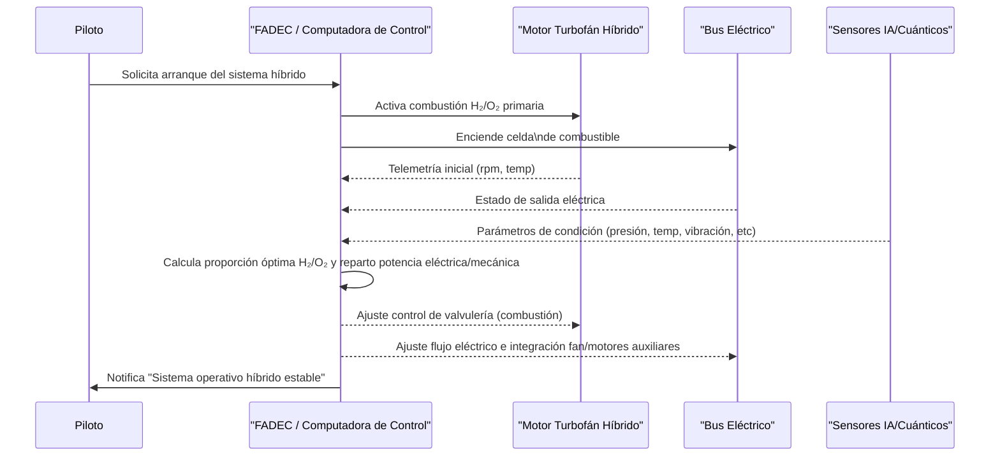
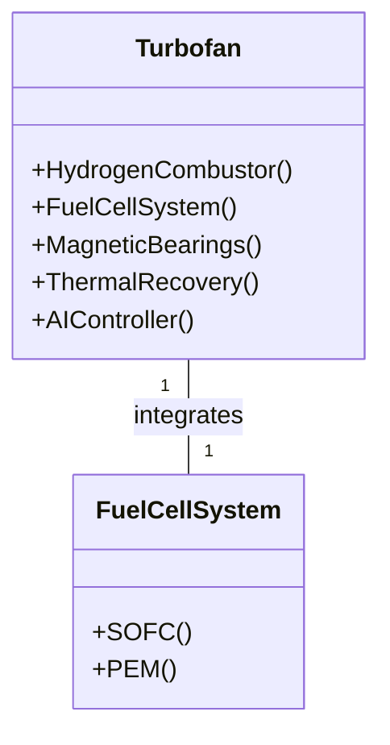

# 🚀 GAIA Innovation Management Platform 


**Version:** 1.3.0  
**Author:** Amedeo Pelliccia  
**Issued by:** GAIA Quantum Aerospace Optimization  
**Release Date:** 2025-05-28  
**Last Updated:** 2025-06-23  
**License:** GAIA-QAO Open Innovation License v1.0

---

## 🌟 Platform Overview

The **GAIA Innovation Management Platform** is a comprehensive quantum aerospace optimization system featuring advanced digital twin technology, AI lifecycle orchestration, and complete API architecture for aerospace innovation management.

### 🎯 Quick Navigation
- **[🚀 Quick Start Guide](#installation--setup)** - Get up and running in minutes
- **[📊 Dashboard Demo](gaia_digital_twin_dashboard.py)** - Interactive Streamlit dashboard
- **[🔗 API Documentation](#api-architecture)** - Complete REST, GraphQL, and WebSocket APIs
- **[📚 Technical Documentation](docs/)** - Comprehensive documentation suite
- **[⚙️ Configuration Management](config/)** - System configuration and digital twin setup

---

> **Nota:** Este documento contiene secciones en inglés y español para garantizar el cumplimiento y la comprensión internacional.

---

## Table of Contents

- [🌟 Platform Overview](#-platform-overview)
- [🎯 Vision Statement](#vision-statement)
- [🏗️ Architecture Overview](#architecture-overview)
- [🚀 Quick Start](#installation--setup)
- [🔗 API Architecture](#api-architecture)
- [📊 Digital Twin Integration](#digital-twin-integration)
- [🔐 Security & Encryption](#security--encryption)
- [📋 Module DPM&A Index](#module-dpma-index)
- [⚡ Key Features](#key-features)
- [📈 Performance Metrics](#performance-metrics)
- [🛠️ Development Roadmap](#development-roadmap)
- [🔄 CI/CD Integration](#cicd-integration)
- [🤝 Contributing](#contributing)
- [📄 License](#license)
- [📞 Contact](#contact)
- [📚 References & Documentation](#references--linked-documents)

---

## 🚀 Live Platform Features

### ✅ **Production Ready Components**
- **RESTful API Server** - FastAPI with health, metrics, and telemetry endpoints
- **GraphQL API** - Flexible data querying with Strawberry framework
- **WebSocket Support** - Real-time updates and streaming data
- **Digital Twin Dashboard** - Interactive Streamlit interface
- **SDK Libraries** - Python and TypeScript client libraries
- **API Gateway** - Kong configuration for unified API management
- **Streaming Analytics** - Kafka integration for real-time data processing

### 🎮 **Interactive Dashboard**
```bash
# Launch the complete platform dashboard
python src/gaia_digital_twin_dashboard.py
# or use the startup scripts
./scripts/start_gaia.bat
```

### 🔗 **API Endpoints**
```
🌐 REST API:     http://localhost:8000/api/
🔍 GraphQL:      http://localhost:8000/graphql
📡 WebSocket:    ws://localhost:8000/ws
📊 Dashboard:    http://localhost:8501
```

---

## Vision Statement

Empowering quantum aerospace and sustainable engineering through AI lifecycle orchestration, modular traceability, and secure, high-performance digital threads.

---

## Architecture Overview

The GAIA platform integrates quantum technologies, sustainable engineering practices, and advanced AI for comprehensive innovation management. The system follows a modern microservices architecture with full API coverage.

```
GAIA Platform Architecture
├── 🌐 API Layer
│   ├── RESTful API (FastAPI)
│   ├── GraphQL API (Strawberry)
│   ├── WebSocket Real-time
│   └── API Gateway (Kong)
├── 🧠 AI/ML Layer
│   ├── SGPT Engine
│   ├── Quantum ML Pipeline
│   ├── Predictive Analytics
│   └── Anomaly Detection
├── 👥 Digital Twin Layer
│   ├── System Modeling
│   ├── Real-time Simulation
│   ├── Performance Monitoring
│   └── Predictive Maintenance
├── 📊 Data Layer
│   ├── Time Series Analytics
│   ├── Configuration Management
│   ├── Telemetry Processing
│   └── Data Provider Registry
└── 🔐 Security Layer
    ├── Authentication & Authorization
    ├── Encryption (AES-256)
    ├── Digital Signatures
    └── Audit Logging
```

---

## 🔗 API Architecture

The GAIA platform provides a comprehensive API suite for seamless integration:

### **RESTful API** (`api/main.py`)
- **Base URL:** `http://localhost:8000/api/`
- **Health Check:** `GET /health`
- **Metrics:** `GET /metrics` (Prometheus format)
- **Digital Twin Status:** `GET /digital-twin/status`
- **Telemetry Ingestion:** `POST /telemetry`
- **Predictive Alerts:** `GET /alerts/predictive`

### **GraphQL API** (`api/graphql_api.py`)
- **Endpoint:** `http://localhost:8000/graphql`
- **Interactive Playground:** `http://localhost:8000/graphql`
- **Schema:** Digital twin queries, telemetry data, system metrics

### **WebSocket Real-time** (`api/websocket.py`)
- **Endpoint:** `ws://localhost:8000/ws`
- **Features:** Real-time telemetry updates, system notifications
- **Authentication:** Token-based authentication

### **SDK Support**
- **Python SDK:** `sdk/python/gaia_client.py`
- **TypeScript SDK:** `sdk/typescript/gaia-client.ts`
- **Example Usage:** Async/await patterns, WebSocket subscriptions

```python
# Python SDK Example
from sdk.python.gaia_client import GAIAClient

async with GAIAClient("http://localhost:8000", "your-api-key") as client:
    status = await client.get_digital_twin_status("QPS-2025-001")
    await client.send_telemetry(telemetry_data)
```

---

## 📊 Digital Twin Integration

The GAIA platform features advanced digital twin capabilities:

### **System Models**
- **Quantum Propulsion System (QPS-2025-001)**
- **Hybrid Turbofan Engine (HTF-ZE-2025-11)**
- **Urban Air Mobility Systems (UAM-ES-2025-12)**
- **In-Orbit Assembly Platform (IOA-SPACE-2025-13)**

### **Real-time Capabilities**
- Live telemetry processing and visualization
- Predictive maintenance algorithms
- Anomaly detection and alerting
- Performance optimization recommendations

### **Configuration** (`config/digital_twin_configuration.json`)
Complete digital twin configuration with:
- System definitions and parameters
- Data flow specifications
- Analytics pipeline configuration
- ML model integration points

---

## 📋 Module DPM&A Index

### **Bill of Materials (BOMs)**
- [Fan Module BOM](boms/fan_module.yaml) (Assembly ID: GQ-AIR-TURB-FAN-01)
- [Compressor Module BOM](boms/compressor_module.yaml) (Assembly ID: GQ-AIR-TURB-COMP-02)
- [Combustion Module BOM](boms/combustion_module.yaml) (Assembly ID: GQ-AIR-TURB-COMB-03)
- [Turbine Module BOM](boms/turbine_module.yaml) (Assembly ID: GQ-AIR-TURB-TRBN-04)
- [Exhaust Module BOM](boms/exhaust_module.yaml) (Assembly ID: GQ-AIR-TURB-EXH-05)

### **Technical Documentation**
- [Setup Guide](docs/guides/SETUP_GUIDE.md) - Complete installation guide
- [API Documentation](docs/technical/api_documentation.md) - Full API reference
- [Digital Twin Architecture](docs/digital_twin/digital_twin_architecture.md)
- [MBSE Integration](docs/technical/mbse_integration.md)
- [Configuration Management](docs/de-re-ma/configuration_management/)

### **Assets & Renders**
- [Exploded View Renders](assets/figures/) - 3D visualization assets
- [System Diagrams](assets/diagrams/) - Architecture and flow diagrams

---

## ⚡ Key Features

### **🚀 Core Platform Capabilities**
- **AI Lifecycle Orchestration** - Advanced SGPT engine with quantum ML
- **Digital Twin Integration** - Real-time system modeling and simulation
- **Comprehensive API Suite** - REST, GraphQL, WebSocket support
- **Secure Digital Thread** - Hash-stamped traceability with AES-256 encryption
- **Modular PLM Integration** - Seamless BOM and configuration management
- **Real-time Analytics** - Performance monitoring and predictive insights

### **🔧 Technical Features**
- **Quantum-Accelerated Simulation** - Advanced physics modeling
- **Streaming Data Processing** - Kafka integration for real-time analytics
- **Multi-language SDKs** - Python and TypeScript client libraries
- **API Gateway Management** - Kong configuration for unified access
- **Automated Startup Scripts** - Windows, PowerShell, and Python launchers
- **CI/CD Ready Architecture** - GitHub Actions workflows included

### **📊 Analytics & Intelligence**
- **Predictive Maintenance** - ML-powered failure prediction
- **Anomaly Detection** - Real-time system health monitoring
- **Performance Optimization** - AI-driven efficiency recommendations
- **Digital Twin Analytics** - Comprehensive system insights

---

## Installation & Setup

### Quick Start (Recommended)

The GAIA platform includes automated startup scripts to resolve data provider issues and ensure smooth operation:

#### Option 1: Windows Batch File (Easiest)
```cmd
# Double-click or run in Command Prompt
start_gaia.bat
```

#### Option 2: PowerShell Script (Advanced)
```powershell
# Interactive mode
.\start_gaia.ps1

# Direct dashboard launch
.\start_gaia.ps1 -Dashboard

# Custom port
.\start_gaia.ps1 -Dashboard -Port 8502

# Install dependencies
.\start_gaia.ps1 -Install

# Run diagnostics
.\start_gaia.ps1 -Diagnostics
```

#### Option 3: Python Startup Script (Cross-platform)
```bash
python gaia_startup.py
```

### Manual Installation

If you prefer manual setup:

1. **Install Dependencies:**
   ```bash
   pip install streamlit plotly pandas numpy
   ```

2. **Start Dashboard:**
   ```bash
   streamlit run gaia_digital_twin_dashboard.py
   ```

3. **Access Dashboard:**
   Open http://localhost:8501 in your browser

### Troubleshooting

- **"No data provider registered" error:** Use the startup scripts which automatically initialize data providers
- **Missing dependencies:** Run `start_gaia.ps1 -Install` or `pip install -r requirements.txt`
- **Configuration errors:** The startup script validates all configuration files
- **Port conflicts:** Use `start_gaia.ps1 -Port 8502` to specify a different port

See `SETUP_GUIDE.md` for detailed installation instructions and troubleshooting.

### Legacy Setup

1. Clone this repository:
    ```bash
    git clone https://github.com/Robbbo-T/Robbbo-T.git
    ```
2. See [Installation & Setup Guide](../Technical/integration_analysis.md) for detailed instructions.

### Local Development

**Prerequisites:** Node.js, npm

1. Install dependencies:
   ```bash
   npm install
   ```
2. Set the `GEMINI_API_KEY` in [.env.local](.env.local) to your Gemini API key
3. Run the app:
   ```bash
   npm run dev
   ```

---

## Security & Encryption

- Uses SHA3-512 and BLAKE3 for all critical documentation and assets.
- See [manifest.json](../../META-INF/manifest.json) for integrity proof.
    - SHA3-512: `2f16c7a4a3e1d857c9f14e99e0d9d00e1ccf9971cd9f451f7d0b13ea1d40582e6d76bbfdfb32dbe135df09b476d50d4ae34d06a1d1c5297b627d3e3c4d507a0b`
    - BLAKE3: `9d39c91c84e7f6c2138cdb4b69e7b7f4f34d74f2f2bfae0d88841794f0a1b0e2`

---

## BOM / PLM Integration

- All modules maintain digital-thread traceability to BOMs and renders.
- [Fan Exploded Render](../Figures/fan_exploded_turn13.png)
- [Compressor Exploded Render](../Figures/compressor_exploded_turn14.png)
- [Combustion Exploded Render](../Figures/combustion_exploded_turn15.png)
- [Turbine Exploded Render](../Figures/turbine_exploded_turn15.png)
- [Exhaust Exploded Render](../Figures/exhaust_exploded_turn16.png)

---

## Performance Metrics

Performance data and analytics are documented in the [industry summary](../Exports/industry_summary.pdf).

---

## Development Roadmap

See [integration analysis](../Technical/integration_analysis.md) and [patent preparation](../Technical/patent_preparation.xml) for upcoming features and R&D directions.

---

## CI/CD Integration

- Manifest for automated validation: [manifest.json](../../META-INF/manifest.json)
- CI/CD best practices and pipeline integration are outlined in the [Technical documentation](../Technical/integration_analysis.md).

---

## Contributing

We welcome contributions! Please see [CONTRIBUTING.md](CONTRIBUTING.md) (add this file if it does not exist) for guidelines.

---

## License

This project is licensed under the [GAIA-QAO Open Innovation License v1.0](LICENSE) (add this file if it does not exist).

---

## Contact

For any questions, please contact Amedeo Pelliccia or the GAIA-QAO team.

---

## References & Linked Documents

- [Integration Analysis](../Technical/integration_analysis.md)
- [Patent Preparation](../Technical/patent_preparation.xml)
- [Industry Summary (PDF)](../Exports/industry_summary.pdf)
- [Configuration Management Index](docs/configuration_management/configuration_index_tables.md)
- [S1000D Configuration Data Module](docs/configuration_management/s1000d_configuration_data_module.xml)
- [Digital Twin Configuration](docs/digital_twin/digital_twin_configuration.json)
- [Digital Twin Architecture](docs/digital_twin/digital_twin_architecture.md)

### Configuration Management Documentation

- **Configuration Index Tables:** Complete CI trees for 10 aerospace systems
- **S1000D Data Module:** Industry-standard XML documentation format
- **Digital Twin Architecture:** DTDL v3-compliant digital twin configuration for all systems
- **Digital Thread Traceability:** Bidirectional links from requirements to test
- **Change Control Process:** AS9100D/EIA-649C compliant configuration management
- **Technology Readiness Levels:** TRL tracking for all major systems

### Digital Twin & Advanced Analytics

- **Digital Twin Configuration:** [JSON Configuration](docs/digital_twin/digital_twin_configuration.json) - Complete DTDL v3 models for all 10 systems
- **Architecture Documentation:** [Digital Twin Architecture](docs/digital_twin/digital_twin_architecture.md) - Comprehensive technical overview
- **Real-Time Data Mesh:** Sub-millisecond latency with quantum-enhanced processing
- **Edge Computing Framework:** Hybrid cloud-edge deployment for autonomous operations
- **AI/ML Pipeline:** Continuous learning with federated model training and quantum acceleration
- **Predictive Analytics:** 95% accuracy target for maintenance and anomaly detection

---

> **Note:**  
> This README provides a structured metadata and hyperlinked documentation trail for GAIA-QAO's innovation management platform. All paths are relative to the monorepo structure for traceability and compliance.

---

# Motor turbofán híbrido de impacto cero  
### Resumen técnico para solicitud de patente

---

## 🔧 1. Funcionamiento

1. **Arquitectura híbrida de propulsión**  
   - Combina **combustión de hidrógeno** y sistema **eléctrico mediante pila de combustible (fuel cell)**.  
   - **Configuración dual:**  
     - *Combustor*: quema hidrógeno + oxígeno, impulsando la turbina.  
     - *Fuel cell (SOFC/PEM)*: transforma hidrógeno en electricidad para motores eléctricos del fan o ejes. Inspirado en NASA Hy2PASS y Airbus, reduce notablemente emisiones ([nasa.gov][1], [aerospacemanufacturinganddesign.com][2]).

2. **Materiales avanzados y estructura ligera**  
   - Composites de grafeno y nanotubos para palas/rotativos.  
   - Rodamientos **magnéticos** sin contacto (menos fricción y desgaste).

3. **Recuperación adaptativa de calor**  
   - Sistemas termoeléctricos y ciclos Rankine, sensores de temperatura, máxima recuperación de calor residual.  
   - En línea con tecnologías de intercooling e inlet cooling para eficiencia exergética.

4. **Control inteligente IA/Cuántico**  
   - Algoritmos en tiempo real para proporciones H₂/O₂, potencia de fuel cell y ciclos térmicos.  
   - Sensores cuánticos mejoran precisión y respuesta dinámica.

---

## 🌐 2. Aplicaciones

- **Aviación comercial y ejecutiva**: Motores listos para regulaciones cero emisiones, previstos entre 2035–2045 ([aeroreport.de][3]).
- **Drones/UAVs de larga duración**: Sistemas ligeros y autónomos a base de hidrógeno.
- **Transporte aéreo regional**: Aeronaves 10–80 pax, prototipos como ZeroAvia HyFlyer y Universal Hydrogen ([airbus.com][5], [en.wikipedia.org][6]).
- **Misiones experimentales/aeroespaciales**: Para entornos extremos/híbridos.

---

## ⚙️ 3. Ventajas

| Ventaja                      | Detalles                                                                                                          |
|------------------------------|-------------------------------------------------------------------------------------------------------------------|
| **Emisiones cero directas**  | Sólo agua como subproducto, sin CO₂/partículas ([embraercommercialaviationsustainability.com][7])                 |
| **Alta eficiencia energética** | Fuel cell 2–3× más eficientes, p/recuperación térmica y optimización exergética                                   |
| **Menor desgaste y peso**    | Materiales avanzados y rodamientos magnéticos amplían vida útil y reducen mantenimiento                           |
| **Flexibilidad operacional** | IA adapta potencia y modos según demanda/altitud                                                                 |
| **Regulatorio ágil**        | Cumple ROE-1/2, NOₓ bajísimo, alineado con CORSIA+                                                                |
| **Compatibilidad escalable** | Retrofit en motores existentes (GE, CFM, P&W) o nuevas familias narrow‑body                                       |

---

## 📄 4. Elementos clave de la patente

1. **Arquitectura dual (combustor híbrido + fuel cell)**, gestión total del flujo energético.
2. **Recuperación térmica adaptativa** autocalibrada, maximiza eficiencia.
3. **Rodamientos magnéticos** y **sensores cuánticos** para máxima estabilidad.
4. Algoritmos híbridos **IA/cuánticos** para control dinámico.
5. Diseño **modular** (retrofit o nueva aeronave).

---

## ✅ Conclusión

El motor se presenta como una evolución disruptiva del turbofan:
- Emisiones cero reales.
- Eficiencia y fiabilidad superiores.
- Máxima adaptabilidad y facilidad de certificación futura.

---

> ¿Deseas un documento formal con diagramas (SysML/MBSE), ciclo térmico, criterios de certificación y mapas de flujo energético para adjuntar a tu solicitud de patente?  
> Es posible generarlo con diagramas Mermaid, tablas de ciclo e integración técnica.

---

**Referencias**:  
[1]: https://www.nasa.gov/directorates/stmd/niac/niac-studies/hydrogen-hybrid-power-for-aviation-sustainable-systems-hy2pass/?utm_source=chatgpt.com  
[2]: https://www.aerospacemanufacturinganddesign.com/news/airbus-reveals-hydrogen-powered-zero-emission-engine/?utm_source=chatgpt.com  
[3]: https://aeroreport.de/en/innovation/integrating-hydrogen-propulsion-into-aircraft?utm_source=chatgpt.com  
[4]: https://www.reuters.com/business/aerospace-defense/ge-aerospace-developing-hybrid-engines-single-aisle-jets-2024-06-19/?utm_source=chatgpt.com  
[5]: https://www.airbus.com/en/innovation/energy-transition/hydrogen/zeroe-our-hydrogen-powered-aircraft?utm_source=chatgpt.com  
[6]: https://en.wikipedia.org/wiki/ZeroAvia?utm_source=chatgpt.com  
[7]: https://embraercommercialaviationsustainability.com/concepts/?utm_source=chatgpt.com  

---


```mermaid
sequenceDiagram
    participant Piloto
    participant FADEC as "FADEC / Computadora de Control"
    participant Turbofan as "Motor Turbofán Híbrido"
    participant BusEnergia as "Bus Eléctrico"
    participant Sensores as "Sensores IA/Cuánticos"

    Piloto->>FADEC: Solicita arranque del sistema híbrido
    FADEC->>Turbofan: Activa combustión H₂/O₂ primaria
    FADEC->>BusEnergia: Enciende celda\nde combustible
    Turbofan-->>FADEC: Telemetría inicial (rpm, temp)
    BusEnergia-->>FADEC: Estado de salida eléctrica
    Sensores-->>FADEC: Parámetros de condición (presión, temp, vibración, etc)
    FADEC->>FADEC: Calcula proporción óptima H₂/O₂ y reparto potencia eléctrica/mecánica
    FADEC-->>Turbofan: Ajuste control de valvulería (combustión)
    FADEC-->>BusEnergia: Ajuste flujo eléctrico e integración fan/motores auxiliares
    FADEC->>Piloto: Notifica "Sistema operativo híbrido estable"
```

---

## Technical Annex: MBSE & Integration

### MBSE Overview

This platform leverages Model-Based Systems Engineering (MBSE) principles for the entire lifecycle:

- **SysML v2 Models**: System requirements, architecture, and traceability from concept to test.
- **Digital Twin**: Real-time, bidirectional connection between physical assets and their digital representations.
- **Simulation Integration**: Multiphysics, quantum-accelerated, and AI-driven co-simulation.

#### Example: SysML Block Definition Diagram


```mermaid
classDiagram
    class Turbofan {
      +HydrogenCombustor()
      +FuelCellSystem()
      +MagneticBearings()
      +ThermalRecovery()
      +AIController()
    }
    class FuelCellSystem {
      +SOFC()
      +PEM()
    }
    Turbofan "1" -- "1" FuelCellSystem : integrates
```

### Integration with PLM/ALM

- Full digital thread from BOM to compliance/certification
- Automated traceability matrix generation
- Secure, hash-based artifact verification

### Compliance References

- **Aerospace**: DO-178C, DO-254, ARP4754A, ISO 21434
- **AI/Software**: ISO/IEC 25010, EN 50128, SAE ARP6316

---

## 🤝 Colaboración

¿Interesado en colaborar, integrar nuevas tecnologías o co-desarrollar soluciones? Contáctanos: [Amedeo Pelliccia](mailto:your-email@domain.com) o vía issues/pull requests.

---

Ready to enable a functional, real AI in an aerospace context!

