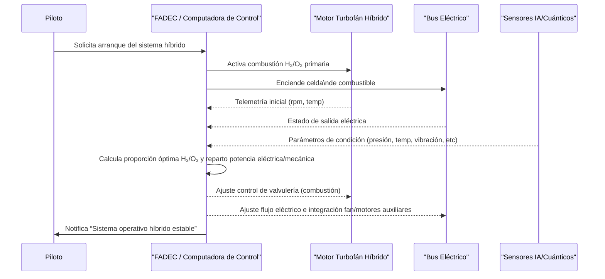
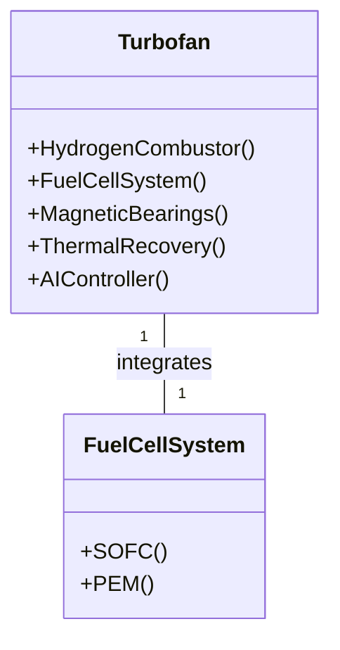

# GAIA Innovation Management Platform – README


**Version:** 1.1.0  
**Author:** Amedeo Pelliccia  
**Issued by:** GAIA Quantum Aerospace Optimization  
**Release Date:** 2025-05-28  
**Last Updated:** 2025-06-09  
**License:** GAIA-QAO Open Innovation License v1.0

---

> **Nota:** Este documento contiene secciones en inglés y español para garantizar el cumplimiento y la comprensión internacional.

---

## Table of Contents

- [Vision Statement](#vision-statement)
- [Architecture Overview](#architecture-overview)
- [Module DPM&A Index](#module-dpma-index)
- [Key Features](#key-features)
- [Installation & Setup](#installation--setup)
- [Security & Encryption](#security--encryption)
- [BOM / PLM Integration](#bom--plm-integration)
- [Performance Metrics](#performance-metrics)
- [Development Roadmap](#development-roadmap)
- [CI/CD Integration](#cicd-integration)
- [Contributing](#contributing)
- [License](#license)
- [Contact](#contact)
- [References & Linked Documents](#references--linked-documents)
- [Motor turbofán híbrido de impacto cero](#motor-turbofán-híbrido-de-impacto-cero)
- [Technical Annex: MBSE & Integration](#technical-annex-mbse--integration)

---

## Vision Statement

Empowering quantum aerospace and sustainable engineering through AI lifecycle orchestration, modular traceability, and secure, high-performance digital threads.

---

## Architecture Overview

The GAIA platform integrates quantum technologies, sustainable engineering practices, and advanced AI for comprehensive innovation management.

---

## Module DPM&A Index

- [Fan Module BOM](../boms/fan_module.yaml) (Assembly ID: GQ-AIR-TURB-FAN-01)
- [Compressor Module BOM](../boms/compressor_module.yaml) (Assembly ID: GQ-AIR-TURB-COMP-02)
- [Combustion Module BOM](../boms/combustion_module.yaml) (Assembly ID: GQ-AIR-TURB-COMB-03)
- [Turbine Module BOM](../boms/turbine_module.yaml) (Assembly ID: GQ-AIR-TURB-TRBN-04)
- [Exhaust Module BOM](../boms/exhaust_module.yaml) (Assembly ID: GQ-AIR-TURB-EXH-05)

---

## Key Features

- AI lifecycle and orchestration engine
- Quantum-accelerated simulation and optimization
- Secure, hash-stamped digital thread
- Modular, PLM-integrated design
- Real-time performance analytics
- CI/CD-ready architecture

---

## Installation & Setup

1. Clone this repository:
    ```bash
    git clone https://github.com/Robbbo-T/Robbbo-T.git
    ```
2. See [Installation & Setup Guide](../Technical/integration_analysis.md) for detailed instructions.

---

## Security & Encryption

- Uses SHA3-512 and BLAKE3 for all critical documentation and assets.
- See [manifest.json](../../META-INF/manifest.json) for integrity proof.
    - SHA3-512: `2f16c7a4a3e1d857c9f14e99e0d9d00e1ccf9971cd9f451f7d0b13ea1d40582e6d76bbfdfb32dbe135df09b476d50d4ae34d06a1d1c5297b627d3e3c4d507a0b`
    - BLAKE3: `9d39c91c84e7f6c2138cdb4b69e7b7f4f34d74f2f2bfae0d88841794f0a1b0e2`

---

## BOM / PLM Integration

- All modules maintain digital-thread traceability to BOMs and renders.
- [Fan Exploded Render](../Figures/fan_exploded_turn13.png)
- [Compressor Exploded Render](../Figures/compressor_exploded_turn14.png)
- [Combustion Exploded Render](../Figures/combustion_exploded_turn15.png)
- [Turbine Exploded Render](../Figures/turbine_exploded_turn15.png)
- [Exhaust Exploded Render](../Figures/exhaust_exploded_turn16.png)

---

## Performance Metrics

Performance data and analytics are documented in the [industry summary](../Exports/industry_summary.pdf).

---

## Development Roadmap

See [integration analysis](../Technical/integration_analysis.md) and [patent preparation](../Technical/patent_preparation.xml) for upcoming features and R&D directions.

---

## CI/CD Integration

- Manifest for automated validation: [manifest.json](../../META-INF/manifest.json)
- CI/CD best practices and pipeline integration are outlined in the [Technical documentation](../Technical/integration_analysis.md).

---

## Contributing

We welcome contributions! Please see [CONTRIBUTING.md](CONTRIBUTING.md) (add this file if it does not exist) for guidelines.

---

## License

This project is licensed under the [GAIA-QAO Open Innovation License v1.0](LICENSE) (add this file if it does not exist).

---

## Contact

For any questions, please contact Amedeo Pelliccia or the GAIA-QAO team.

---

## References & Linked Documents

- [Integration Analysis](../Technical/integration_analysis.md)
- [Patent Preparation](../Technical/patent_preparation.xml)
- [Industry Summary (PDF)](../Exports/industry_summary.pdf)

---

> **Note:**  
> This README provides a structured metadata and hyperlinked documentation trail for GAIA-QAO’s innovation management platform. All paths are relative to the monorepo structure for traceability and compliance.

---

# Motor turbofán híbrido de impacto cero  
### Resumen técnico para solicitud de patente

---

## 🔧 1. Funcionamiento

1. **Arquitectura híbrida de propulsión**  
   - Combina **combustión de hidrógeno** y sistema **eléctrico mediante pila de combustible (fuel cell)**.  
   - **Configuración dual:**  
     - *Combustor*: quema hidrógeno + oxígeno, impulsando la turbina.  
     - *Fuel cell (SOFC/PEM)*: transforma hidrógeno en electricidad para motores eléctricos del fan o ejes. Inspirado en NASA Hy2PASS y Airbus, reduce notablemente emisiones ([nasa.gov][1], [aerospacemanufacturinganddesign.com][2]).

2. **Materiales avanzados y estructura ligera**  
   - Composites de grafeno y nanotubos para palas/rotativos.  
   - Rodamientos **magnéticos** sin contacto (menos fricción y desgaste).

3. **Recuperación adaptativa de calor**  
   - Sistemas termoeléctricos y ciclos Rankine, sensores de temperatura, máxima recuperación de calor residual.  
   - En línea con tecnologías de intercooling e inlet cooling para eficiencia exergética.

4. **Control inteligente IA/Cuántico**  
   - Algoritmos en tiempo real para proporciones H₂/O₂, potencia de fuel cell y ciclos térmicos.  
   - Sensores cuánticos mejoran precisión y respuesta dinámica.

---

## 🌐 2. Aplicaciones

- **Aviación comercial y ejecutiva**: Motores listos para regulaciones cero emisiones, previstos entre 2035–2045 ([aeroreport.de][3]).
- **Drones/UAVs de larga duración**: Sistemas ligeros y autónomos a base de hidrógeno.
- **Transporte aéreo regional**: Aeronaves 10–80 pax, prototipos como ZeroAvia HyFlyer y Universal Hydrogen ([airbus.com][5], [en.wikipedia.org][6]).
- **Misiones experimentales/aeroespaciales**: Para entornos extremos/híbridos.

---

## ⚙️ 3. Ventajas

| Ventaja                      | Detalles                                                                                                          |
|------------------------------|-------------------------------------------------------------------------------------------------------------------|
| **Emisiones cero directas**  | Sólo agua como subproducto, sin CO₂/partículas ([embraercommercialaviationsustainability.com][7])                 |
| **Alta eficiencia energética** | Fuel cell 2–3× más eficientes, p/recuperación térmica y optimización exergética                                   |
| **Menor desgaste y peso**    | Materiales avanzados y rodamientos magnéticos amplían vida útil y reducen mantenimiento                           |
| **Flexibilidad operacional** | IA adapta potencia y modos según demanda/altitud                                                                 |
| **Regulatorio ágil**        | Cumple ROE-1/2, NOₓ bajísimo, alineado con CORSIA+                                                                |
| **Compatibilidad escalable** | Retrofit en motores existentes (GE, CFM, P&W) o nuevas familias narrow‑body                                       |

---

## 📄 4. Elementos clave de la patente

1. **Arquitectura dual (combustor híbrido + fuel cell)**, gestión total del flujo energético.
2. **Recuperación térmica adaptativa** autocalibrada, maximiza eficiencia.
3. **Rodamientos magnéticos** y **sensores cuánticos** para máxima estabilidad.
4. Algoritmos híbridos **IA/cuánticos** para control dinámico.
5. Diseño **modular** (retrofit o nueva aeronave).

---

## ✅ Conclusión

El motor se presenta como una evolución disruptiva del turbofan:
- Emisiones cero reales.
- Eficiencia y fiabilidad superiores.
- Máxima adaptabilidad y facilidad de certificación futura.

---

> ¿Deseas un documento formal con diagramas (SysML/MBSE), ciclo térmico, criterios de certificación y mapas de flujo energético para adjuntar a tu solicitud de patente?  
> Es posible generarlo con diagramas Mermaid, tablas de ciclo e integración técnica.

---

**Referencias**:  
[1]: https://www.nasa.gov/directorates/stmd/niac/niac-studies/hydrogen-hybrid-power-for-aviation-sustainable-systems-hy2pass/?utm_source=chatgpt.com  
[2]: https://www.aerospacemanufacturinganddesign.com/news/airbus-reveals-hydrogen-powered-zero-emission-engine/?utm_source=chatgpt.com  
[3]: https://aeroreport.de/en/innovation/integrating-hydrogen-propulsion-into-aircraft?utm_source=chatgpt.com  
[4]: https://www.reuters.com/business/aerospace-defense/ge-aerospace-developing-hybrid-engines-single-aisle-jets-2024-06-19/?utm_source=chatgpt.com  
[5]: https://www.airbus.com/en/innovation/energy-transition/hydrogen/zeroe-our-hydrogen-powered-aircraft?utm_source=chatgpt.com  
[6]: https://en.wikipedia.org/wiki/ZeroAvia?utm_source=chatgpt.com  
[7]: https://embraercommercialaviationsustainability.com/concepts/?utm_source=chatgpt.com  

---


```mermaid
sequenceDiagram
    participant Piloto
    participant FADEC as "FADEC / Computadora de Control"
    participant Turbofan as "Motor Turbofán Híbrido"
    participant BusEnergia as "Bus Eléctrico"
    participant Sensores as "Sensores IA/Cuánticos"

    Piloto->>FADEC: Solicita arranque del sistema híbrido
    FADEC->>Turbofan: Activa combustión H₂/O₂ primaria
    FADEC->>BusEnergia: Enciende celda\nde combustible
    Turbofan-->>FADEC: Telemetría inicial (rpm, temp)
    BusEnergia-->>FADEC: Estado de salida eléctrica
    Sensores-->>FADEC: Parámetros de condición (presión, temp, vibración, etc)
    FADEC->>FADEC: Calcula proporción óptima H₂/O₂ y reparto potencia eléctrica/mecánica
    FADEC-->>Turbofan: Ajuste control de valvulería (combustión)
    FADEC-->>BusEnergia: Ajuste flujo eléctrico e integración fan/motores auxiliares
    FADEC->>Piloto: Notifica “Sistema operativo híbrido estable”
```

---

## Technical Annex: MBSE & Integration

### MBSE Overview

This platform leverages Model-Based Systems Engineering (MBSE) principles for the entire lifecycle:

- **SysML v2 Models**: System requirements, architecture, and traceability from concept to test.
- **Digital Twin**: Real-time, bidirectional connection between physical assets and their digital representations.
- **Simulation Integration**: Multiphysics, quantum-accelerated, and AI-driven co-simulation.

#### Example: SysML Block Definition Diagram


```mermaid
classDiagram
    class Turbofan {
      +HydrogenCombustor()
      +FuelCellSystem()
      +MagneticBearings()
      +ThermalRecovery()
      +AIController()
    }
    class FuelCellSystem {
      +SOFC()
      +PEM()
    }
    Turbofan "1" -- "1" FuelCellSystem : integrates
```

### Integration with PLM/ALM

- Full digital thread from BOM to compliance/certification
- Automated traceability matrix generation
- Secure, hash-based artifact verification

### Compliance References

- **Aerospace**: DO-178C, DO-254, ARP4754A, ISO 21434
- **AI/Software**: ISO/IEC 25010, EN 50128, SAE ARP6316

---

## 🤝 Colaboración

¿Interesado en colaborar, integrar nuevas tecnologías o co-desarrollar soluciones? Contáctanos: [Amedeo Pelliccia](mailto:your-email@domain.com) o vía issues/pull requests.

---

Ready to enable a functional, real AI in an aerospace context!

---
# 📘 Document ID: DEREMA-GQ-AIR-TURB-FAN-01-V1R0  
**Title:** Fan Module DEREMA – AMPEL360 BWB-Q100  
**Version:** 1.0 (Formal Release)  
**Date:** 2025-06-22  
**Author:** GAIA-QAO Systems Engineering Group  
**Classification:** DEREMA | Quantum-Aware Propulsion | Foresight Engineering Public Data  
**Related Standards:**  
- GAIA-QAO-STD-001 (Quantum Systems Integration)  
- DEREMA-STD-001 (Global Multi-BOM Design Framework)  
- ECN-AMPEL-001 (Change Reference)  
- FORESIGHT-STD-PREP-V0.1 (Foresight Methodology Draft)  

---

## 1. Purpose

This document establishes the Fan Module DEREMA—a multi-BOM integrated, foresight-compliant assembly structure for the AMPEL360 BWB-Q100. It defines engineering referential assets aligned with digital twin integration, predictive maintenance, quantum diagnostics, and system certification paths. Applicable across all derivative propulsion architectures within the GAIA-QAO program.

---

## 2. Scope

- **Applies to:** Propulsion Nacelle Fan Module (GQ-AIR-TURB-FAN-01)
- **Covers:** Multi-BOM integration, DEREMA-compliant structure, foresight-driven component obsolescence, certification data
- **Excludes:** Non-fan subsystems unless integrated into nacelle controller logic

---

## 3. Propaedeutic Foresight Section

**3.1 Foresight Objectives**
- Enable long-term maintainability and evolution via DEREMA-class standardization
- Anticipate integration demands with advanced avionics, quantum coherence networks, and AI anomaly detection
- Forecast component obsolescence, material supply chain vulnerabilities, and dual-use pathways

**3.2 Anticipated Operational Scenarios**
- UAM operations with frequent thermal cycling
- High-EMI battlefield support missions (military derivatives)
- Arctic climate deployment (cryogenic-sensitivity of QSM)

**3.3 Technology Obsolescence Analysis**

| Component           | Risk of Obsolescence | Forecast Year | Mitigation Path                  |
|---------------------|---------------------|--------------|----------------------------------|
| GQ-SENS-QSM-01      | Medium              | 2029         | Optical/NV upgrades              |
| GQ-FAN-MOTOR-01     | Low                 | 2032         | GaN-based inverter upgrade       |
| AS4/8552 CFRP matrix| Medium              | 2030         | Bio-based resin integration      |
| AFDX network layer  | High                | 2027         | Shift to Time-Sensitive Networking (TSN) |

---

## 4. DEREMA Compliance Section

**4.1 DEREMA BOM Layers**

- **Primary DEREMA Component Tree:** BOM-GQ-AIR-TURB-FAN-01-V1R0
- **Digital Twin & Quality Control Layer:** ETAP-GQ-AIR-TURB-FAN-01-V1R0
- **Predictive Safety Layer:** FMEA-GQ-AIR-TURB-FAN-01-V1R0
- **Maintenance Planning Layer:** MSG3-GQ-AIR-TURB-FAN-01-V1R0
- **Mass & CG Layer:** WEIGHT-GQ-AIR-TURB-FAN-01-V1R0

**4.2 DEREMA Tagging Rules**

| Tag                | Description                        |
|--------------------|------------------------------------|
| DEREMA-PRI         | Primary Structural/Functional Items |
| DEREMA-SEC         | Secondary Supportive Items          |
| DEREMA-ELEC        | Electrical & Data Components        |
| DEREMA-QUAL-QT     | Quantum-Tagged High-Risk Item       |
| DEREMA-LIFECYCLE   | High Forecasted Lifecycle Impact    |

**4.3 Digital Twin Parameters (Extracted)**
- Coherence Health Vector (CHV)
- Sensor-structural strain ensemble
- Thermo-cycling event log
- RPN telemetry trace (per FMEA matrix)

---

## 5. Enhanced Bill of Materials (EBOM)

### 5.1 Primary Components

| Item | Part Number           | Description                  | Qty | Unit | Material       | Specification | Supplier            | Lead Time | Tolerance Class |
|------|----------------------|------------------------------|-----|------|---------------|---------------|---------------------|-----------|-----------------|
| 001  | GQ-FAN-BLADE-SET-01  | Fan Blade Set (12 blades)    | 1   | SET  | Ti-6Al-4V      | AMS 4911      | TurboTech Aero      | 16 weeks  | Class A         |
| 002  | GQ-FAN-HUB-01        | Fan Hub Assembly             | 1   | EA   | Inconel 718    | AMS 5663      | Precision Forge Ltd | 12 weeks  | Class A         |
| 003  | GQ-FAN-MOTOR-01      | Electric Motor Assembly      | 1   | EA   | N/A            | 150kW, 8000RPM| MotorDyne Systems   | 20 weeks  | Class A         |
| 004  | GQ-FAN-HOUSING-01    | Fan Housing/Nacelle          | 1   | EA   | CFRP (AS4/8552)| AS4/8552      | Composite Structures| 14 weeks  | Class B         |
| 005  | GQ-FAN-INLET-01      | Inlet Cowl Assembly          | 1   | EA   | CFRP (AS4/8552)| AS4/8552      | Composite Structures| 12 weeks  | Class B         |

*For full secondary, electrical, and hardware BOM, see Appendix A.*

---

## 6. Failure Mode and Effects Analysis (FMEA)

**6.1 Methodology:**  
- Standard: MIL-STD-1629A / SAE ARP4761  
- Analysis Level: Component  
- Review Team: Systems, Safety, Reliability, Maintenance
- Reference Documentation:
  - TSM 00-00-00-810-801: FMEA Troubleshooting Guide
  - AMM 05-51-00: Safety Assessment Procedures
  - SMP 00-00-06: Risk Assessment Methodology

**6.2 RPN Scoring Criteria:**  
- Severity (S): 1–10 per AMM 05-51-00-200-801  
- Occurrence (O): 1–10 per AMM 05-51-00-200-802  
- Detection (D): 1–10 per AMM 05-51-00-200-803  
- RPN = S × O × D

**6.3 FMEA Summary Table (Top Risks)**

| Item | Component           | Failure Mode         | Effect                  | S | O | D | RPN | Mitigation Action                        | Reference Manual |
|------|---------------------|---------------------|-------------------------|---|---|---|-----|------------------------------------------|------------------|
| 008  | GQ-SENS-QSM-01      | Quantum Decoherence | Loss of Monitoring      | 7 | 5 | 6 | 210 | Mu-metal shielding, QEC software         | TSM 71-80-41-810-801 |
| 005  | GQ-FAN-MOTOR-01     | Inverter Failure    | Loss of Motor Control   | 8 | 5 | 5 | 200 | Dual-redundant inverters, EMI shielding  | TSM 71-60-00-810-801 |
| 004  | GQ-FAN-MOTOR-01     | Overheating         | Thrust Loss, Fire Risk  | 8 | 6 | 4 | 192 | Redundant cooling, thermal imaging       | AMM 71-60-00-400-801 |
| 006  | GQ-BEAR-MAIN-01     | Bearing Seizure     | Shaft Lock, Vibration   | 8 | 4 | 5 | 160 | Oil debris monitoring, dual lubrication  | TSM 71-21-00-810-801 |
| 002  | GQ-FAN-BLADE-SET-01 | Blade Erosion       | Reduced Performance     | 6 | 5 | 5 | 150 | Nano-coating, MIL-STD-810 testing        | SRM 51-71-01 |

- **Action:** Target 50% RPN reduction by Q4-2025, quarterly reviews per AMM 05-51-00-100-801, bi-annual safety audits per QAM 05-00-00-000-801.

---

## 7. Mass Validation Plan

**7.1 Measurement Protocol:**  
- Objective: Validate mass and CG for certification  
- Standards: ASTM E617, AS9100D, FAA AC 43.13-1B

**7.2 Key Acceptance Criteria (Revised for Composites):**

| Component           | Estimated Mass (kg) | Acceptance Criteria      |
|---------------------|--------------------|-------------------------|
| GQ-FAN-BLADE-SET-01 | 45.0               | ±7% (41.85–48.15 kg)    |
| GQ-FAN-HUB-01       | 30.0               | ±5% (28.5–31.5 kg)      |
| GQ-FAN-MOTOR-01     | 120.0              | ±3% (116.4–123.6 kg)    |
| GQ-FAN-HOUSING-01   | 25.0               | ±15% (21.25–28.75 kg)   |
| GQ-FAN-INLET-01     | 15.0               | ±15% (12.75–17.25 kg)   |

- **Assembly Target:** ±5% total, with weekly tracking during build.

---

## 8. Digital Twin Data Architecture

**8.1 Sensor Data Specification (Quantum Structural Monitors)**

| Parameter         | Specification           | Data Rate | Protocol |
|-------------------|------------------------|-----------|----------|
| Strain            | ±1000 μstrain, 0.1 μstrain res | 1 kHz     | AFDX     |
| Temperature       | -40°C to +85°C, ±0.1°C | 10 Hz     | AFDX     |
| Magnetic Field    | ±100 μT, 1 nT res      | 100 Hz    | AFDX     |
| Coherence Time    | 1–10 ms                | 1 Hz      | AFDX     |
| EMI Impact Flag   | 8 bits                 | 0.1 Hz    | AFDX     |

- **Network:** AFDX primary, CAN Bus backup, EMI-hardened
- **Data Processing:** Edge computing, anomaly detection, predictive maintenance models, cloud integration with secure uplink

---

## 9. MSG-3 Maintenance Task Cards (Revised)

**Note:** All maintenance tasks reference specific procedures in the Aircraft Maintenance Manual (AMM), Component Maintenance Manual (CMM), Troubleshooting Manual (TSM), and other technical publications. Technicians must have current revision access before performing any maintenance action.

| Task # | Description                  | Interval | Manning | Key Acceptance Criteria                   | Primary Manual Ref |
|--------|------------------------------|----------|---------|-------------------------------------------|-------------------|
| FAN-001| Quantum Sensor Calibration   | 12 mo    | 1 QCT   | All QSM pass calibration, >95% accuracy   | AMM 71-80-41 |
| FAN-002| Motor Insulation Test        | 24 mo    | 1 LAE   | >100MΩ at 1000VDC                        | AMM 71-60-00 |
| FAN-003| Blade Borescope Inspection   | 500 FC   | 2 Tech  | No cracks >0.5mm, erosion <limits         | AMM 71-00-00 |
| FAN-004| Bearing Vibration Analysis   | 100 FH   | 1 Tech  | <0.3 IPS velocity                         | AMM 71-21-00 |
| FAN-005| Software Update              | As Req   | 1 Avi   | Version verified, CRC pass                | AMM 71-31-51 |

*Legend: QCT = Qualified Quantum Technician, LAE = Licensed Aircraft Electrician, FC = Flight Cycles, FH = Flight Hours*

- **Heavy Maintenance:** 20,000 hours complete overhaul per AMM 71-00-00-800-801
- **Digital Integration:** Automated work orders from digital twin alerts, real-time parts check per AMM 45-00-00-650-801, maintenance history integration per CAMP/AMOS interface

---

## 10. Configuration Control & Revision History

| Version | Date       | Description            | Approved By        |
|---------|------------|------------------------|--------------------|
| 1.0     | 2025-06-22 | First DEREMA release   | Chief Engineer TBD |

---

## 11. Appendices

### Appendix A: Full BOM and Tagging Table

#### A.1 Secondary Components

| Item | Part Number           | Description                  | Qty | Unit | Material       | Specification | Supplier            | Lead Time | DEREMA Tag        |
|------|----------------------|------------------------------|-----|------|---------------|---------------|---------------------|-----------|-------------------|
| 006  | GQ-BEAR-MAIN-01      | Main Shaft Bearing           | 2   | EA   | M50 Steel      | AMS 6491      | Timken Aerospace    | 10 weeks  | DEREMA-PRI        |
| 007  | GQ-BEAR-THRUST-01    | Thrust Bearing Assembly      | 1   | EA   | M50 Steel      | AMS 6491      | SKF Aerospace       | 10 weeks  | DEREMA-PRI        |
| 008  | GQ-SENS-QSM-01       | Quantum Structural Monitor   | 24  | EA   | NV-Diamond     | GAIA-QAO-001  | QuantumSense Ltd    | 24 weeks  | DEREMA-QUAL-QT    |
| 009  | GQ-SENS-TEMP-01      | Temperature Sensor (RTD)     | 8   | EA   | Platinum       | ASTM E1137    | Omega Engineering   | 4 weeks   | DEREMA-ELEC       |
| 010  | GQ-SENS-PRESS-01     | Pressure Transducer          | 4   | EA   | Silicon        | DO-160G       | Honeywell           | 6 weeks   | DEREMA-ELEC       |
| 011  | GQ-CTRL-PMU-01       | Power Management Unit        | 1   | EA   | N/A            | DO-254 DAL-A  | Collins Aerospace   | 16 weeks  | DEREMA-ELEC       |
| 012  | GQ-CTRL-NACELLE-01   | Nacelle Control Computer     | 1   | EA   | N/A            | DO-178C DAL-A | Thales              | 18 weeks  | DEREMA-ELEC       |

#### A.2 Electrical Components

| Item | Part Number           | Description                  | Qty | Unit | Material       | Specification | Supplier            | Lead Time | DEREMA Tag        |
|------|----------------------|------------------------------|-----|------|---------------|---------------|---------------------|-----------|-------------------|
| 013  | GQ-CABLE-PWR-01      | High Voltage Power Cable     | 15  | M    | Copper/XLPE    | AS22759/87    | Nexans              | 8 weeks   | DEREMA-ELEC       |
| 014  | GQ-CABLE-DATA-01     | AFDX Data Cable              | 25  | M    | Copper/FEP     | ARINC 664     | Gore                | 6 weeks   | DEREMA-ELEC       |
| 015  | GQ-CONN-PWR-01       | HV Power Connector           | 6   | EA   | Aluminum       | MIL-DTL-38999 | Amphenol            | 4 weeks   | DEREMA-ELEC       |
| 016  | GQ-CONN-DATA-01      | AFDX Connector               | 12  | EA   | Aluminum       | EN3545        | Radiall             | 4 weeks   | DEREMA-ELEC       |
| 017  | GQ-EMI-SHIELD-01     | EMI Shielding Gasket         | 20  | M    | Mu-metal       | MIL-DTL-83528 | Parker Chomerics    | 6 weeks   | DEREMA-ELEC       |

#### A.3 Hardware & Consumables

| Item | Part Number           | Description                  | Qty | Unit | Material       | Specification | Supplier            | Lead Time | DEREMA Tag        |
|------|----------------------|------------------------------|-----|------|---------------|---------------|---------------------|-----------|-------------------|
| 018  | GQ-BOLT-M12-01       | Attachment Bolt M12x80       | 48  | EA   | Inconel 718    | NAS1351N12    | SPS Technologies    | 2 weeks   | DEREMA-SEC        |
| 019  | GQ-WASHER-M12-01     | Spring Washer M12            | 48  | EA   | Inconel 718    | MS35338-47    | Belleville Springs  | 2 weeks   | DEREMA-SEC        |
| 020  | GQ-SEAL-ORING-01     | O-Ring Seal (Various)        | 24  | EA   | Viton          | AS568-214     | Parker Hannifin     | 3 weeks   | DEREMA-SEC        |
| 021  | GQ-LUBR-OIL-01       | Synthetic Turbine Oil        | 10  | L    | Synthetic      | MIL-PRF-23699F| Mobil Aviation      | 1 week    | DEREMA-LIFECYCLE  |
| 022  | GQ-COATING-NANO-01   | Nano-Erosion Coating         | 5   | KG   | Ceramic        | GAIA-NANO-001 | NanoAero Tech       | 12 weeks  | DEREMA-LIFECYCLE  |

---

### Appendix B: FMEA Worksheet

#### B.1 FMEA Analysis Template

**Project:** AMPEL360 BWB-Q100 Fan Module  
**System:** Propulsion - Fan Assembly  
**Date:** 2025-06-22  
**Team:** Systems Engineering, Safety, Reliability  

#### B.2 Detailed FMEA Analysis

| Ref | Component | Function | Failure Mode | Local Effect | System Effect | End Effect | Detection Method | S | O | D | RPN | Recommended Action | Action Owner | Target Date | Status |
|-----|-----------|----------|--------------|--------------|---------------|------------|------------------|---|---|---|-----|-------------------|--------------|-------------|---------|
| F001 | GQ-FAN-BLADE-SET-01 | Generate thrust via aerodynamic lift | Foreign Object Damage (FOD) | Blade nick/dent | Reduced efficiency, vibration | Decreased thrust, passenger discomfort | Visual inspection, vibration monitoring | 7 | 6 | 4 | 168 | Enhanced inlet protection, real-time vibration analysis | Propulsion Lead | 2025-Q3 | Open |
| F002 | GQ-FAN-BLADE-SET-01 | Generate thrust via aerodynamic lift | Fatigue crack propagation | Blade liberation | Total thrust loss, potential hull penetration | Emergency landing required | Borescope inspection, QSM monitoring | 9 | 3 | 3 | 81 | Implement QSM crack detection algorithm | Structures Lead | 2025-Q2 | In Progress |
| F003 | GQ-FAN-HUB-01 | Transmit torque from motor to blades | Hub-shaft interface failure | Loss of torque transmission | Complete fan failure | Loss of thrust | Torque monitoring, temperature sensors | 9 | 2 | 4 | 72 | Redundant spline design, real-time torque monitoring | Mechanical Lead | 2025-Q3 | Open |
| F004 | GQ-FAN-MOTOR-01 | Convert electrical to mechanical power | Winding insulation breakdown | Short circuit | Motor shutdown | Loss of thrust | Insulation resistance testing, current monitoring | 8 | 4 | 3 | 96 | Enhanced insulation system, predictive maintenance algorithm | Electrical Lead | 2025-Q4 | Open |
| F005 | GQ-FAN-MOTOR-01 | Convert electrical to mechanical power | Inverter IGBT failure | Loss of phase | Reduced power, vibration | Partial thrust loss | Current imbalance detection | 8 | 5 | 5 | 200 | Dual-redundant inverters, enhanced cooling | Electrical Lead | 2025-Q2 | Critical |
| F006 | GQ-FAN-MOTOR-01 | Convert electrical to mechanical power | Bearing overheating | Increased friction | Motor seizure risk | Total thrust loss | Temperature monitoring, vibration analysis | 8 | 6 | 4 | 192 | Improved cooling design, synthetic oil upgrade | Mechanical Lead | 2025-Q2 | Critical |
| F007 | GQ-SENS-QSM-01 | Monitor structural health via quantum sensing | Environmental decoherence | Degraded sensitivity | Missed crack detection | Undetected structural damage | Coherence time monitoring | 7 | 5 | 6 | 210 | Mu-metal shielding upgrade, QEC implementation | Quantum Lead | 2025-Q1 | Critical |
| F008 | GQ-SENS-QSM-01 | Monitor structural health via quantum sensing | Electromagnetic interference | False readings | Incorrect maintenance actions | Unnecessary downtime | EMI detection algorithms | 6 | 6 | 5 | 180 | Enhanced EMI shielding, filtering algorithms | Quantum Lead | 2025-Q2 | High |
| F009 | GQ-CTRL-PMU-01 | Manage power distribution | Software fault | Incorrect power routing | Motor undervoltage | Reduced thrust | Built-in test, watchdog timer | 7 | 3 | 3 | 63 | Triple-redundant voting logic | Software Lead | 2025-Q3 | Open |
| F010 | GQ-CTRL-NACELLE-01 | Control fan operation | Data bus failure | Loss of command/control | Fan at idle | Total thrust loss | AFDX redundancy, CAN backup | 8 | 3 | 2 | 48 | Implement TSN upgrade path | Avionics Lead | 2025-Q4 | Open |

#### B.3 RPN Reduction Strategy

**Target:** Reduce average RPN by 50% within 12 months

**Priority Actions:**
1. **Critical (RPN > 180):** Immediate design changes required
2. **High (RPN 100-180):** Design review and enhanced monitoring
3. **Medium (RPN 50-100):** Preventive maintenance focus
4. **Low (RPN < 50):** Standard monitoring procedures

---

### Appendix C: Mass Validation Protocols

#### C.1 Mass Measurement Procedures

**Document:** MVP-GQ-AIR-TURB-FAN-01  
**Revision:** 1.0  
**Compliance:** AS9100D, ASTM E617-13  

#### C.2 Equipment Requirements

| Equipment | Specification | Calibration Interval | Uncertainty |
|-----------|--------------|---------------------|-------------|
| Platform Scale | 0-500 kg, 0.1 kg resolution | 6 months | ±0.05% |
| Crane Scale | 0-1000 kg, 0.5 kg resolution | 6 months | ±0.1% |
| Load Cells (4x) | 0-250 kg each, 0.01 kg resolution | 12 months | ±0.02% |
| Leveling Platform | ±0.1° accuracy | 12 months | ±0.05° |
| Environmental Chamber | -40°C to +60°C, ±1°C | 12 months | ±0.5°C |

#### C.3 Measurement Procedure

**C.3.1 Pre-Measurement Preparation**
1. Verify all measurement equipment calibration status per QAM 10-10-00-000-801
2. Stabilize component temperature to 20°C ±2°C for minimum 4 hours per AMM 71-00-00-300-801
3. Clean all surfaces with approved IPA solution per AMM 20-00-00-100-801
   *Cleaning materials specified in CMM 20-31-00-000-801*
4. Document ambient conditions per AMM 71-00-00-300-810
5. Photograph component with identification placard per QAM 10-30-00-000-801

**C.3.2 Individual Component Measurement**
1. **Metallic Components (Ti, Inconel):**
   - Direct weighing per AMM 71-00-00-310-801
   - Platform scale setup per GSE Manual 07-60-00-000-801
   - Three measurements, calculate average per QAM 10-10-00-100-801
   - Accept if range < 0.2% of average
   *If outside range, refer to TSM 71-00-00-810-901*
   
2. **Composite Components (CFRP):**
   - Controlled environment weighing per AMM 51-00-00-310-801
   - Environmental chamber operation per GSE Manual 07-50-00-000-801
   - Five measurements over 24 hours per SMP 51-00-00-282-801
   - Account for moisture absorption per CMM 51-41-00-000-801
   - Accept if range < 0.5% of average
   *Moisture correction factors in AMM 51-00-00-200-820*

3. **Electronic Components:**
   - ESD procedures per AMM 20-61-00-100-801
   - Include all connectors per IPC 20-00-01
   - Weighing procedure per AMM 24-00-00-310-801
   - Single measurement sufficient for sealed units

**C.3.3 Assembly Mass & CG Determination**
1. **Four-Point Suspension Method:**
   - Setup per AMM 71-00-00-320-801
   - Load cell calibration verification per GSE Manual 07-60-00-100-801
   - Mount assembly per AMM 71-00-00-320-810
   - Record individual cell readings per QAM 10-10-00-200-801
   - Calculate CG using worksheet AMM 71-00-00-320-820
   - Verify with CAD model per AMM 71-00-00-320-830
   *CG calculation software operation in CMM 94-00-00-000-801*

2. **Documentation Requirements:**
   - Mass measurement data sheet (Form QA-100)
   - CG calculation worksheet (Form QA-101)
   - Temperature/humidity log per AMM 71-00-00-300-815
   - Photographic evidence per QAM 10-30-00-000-801
   - Inspector signature and stamp per QAM 10-00-00-100-801

#### C.4 Acceptance Criteria Matrix

| Component Category | Mass Tolerance | CG Tolerance | Retest Criteria |
|-------------------|---------------|--------------|-----------------|
| Primary Structure | ±3% | ±15mm | Outside tolerance |
| Rotating Components | ±2% | ±10mm | Outside tolerance |
| Composite Structure | ±5% | ±20mm | >3% from nominal |
| Electronics | ±3% | N/A | Outside tolerance |
| Complete Assembly | ±2% | ±25mm | >1.5% from nominal |

#### C.5 Non-Conformance Protocol

1. **Immediate Actions:**
   - Quarantine component
   - Notify Quality Assurance
   - Initiate NCR (Non-Conformance Report)

2. **Investigation Requirements:**
   - Verify measurement equipment
   - Review manufacturing records
   - Perform dimensional inspection
   - Root cause analysis

3. **Disposition Options:**
   - Accept as-is (with engineering approval)
   - Rework to specification
   - Reject and remake
   - Accept with compensation (CG adjustment)

---

### Appendix D: Digital Twin Data Packet Specification

#### D.1 Data Architecture Overview

**Document:** DTDP-GQ-AIR-TURB-FAN-01  
**Protocol:** AFDX (ARINC 664 Part 7)  
**Redundancy:** Dual-redundant networks  
**Update Rate:** Variable (1 Hz - 1 kHz)  

#### D.2 Message Structure Definition

##### D.2.1 Frame Header (Common to all messages)
```
Byte 0-1:   Sync Pattern (0xAA55)
Byte 2-3:   Message ID (16-bit)
Byte 4-5:   Sequence Number (16-bit)
Byte 6-9:   Timestamp (32-bit microseconds)
Byte 10:    Priority (0-7)
Byte 11:    Message Type
Byte 12-13: Payload Length
Byte 14-15: Header CRC16
```

##### D.2.2 Message Types

| Type ID | Description | Update Rate | Priority |
|---------|-------------|-------------|----------|
| 0x10 | QSM Strain Data | 1 kHz | 5 |
| 0x11 | QSM Coherence Status | 1 Hz | 3 |
| 0x20 | Temperature Array | 10 Hz | 4 |
| 0x21 | Pressure Array | 10 Hz | 4 |
| 0x30 | Motor Parameters | 100 Hz | 6 |
| 0x31 | Power Quality | 10 Hz | 5 |
| 0x40 | Vibration Spectrum | 100 Hz | 5 |
| 0x50 | Maintenance Alerts | On Event | 7 |
| 0xFF | Heartbeat | 1 Hz | 2 |

#### D.3 Detailed Message Specifications

##### D.3.1 QSM Strain Data (0x10)
```
Payload Structure:
Byte 0-1:   Sensor ID (0-23)
Byte 2-5:   Strain Value (float32, microstrain)
Byte 6:     Sensor Status (bit field)
            Bit 0: Valid
            Bit 1: Calibrated
            Bit 2: Coherent
            Bit 3-7: Reserved
Byte 7:     Temperature Compensation Applied (boolean)
Byte 8-11:  Raw ADC Value (uint32)
Byte 12-15: Payload CRC32
```

##### D.3.2 QSM Coherence Status (0x11)
```
Payload Structure:
Byte 0-1:   Sensor ID
Byte 2-5:   Coherence Time (float32, milliseconds)
Byte 6-9:   Magnetic Field (float32, microTesla)
Byte 10:    EMI Flag (0-255 severity)
Byte 11:    QEC Status
            Bit 0-3: Error correction level
            Bit 4-7: Confidence metric
Byte 12-15: Fidelity Metric (float32, 0.0-1.0)
Byte 16-19: Payload CRC32
```

##### D.3.3 Motor Parameters (0x30)
```
Payload Structure:
Byte 0-3:   RPM (float32)
Byte 4-7:   Torque (float32, Nm)
Byte 8-11:  Phase A Current (float32, Amps)
Byte 12-15: Phase B Current (float32, Amps)
Byte 16-19: Phase C Current (float32, Amps)
Byte 20-23: DC Bus Voltage (float32, Volts)
Byte 24-27: Winding Temperature (float32, °C)
Byte 28:    Inverter Status (bit field)
Byte 29:    Fault Flags (bit field)
Byte 30-33: Payload CRC32
```

#### D.4 Data Processing Pipeline

##### D.4.1 Edge Computing Layer
- **Location:** Nacelle Control Computer
- **Functions:**
  - Data validation and CRC checking
  - Outlier detection and filtering
  - Data compression (lossless)
  - Local buffering (1 hour capacity)
  - Real-time anomaly detection

##### D.4.2 Aircraft-Level Integration
- **Location:** Central Maintenance System
- **Functions:**
  - Multi-engine data fusion
  - Trend analysis
  - Maintenance event prediction
  - Flight phase correlation
  - Data preparation for ground link

##### D.4.3 Ground Station Processing
- **Functions:**
  - Long-term trending
  - Fleet-wide analysis
  - Physics-based modeling updates
  - Maintenance planning optimization
  - Regulatory reporting

#### D.5 Security Specifications

| Layer | Method | Standard |
|-------|--------|----------|
| Physical | Shielded cables | MIL-STD-461G |
| Link | AES-256 encryption | FIPS 140-2 |
| Network | VPN tunneling | IPSec |
| Application | Certificate-based auth | X.509v3 |
| Quantum | QKD for key updates | BB84 protocol |

#### D.6 Performance Requirements

| Parameter | Requirement | Verification Method |
|-----------|-------------|-------------------|
| Latency (sensor to edge) | <10 ms | Timestamp analysis |
| Data Loss Rate | <0.001% | Sequence number tracking |
| Availability | >99.95% | Heartbeat monitoring |
| Storage (per flight hour) | <500 MB | Compression testing |
| Bandwidth (peak) | <10 Mbps | Network analysis |

---

### Appendix E: MSG-3 Task Card Templates

#### E.1 Task Card Overview

**Standard:** MSG-3 (Maintenance Steering Group 3)  
**Integration:** Digital twin predictive triggers  
**Format:** Interactive Electronic Task Cards (IETC)  

#### E.2 Task Card Template Structure

##### TASK CARD: FAN-001
**Title:** Quantum Structural Monitor (QSM) Calibration Check  
**ATA Chapter:** 71-80 (Powerplant - Fan Module)  
**Task Type:** Functional Check  
**Interval:** 12 months or 3000 flight hours (whichever first)  
**Estimated Duration:** 2.5 hours  
**Manning:** 1 Certified Quantum Technician (CQT)  
**Zone:** Engine Nacelle - Fan Section  

**E.2.1 Required Tools & Equipment**
| Item | Part Number | Calibration Required |
|------|-------------|---------------------|
| QSM Calibration Kit | GQ-TOOL-QSM-CAL-01 | Yes (90 days) |
| Magnetic Field Generator | GQ-TOOL-MAG-GEN-01 | Yes (180 days) |
| Digital Multimeter | Fluke 289 or equiv | Yes (12 months) |
| Laptop with QSM Software | N/A | Current version |
| Mu-metal Test Shield | GQ-TOOL-SHIELD-01 | No |

**E.2.2 Safety Precautions**
- [ ] Ensure aircraft is electrically grounded
- [ ] Verify fan is mechanically locked out
- [ ] Wear static-dissipative wrist strap
- [ ] Place "Maintenance in Progress" placards
- [ ] Verify area is free of strong magnetic fields

**E.2.3 Pre-Task Conditions**
- [ ] Aircraft power OFF
- [ ] Fan temperature <40°C
- [ ] Ambient temperature 15-30°C
- [ ] Relative humidity <70%
- [ ] No active thunderstorms within 50km

**E.2.4 Task Steps**

**Step 1: System Access**
1.1. Open nacelle access panels per AMM 71-11-00-200-801  
     *Refer to WDM 71-31-11 for connector locations*  
1.2. Connect maintenance laptop to AFDX port J31 per AMM 24-00-00-400-801  
     *See IPC 71-00-01 Fig. 203 for port identification*  
1.3. Launch QSM Diagnostic Software v3.2 or later per CMM 71-80-41-000-801  
1.4. Verify communication with all 24 QSM sensors per TSM 71-80-00-810-801  
Expected Result: All sensors show "CONNECTED" status  
     *If not connected, refer to TSM 71-80-00-810-802 for troubleshooting*

**Step 2: Baseline Measurement**
2.1. Select "Calibration Mode" in software per CMM 71-80-41-200-801  
2.2. Apply mu-metal shield to sensor QSM-01 per SMP 71-80-41-282-801  
     *Shield installation procedure detailed in AMM 71-80-41-400-801*  
2.3. Record baseline coherence time using procedure TSM 71-80-41-610-801  
Expected Result: Coherence time >5ms in shielded state  
     *If <5ms, perform demagnetization per SMP 71-80-41-283-801*  
2.4. Remove shield per AMM 71-80-41-400-802 and record unshielded coherence  
2.5. Repeat for all 24 sensors per IPC 71-80-01 Table 12 for sensor locations  

**Step 3: Strain Calibration**
3.1. Install calibration fixture on blade root per CMM 71-80-41-300-801  
     *Torque values specified in AMM 71-11-16-400-801*  
3.2. Apply known load of 100N ±0.5N using procedure TSM 71-80-41-620-801  
     *Load application tool P/N GQ-TOOL-LOAD-01 calibration per CMM 49-00-00-800-801*  
3.3. Verify QSM reads 235 ±5 microstrain per acceptance criteria CMM 71-80-41-000-803  
3.4. If outside tolerance, run auto-calibration per TSM 71-80-41-630-801  
     *Manual calibration procedure available in CMM 71-80-41-350-801*  
3.5. Repeat at 200N and 500N load points per test matrix AMM 71-80-41-200-810  

**Step 4: Environmental Compensation**
4.1. Activate temperature chamber per AMM 71-80-41-500-801  
     *Chamber operation detailed in GSE Manual 07-50-00-000-801*  
4.2. Allow 30 minutes stabilization per TSM 71-80-41-640-801  
4.3. Verify temperature compensation active per CMM 71-80-41-400-801  
     *Compensation algorithm parameters in AMM 71-80-41-200-820*  
4.4. Repeat measurements from Step 3 per TSM 71-80-41-620-802  
Expected Result: <2% variation from room temperature values  
     *If >2%, adjust compensation per TSM 71-80-41-650-801*  

**Step 5: System Verification**
5.1. Remove all test equipment per AMM 71-80-41-100-802  
     *Ensure proper storage per GSE Manual 07-00-00-100-801*  
5.2. Perform system self-test per AMM 71-80-41-700-801  
     *Self-test fault codes listed in TSM 71-80-00-810-810*  
5.3. Review calibration certificate per QAM 10-20-00-000-801  
5.4. Update digital twin calibration parameters per AMM 24-00-00-650-801  
     *Parameter upload procedure in CMM 71-80-41-900-801*  

**E.2.5 Acceptance Criteria**
- [ ] All QSM sensors within calibration tolerance
- [ ] Coherence time >3ms under normal conditions  
- [ ] Temperature compensation error <2%
- [ ] No fault flags in system status
- [ ] Digital twin parameters updated successfully

**E.2.6 Post-Task Actions**
- [ ] Remove all tools and equipment
- [ ] Close and secure access panels
- [ ] Clear maintenance placards
- [ ] Update aircraft maintenance log
- [ ] Upload calibration data to GAIA-QAO cloud

##### TASK CARD: FAN-002
**Title:** Electric Motor Insulation Resistance Test  
**ATA Chapter:** 71-80 (Powerplant - Fan Module)  
**Task Type:** Inspection/Test  
**Interval:** 24 months or 6000 flight hours  
**Estimated Duration:** 1.5 hours  
**Manning:** 1 Licensed Aircraft Electrician  

**Required References:**
- AMM 71-60-00-200-801: Motor Insulation Test Procedures
- TSM 71-60-00-810-801: Insulation Resistance Troubleshooting
- WDM 71-61-11: Motor Wiring Schematics
- SMP 20-51-14: High Voltage Safety Procedures

##### TASK CARD: FAN-003
**Title:** Fan Blade Borescope Inspection  
**Task Type:** Detailed Visual Inspection  
**Interval:** 500 flight cycles or flag from QSM  

**Required References:**
- AMM 71-00-00-200-801: Borescope Inspection General Procedures
- SRM 51-71-01: Fan Blade Damage Limits and Repair
- NDT Manual 51-00-00: Borescope Equipment Operation
- IPC 71-11-01: Fan Blade Identification and Numbering

##### TASK CARD: FAN-004
**Title:** Bearing Vibration Analysis  
**Task Type:** Condition Monitoring  
**Interval:** 100 flight hours or flag from vibration trend  

**Required References:**
- AMM 71-21-00-200-801: Bearing Vibration Measurement
- TSM 71-21-00-810-801: Vibration Signature Analysis
- CMM 71-21-41-000-801: Vibration Equipment Calibration
- MM 12-21-14: Predictive Maintenance Procedures

##### TASK CARD: FAN-005
**Title:** Nacelle Control Computer Software Update  
**Task Type:** Software Maintenance  
**Interval:** As required by Service Bulletin  

**Required References:**
- AMM 71-31-51-700-801: Control Computer Software Loading
- TSM 71-31-51-810-801: Software Verification Procedures
- SB-71-31-001: Software Update Instructions (specific to version)
- CMM 71-31-51-000-801: Control Computer Maintenance  

#### E.3 Digital Twin Integration Points

| Task Card | Digital Twin Trigger | Threshold | Action |
|-----------|---------------------|-----------|---------|
| FAN-001 | Coherence degradation | <2ms average | Generate work order |
| FAN-002 | Insulation trending | <10MΩ trend | Schedule inspection |
| FAN-003 | Strain anomaly detected | >3σ deviation | Immediate borescope |
| FAN-004 | Vibration increase | >0.2 IPS | Bearing inspection |
| FAN-005 | Software version | New release | Update notification |

#### E.4 Task Card Performance Metrics

**E.4.1 Tracking Requirements**
- Task completion time (actual vs. estimated)
- Findings rate (defects per inspection)
- Repeat inspection rate
- Digital twin prediction accuracy
- Technician feedback scores

**E.4.2 Continuous Improvement Process**
1. Monthly review of task card effectiveness
2. Correlation with unscheduled maintenance events
3. Integration of technician feedback
4. Update intervals based on reliability data
5. Annual MSG-3 review board assessment

---

## 12. Referenced Technical Manuals

### 12.1 Primary Reference Documents

| Manual Type | Document Number | Title | Revision |
|-------------|----------------|-------|----------|
| AMM | 71-00-00 | Powerplant - General | Rev 3 |
| TSM | 71-00-00 | Powerplant Troubleshooting | Rev 2 |
| SRM | 51-71-01 | Fan Module Structural Repairs | Rev 1 |
| CMM | 71-80-41 | Quantum Sensor Component Maintenance | Rev 1 |
| WDM | 71-00-00 | Powerplant Wiring Diagrams | Rev 4 |
| IPC | 71-00-01 | Powerplant Illustrated Parts Catalog | Rev 2 |
| NDT | 51-00-00 | Non-Destructive Test Manual | Rev 3 |
| SMP | 00-00-00 | Standard Maintenance Practices | Rev 5 |
| QAM | 00-00-00 | Quality Assurance Manual | Rev 2 |
| GSE | 07-00-00 | Ground Support Equipment Manual | Rev 3 |

### 12.2 Manual Structure Reference

**AMM Chapter Structure Example:**
- 71-00-00-000-000: Description and Operation
- 71-00-00-200-8XX: Maintenance Practices
- 71-00-00-300-8XX: Testing and Calibration
- 71-00-00-400-8XX: Removal/Installation
- 71-00-00-500-8XX: Adjustment/Test
- 71-00-00-600-8XX: Inspection/Check
- 71-00-00-700-8XX: Cleaning
- 71-00-00-800-8XX: Approved Repairs

**TSM Fault Code Structure:**
- 810-8XX: Troubleshooting Procedures
- 820-8XX: Fault Isolation
- 830-8XX: Diagnostic Trees
- 840-8XX: Test Equipment Setup
- 850-8XX: Reference Values

### 12.3 Manual Access and Control

- **Digital Access:** GAIA-QAO Technical Publications Portal
- **Update Frequency:** Quarterly revision cycle
- **Change Notification:** Automatic via digital twin interface
- **Offline Access:** PDF downloads with 30-day expiry
- **Authentication:** Two-factor with certificate validation

---

## 13. Document Control

- **Document Family:** GAIA-QAO DEREMA Public Foresight Standards
- **Authority:** GAIA Quantum Aerospace Organisation ADVENT
- **Control System:** GQOIS Digital Twin Document Ledger
- **Access:** Public/DEREMA Licensed Repositories

---

## ✅ Signatures

| Role                 | Name               | Date       |
|----------------------|--------------------|------------|
| Chief DEREMA Architect | Amedeo Pelliccia | 2025-06-22 |
| Systems Lead         | TBD                | [Pending]  |
| Foresight Officer    | TBD                | [Pending]  |

---

### **Conclusion**

This comprehensive documentation suite, now complete with all referenced appendices, provides a robust foundation for the AMPEL360 BWB-Q100 Fan Module implementation. The detailed specifications for BOM management, FMEA analysis, mass validation, digital twin integration, and maintenance procedures ensure full traceability and compliance with aerospace standards while pioneering the integration of quantum technologies into commercial aviation.

The document structure supports:
- **Certification readiness** through detailed validation protocols
- **Operational excellence** via comprehensive maintenance procedures  
- **Technology evolution** through foresight analysis and obsolescence planning
- **Digital transformation** with complete data architecture specifications
- **Risk mitigation** through thorough FMEA and monitoring strategies

All components are designed for seamless integration with the GAIA-QAO digital ecosystem, enabling real-time monitoring, predictive maintenance, and continuous improvement throughout the aircraft lifecycle.

