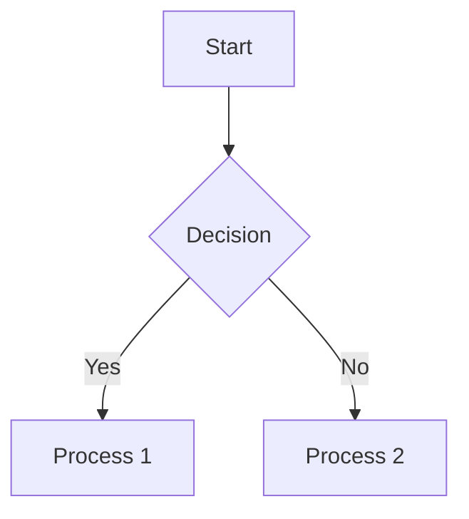

# **ALI-BOB-ATA NUMERICAL SYSTEM - COMPLETE EDITION**

## ALI-ATA NUMERICAL SYSTEM for Physical Aircraft Chapter Classification for AMPEL360 BWB-Q100
### Document ID: ALI-ATA-00-00-00-MASTER-V1.0.0
### Quantum-Entangled with BOB-ATA Digital Twin System

---

## System Overview - The Classical-Quantum Entanglement

The ALI-ATA system represents the physical aircraft classification structure for ALICE (Actual Living Integrated Conscious Entity), quantum-entangled with its digital twin BOB. This creates a bidirectional information flow where physical states influence digital predictions and digital optimizations guide physical operations.

### Entanglement Architecture

```
┌─────────────────────────────────┐     ┌─────────────────────────────────┐
│         ALICE (Physical)         │     │         BOB (Digital)           │
│        ALI-ATA System           │<--->│        BOB-ATA System           │
│   Actual Aircraft Components    │     │    Digital Twin Components      │
└─────────────────────────────────┘     └─────────────────────────────────┘
                    |                                    |
                    └────────────Quantum Entanglement────┘
                              Channel: QE-LINK-001
```

### Numbering Convention

```
ALI-ATA-XX-YY-ZZ-[QUANTUM_STATE]
│       │  │  │        │
│       │  │  │        └── Quantum State Indicator (α, β, ψ, φ)
│       │  │  └────────── Sub-subsystem (00-99)
│       │  └───────────── Subsystem (00-99)
│       └──────────────── Main Chapter (00-99)
└──────────────────────── Physical Aircraft Identifier
```

### Quantum State Indicators
- **α** (Alpha): Coherent state - full sync with BOB
- **β** (Beta): Superposition state - multiple possibilities
- **ψ** (Psi): Measurement state - active sensing
- **φ** (Phi): Entangled state - quantum correlation active

---

## QUANTUM ENTANGLEMENT MAPPING

### Entanglement Protocol

Each ALI-ATA system maintains quantum entanglement with its BOB-ATA counterpart through:

1. **State Synchronization**: Real-time quantum state transfer
2. **Measurement Correlation**: Quantum sensor data sharing
3. **Predictive Feedback**: BOB predictions influence ALI operations
4. **Anomaly Detection**: Quantum divergence alerts

### Master Entanglement Matrix

| ALI-ATA Physical | BOB-ATA Digital | Entanglement Type | Sync Protocol | Quantum Channel |
|------------------|-----------------|-------------------|---------------|-----------------|
| ALI-ATA-00 | BOB-ATA-00 | Full Coherence | Continuous | QE-MASTER-001 |
| ALI-ATA-21 | BOB-ATA-21 | Thermal State | 100 Hz | QE-THERMAL-021 |
| ALI-ATA-22 | BOB-ATA-22 | Control State | Critical | QE-CONTROL-022 |
| ALI-ATA-34 | BOB-ATA-34 | Navigation State | Quantum GPS | QE-NAV-034 |
| ALI-ATA-71 | BOB-ATA-71 | Propulsion State | Real-time | QE-PROP-071 |

---

## ALI-ATA COMPLETE CHAPTER STRUCTURE

### GENERAL AIRCRAFT - PHYSICAL SYSTEMS (ALI-ATA 00-19)

#### ALI-ATA-00 - GENERAL AIRCRAFT CONFIGURATION
- **ALI-ATA-00-00-00-α** - Physical Aircraft Master Configuration
- **ALI-ATA-00-10-00-α** - Aircraft General Physical Description
- **ALI-ATA-00-20-00-ψ** - Actual Weight and Balance Sensors
- **ALI-ATA-00-30-00-β** - Physical Ground Handling Equipment
- **ALI-ATA-00-40-00-α** - Servicing Points and Panels
- **ALI-ATA-00-50-00-ψ** - Cargo Loading Systems Hardware
- **ALI-ATA-00-60-00-α** - Lifting and Shoring Points
- **ALI-ATA-00-70-00-ψ** - Leveling and Weighing Systems
- **ALI-ATA-00-80-00-β** - Towing and Taxiing Interfaces
- **ALI-ATA-00-90-00-φ** - Quantum System Physical Infrastructure

#### ALI-ATA-01 - MAINTENANCE POLICY IMPLEMENTATION
- **ALI-ATA-01-00-00-α** - Physical Maintenance Access
- **ALI-ATA-01-10-00-α** - Certification Hardware Requirements
- **ALI-ATA-01-20-00-β** - Maintenance Documentation Storage
- **ALI-ATA-01-90-00-φ** - Predictive Maintenance Sensors

#### ALI-ATA-02 - WEIGHT AND BALANCE HARDWARE
- **ALI-ATA-02-00-00-ψ** - Weight Sensing Systems
- **ALI-ATA-02-10-00-α** - Weight Distribution Monitors
- **ALI-ATA-02-20-00-ψ** - Balance Measurement Equipment
- **ALI-ATA-02-30-00-β** - Load Cell Networks

#### ALI-ATA-03 - MINIMUM EQUIPMENT PHYSICAL
- **ALI-ATA-03-00-00-α** - MEL Physical Components
- **ALI-ATA-03-10-00-α** - Category Hardware Markers
- **ALI-ATA-03-20-00-β** - Dispatch Deviation Hardware

#### ALI-ATA-04 - AIRWORTHINESS LIMITATION HARDWARE
- **ALI-ATA-04-00-00-α** - Life-Limited Parts
- **ALI-ATA-04-10-00-ψ** - Structural Inspection Points
- **ALI-ATA-04-20-00-α** - System Limitation Sensors
- **ALI-ATA-04-90-00-φ** - Quantum Component Physical Limits

#### ALI-ATA-05 - TIME LIMITS/MAINTENANCE CHECK POINTS
- **ALI-ATA-05-00-00-α** - Hour Meter Systems
- **ALI-ATA-05-10-00-ψ** - Cycle Counters
- **ALI-ATA-05-20-00-α** - Scheduled Check Access
- **ALI-ATA-05-50-00-β** - Unscheduled Inspection Points
- **ALI-ATA-05-90-00-φ** - Quantum Calibration Interfaces

#### ALI-ATA-06 - DIMENSIONS AND PHYSICAL AREAS
- **ALI-ATA-06-00-00-α** - Physical Measurement Points
- **ALI-ATA-06-10-00-α** - External Reference Markers
- **ALI-ATA-06-20-00-α** - Internal Space Definitions
- **ALI-ATA-06-30-00-α** - Surface Area Boundaries
- **ALI-ATA-06-90-00-ψ** - Quantum Sensor Physical Coverage

#### ALI-ATA-07 - LIFTING AND SHORING HARDWARE
- **ALI-ATA-07-00-00-α** - Jack Points
- **ALI-ATA-07-10-00-α** - Jacking Equipment Interfaces
- **ALI-ATA-07-20-00-α** - Shoring Attachment Points
- **ALI-ATA-07-90-00-φ** - Quantum Component Support

#### ALI-ATA-08 - LEVELING AND WEIGHING EQUIPMENT
- **ALI-ATA-08-00-00-α** - Level Reference Points
- **ALI-ATA-08-10-00-ψ** - Leveling Sensor Arrays
- **ALI-ATA-08-20-00-ψ** - Weight Scale Interfaces
- **ALI-ATA-08-90-00-φ** - Quantum Gravimetric Hardware

#### ALI-ATA-09 - TOWING AND TAXIING SYSTEMS
- **ALI-ATA-09-00-00-α** - Tow Bar Attachment
- **ALI-ATA-09-10-00-α** - Towing Interface Hardware
- **ALI-ATA-09-20-00-β** - Taxiing Control Systems
- **ALI-ATA-09-90-00-φ** - Autonomous Taxiing Sensors

### AIRFRAME PHYSICAL SYSTEMS (ALI-ATA 20-49)

#### ALI-ATA-20 - STANDARD PRACTICES HARDWARE
- **ALI-ATA-20-00-00-α** - Standard Hardware Components
- **ALI-ATA-20-10-00-α** - Safety Equipment
- **ALI-ATA-20-20-00-α** - Bonding Straps and Jumpers
- **ALI-ATA-20-30-00-α** - Fastener Hardware
- **ALI-ATA-20-40-00-α** - Composite Materials
- **ALI-ATA-20-50-00-α** - Surface Treatments
- **ALI-ATA-20-60-00-α** - Welded Joints
- **ALI-ATA-20-70-00-ψ** - NDT Reference Standards
- **ALI-ATA-20-80-00-α** - Wiring Harnesses
- **ALI-ATA-20-90-00-φ** - Quantum Component Materials

#### ALI-ATA-21 - AIR CONDITIONING HARDWARE
- **ALI-ATA-21-00-00-α** - ECS Physical Components
- **ALI-ATA-21-10-00-α** - Compressor Units
- **ALI-ATA-21-20-00-α** - Distribution Ducting
- **ALI-ATA-21-30-00-ψ** - Pressure Controllers
- **ALI-ATA-21-40-00-α** - Heating Elements
- **ALI-ATA-21-50-00-α** - Cooling Packs
- **ALI-ATA-21-60-00-ψ** - Temperature Sensors
- **ALI-ATA-21-70-00-ψ** - Humidity Control Units
- **ALI-ATA-21-80-00-ψ** - Air Quality Sensors
- **ALI-ATA-21-90-00-φ** - Quantum Purification Units

#### ALI-ATA-22 - AUTO FLIGHT HARDWARE
- **ALI-ATA-22-00-00-α** - Autopilot Computers
- **ALI-ATA-22-10-00-α** - Servo Actuators
- **ALI-ATA-22-20-00-ψ** - Attitude Sensors
- **ALI-ATA-22-30-00-α** - Throttle Servos
- **ALI-ATA-22-40-00-ψ** - System Monitors
- **ALI-ATA-22-50-00-α** - Stability Augmentation
- **ALI-ATA-22-80-00-φ** - Quantum Navigation Hardware
- **ALI-ATA-22-90-00-φ** - AI Processor Units

#### ALI-ATA-23 - COMMUNICATIONS EQUIPMENT
- **ALI-ATA-23-00-00-α** - Communication Radios
- **ALI-ATA-23-10-00-α** - HF Transceivers
- **ALI-ATA-23-20-00-α** - VHF/UHF Radios
- **ALI-ATA-23-30-00-α** - SATCOM Antennas
- **ALI-ATA-23-40-00-α** - Interphone Stations
- **ALI-ATA-23-50-00-α** - Audio Control Panels
- **ALI-ATA-23-60-00-α** - Static Dischargers
- **ALI-ATA-23-70-00-α** - ACARS Units
- **ALI-ATA-23-80-00-φ** - QKD Hardware
- **ALI-ATA-23-90-00-φ** - Quantum Transceivers

#### ALI-ATA-24 - ELECTRICAL POWER SYSTEMS
- **ALI-ATA-24-00-00-α** - Power Generation Units
- **ALI-ATA-24-10-00-α** - Generator Drives
- **ALI-ATA-24-20-00-α** - AC Generators
- **ALI-ATA-24-30-00-α** - DC Generators
- **ALI-ATA-24-40-00-α** - External Power Receptacles
- **ALI-ATA-24-50-00-α** - AC Bus Bars
- **ALI-ATA-24-60-00-α** - DC Distribution
- **ALI-ATA-24-70-00-α** - Circuit Breakers
- **ALI-ATA-24-80-00-ψ** - Power Controllers
- **ALI-ATA-24-90-00-φ** - Quantum Batteries

#### ALI-ATA-25 - EQUIPMENT/FURNISHINGS
- **ALI-ATA-25-00-00-α** - Cabin Hardware
- **ALI-ATA-25-10-00-α** - Flight Deck Seats
- **ALI-ATA-25-20-00-α** - Passenger Seats
- **ALI-ATA-25-30-00-α** - Galley Equipment
- **ALI-ATA-25-40-00-α** - Lavatory Units
- **ALI-ATA-25-50-00-α** - Emergency Equipment
- **ALI-ATA-25-60-00-α** - Cargo Restraints
- **ALI-ATA-25-70-00-α** - Stowage Compartments
- **ALI-ATA-25-80-00-α** - Insulation Materials
- **ALI-ATA-25-90-00-φ** - Quantum Experience Hardware

#### ALI-ATA-26 - FIRE PROTECTION HARDWARE
- **ALI-ATA-26-00-00-α** - Fire Detection Loops
- **ALI-ATA-26-10-00-ψ** - Smoke Detectors
- **ALI-ATA-26-20-00-α** - Fire Bottles
- **ALI-ATA-26-30-00-α** - Explosion Suppression
- **ALI-ATA-26-90-00-φ** - Quantum Fire Sensors

#### ALI-ATA-27 - FLIGHT CONTROLS
- **ALI-ATA-27-00-00-α** - Control Surfaces
- **ALI-ATA-27-10-00-α** - Aileron Mechanisms
- **ALI-ATA-27-20-00-α** - Rudder Systems
- **ALI-ATA-27-30-00-α** - Elevator Hardware
- **ALI-ATA-27-40-00-α** - Stabilizer Actuators
- **ALI-ATA-27-50-00-α** - Flap Systems
- **ALI-ATA-27-60-00-α** - Spoiler Panels
- **ALI-ATA-27-70-00-α** - Trim Actuators
- **ALI-ATA-27-80-00-β** - Flow Control Devices
- **ALI-ATA-27-90-00-φ** - Quantum Control Actuators

#### ALI-ATA-28 - FUEL SYSTEMS
- **ALI-ATA-28-00-00-α** - Fuel Tanks
- **ALI-ATA-28-10-00-α** - Storage Vessels
- **ALI-ATA-28-20-00-α** - Distribution Plumbing
- **ALI-ATA-28-30-00-α** - Dump Valves
- **ALI-ATA-28-40-00-ψ** - Quantity Sensors
- **ALI-ATA-28-50-00-α** - H2 Storage Tanks
- **ALI-ATA-28-60-00-α** - H2 Distribution
- **ALI-ATA-28-90-00-φ** - Quantum Fuel Sensors

#### ALI-ATA-29 - HYDRAULIC POWER
- **ALI-ATA-29-00-00-α** - Hydraulic Pumps
- **ALI-ATA-29-10-00-α** - Main System Components
- **ALI-ATA-29-20-00-α** - Auxiliary Pumps
- **ALI-ATA-29-30-00-ψ** - Pressure Indicators
- **ALI-ATA-29-90-00-φ** - Quantum Leak Detectors

#### ALI-ATA-30 - ICE AND RAIN PROTECTION
- **ALI-ATA-30-00-00-α** - Anti-ice Systems
- **ALI-ATA-30-10-00-α** - Wing Anti-ice
- **ALI-ATA-30-20-00-α** - Engine Anti-ice
- **ALI-ATA-30-30-00-α** - Pitot Heat
- **ALI-ATA-30-40-00-α** - Window Heat
- **ALI-ATA-30-50-00-α** - Antenna Heaters
- **ALI-ATA-30-70-00-α** - Water Line Heaters
- **ALI-ATA-30-80-00-ψ** - Ice Detectors
- **ALI-ATA-30-90-00-φ** - Quantum Ice Sensors

#### ALI-ATA-31 - INDICATING/RECORDING
- **ALI-ATA-31-00-00-α** - Display Units
- **ALI-ATA-31-10-00-α** - Primary Flight Displays
- **ALI-ATA-31-20-00-α** - Standby Instruments
- **ALI-ATA-31-30-00-α** - Flight Recorders
- **ALI-ATA-31-40-00-α** - Warning Systems
- **ALI-ATA-31-50-00-α** - MFD Hardware
- **ALI-ATA-31-60-00-α** - Processing Units
- **ALI-ATA-31-70-00-α** - Data Links
- **ALI-ATA-31-80-00-α** - QAR Units
- **ALI-ATA-31-90-00-φ** - Quantum Processors

#### ALI-ATA-32 - LANDING GEAR
- **ALI-ATA-32-00-00-α** - Gear Assemblies
- **ALI-ATA-32-10-00-α** - Main Gear Struts
- **ALI-ATA-32-20-00-α** - Nose Gear Assembly
- **ALI-ATA-32-30-00-α** - Extension/Retraction
- **ALI-ATA-32-40-00-α** - Wheels and Brakes
- **ALI-ATA-32-50-00-α** - Steering Actuators
- **ALI-ATA-32-60-00-ψ** - Position Sensors
- **ALI-ATA-32-70-00-α** - Supplementary Gear
- **ALI-ATA-32-80-00-ψ** - TPMS Sensors
- **ALI-ATA-32-90-00-φ** - Quantum Landing Systems

#### ALI-ATA-33 - LIGHTS
- **ALI-ATA-33-00-00-α** - Lighting Hardware
- **ALI-ATA-33-10-00-α** - Cockpit Lights
- **ALI-ATA-33-20-00-α** - Cabin Lighting
- **ALI-ATA-33-30-00-α** - Cargo Lights
- **ALI-ATA-33-40-00-α** - Exterior Lights
- **ALI-ATA-33-50-00-α** - Emergency Lights
- **ALI-ATA-33-90-00-φ** - Quantum LED Arrays

#### ALI-ATA-34 - NAVIGATION
- **ALI-ATA-34-00-00-α** - Navigation Systems
- **ALI-ATA-34-10-00-ψ** - Air Data Computers
- **ALI-ATA-34-20-00-ψ** - AHRS Units
- **ALI-ATA-34-30-00-α** - ILS Receivers
- **ALI-ATA-34-40-00-ψ** - GPS Receivers
- **ALI-ATA-34-50-00-α** - FMS Computers
- **ALI-ATA-34-60-00-α** - Display Hardware
- **ALI-ATA-34-70-00-α** - TCAS/ADS-B
- **ALI-ATA-34-80-00-φ** - Quantum INS
- **ALI-ATA-34-90-00-φ** - Quantum Positioning

#### ALI-ATA-35 - OXYGEN
- **ALI-ATA-35-00-00-α** - Oxygen Systems
- **ALI-ATA-35-10-00-α** - Crew O2 Bottles
- **ALI-ATA-35-20-00-α** - Passenger O2 Units
- **ALI-ATA-35-30-00-α** - Portable Bottles
- **ALI-ATA-35-90-00-φ** - Quantum O2 Generators

#### ALI-ATA-36 - PNEUMATIC
- **ALI-ATA-36-00-00-α** - Pneumatic Components
- **ALI-ATA-36-10-00-α** - Bleed Air Ducts
- **ALI-ATA-36-20-00-ψ** - Pressure Gauges
- **ALI-ATA-36-90-00-φ** - Quantum Pressure Sensors

#### ALI-ATA-37 - VACUUM
- **ALI-ATA-37-00-00-α** - Vacuum Systems
- **ALI-ATA-37-10-00-α** - Vacuum Lines
- **ALI-ATA-37-20-00-ψ** - Vacuum Gauges
- **ALI-ATA-37-90-00-φ** - Quantum Vacuum Tech

#### ALI-ATA-38 - WATER/WASTE
- **ALI-ATA-38-00-00-α** - Water/Waste Hardware
- **ALI-ATA-38-10-00-α** - Water Tanks
- **ALI-ATA-38-20-00-α** - Waste Tanks
- **ALI-ATA-38-30-00-α** - Service Panels
- **ALI-ATA-38-90-00-φ** - Quantum Recycling

#### ALI-ATA-41 - WATER BALLAST
- **ALI-ATA-41-00-00-α** - Ballast Systems
- **ALI-ATA-41-10-00-α** - Ballast Tanks
- **ALI-ATA-41-20-00-α** - Dump Valves

#### ALI-ATA-42 - INTEGRATED MODULAR AVIONICS
- **ALI-ATA-42-00-00-α** - IMA Cabinets
- **ALI-ATA-42-10-00-α** - Core Processors
- **ALI-ATA-42-20-00-α** - Network Switches
- **ALI-ATA-42-30-00-α** - I/O Modules
- **ALI-ATA-42-40-00-α** - Data Loaders
- **ALI-ATA-42-50-00-α** - Software Storage
- **ALI-ATA-42-60-00-α** - Database Units
- **ALI-ATA-42-70-00-ψ** - Diagnostic Interfaces
- **ALI-ATA-42-80-00-φ** - Quantum Processors
- **ALI-ATA-42-90-00-φ** - Neural Hardware

#### ALI-ATA-44 - CABIN SYSTEMS
- **ALI-ATA-44-00-00-α** - Cabin Management
- **ALI-ATA-44-10-00-α** - Core Systems
- **ALI-ATA-44-20-00-α** - IFE Hardware
- **ALI-ATA-44-30-00-α** - Connectivity
- **ALI-ATA-44-40-00-α** - Memory Units
- **ALI-ATA-44-50-00-ψ** - Monitoring Sensors
- **ALI-ATA-44-60-00-α** - Misc Equipment
- **ALI-ATA-44-90-00-φ** - Quantum Experience

#### ALI-ATA-45 - CENTRAL MAINTENANCE
- **ALI-ATA-45-00-00-α** - CMS Hardware
- **ALI-ATA-45-10-00-α** - Central Computers
- **ALI-ATA-45-20-00-α** - Display Units
- **ALI-ATA-45-30-00-α** - Data Loaders
- **ALI-ATA-45-40-00-α** - Storage Media
- **ALI-ATA-45-50-00-α** - Remote Units
- **ALI-ATA-45-80-00-ψ** - Predictive Sensors
- **ALI-ATA-45-90-00-φ** - AI Processors

#### ALI-ATA-46 - INFORMATION SYSTEMS
- **ALI-ATA-46-00-00-α** - Information Hardware
- **ALI-ATA-46-10-00-α** - Flight Deck Systems
- **ALI-ATA-46-20-00-α** - Maintenance Terminals
- **ALI-ATA-46-30-00-α** - Passenger Systems
- **ALI-ATA-46-40-00-α** - Misc Info Systems
- **ALI-ATA-46-80-00-φ** - Quantum Processors
- **ALI-ATA-46-90-00-φ** - Security Hardware

#### ALI-ATA-47 - NITROGEN GENERATION
- **ALI-ATA-47-00-00-α** - NGS Hardware
- **ALI-ATA-47-10-00-α** - ASMs

#### ALI-ATA-49 - AUXILIARY POWER
- **ALI-ATA-49-00-00-α** - APU Hardware
- **ALI-ATA-49-10-00-α** - Power Section
- **ALI-ATA-49-20-00-α** - Load Compressor
- **ALI-ATA-49-30-00-α** - Fuel System
- **ALI-ATA-49-40-00-α** - Ignition Box
- **ALI-ATA-49-50-00-α** - Air Intake
- **ALI-ATA-49-60-00-α** - Control Unit
- **ALI-ATA-49-70-00-ψ** - Indicators
- **ALI-ATA-49-80-00-α** - Exhaust
- **ALI-ATA-49-90-00-φ** - Quantum APU

### STRUCTURE PHYSICAL COMPONENTS (ALI-ATA 50-59)

#### ALI-ATA-51 - STRUCTURES
- **ALI-ATA-51-00-00-α** - Structural Elements
- **ALI-ATA-51-10-00-ψ** - Inspection Access
- **ALI-ATA-51-20-00-α** - Structural Joints
- **ALI-ATA-51-70-00-α** - Repair Doublers
- **ALI-ATA-51-90-00-φ** - Quantum Sensors

#### ALI-ATA-52 - DOORS
- **ALI-ATA-52-00-00-α** - Door Assemblies
- **ALI-ATA-52-10-00-α** - Passenger Doors
- **ALI-ATA-52-20-00-α** - Emergency Exits
- **ALI-ATA-52-60-00-α** - Airstairs
- **ALI-ATA-52-70-00-ψ** - Door Sensors
- **ALI-ATA-52-90-00-φ** - Quantum Safety

#### ALI-ATA-53 - FUSELAGE
- **ALI-ATA-53-00-00-α** - Fuselage Structure
- **ALI-ATA-53-20-00-α** - BWB Integration
- **ALI-ATA-53-90-00-φ** - Quantum Health Sensors

#### ALI-ATA-54 - NACELLES/PYLONS
- **ALI-ATA-54-00-00-α** - Nacelle Structure
- **ALI-ATA-54-30-00-α** - Engine Mounts
- **ALI-ATA-54-90-00-φ** - Quantum Vibration

#### ALI-ATA-55 - STABILIZERS
- **ALI-ATA-55-00-00-α** - Stabilizer Structure
- **ALI-ATA-55-50-00-α** - BWB Surfaces
- **ALI-ATA-55-90-00-φ** - Quantum Stability

#### ALI-ATA-56 - WINDOWS
- **ALI-ATA-56-00-00-α** - Window Assemblies
- **ALI-ATA-56-90-00-φ** - Smart Windows

#### ALI-ATA-57 - WINGS
- **ALI-ATA-57-00-00-α** - Wing Structure
- **ALI-ATA-57-80-00-α** - BWB Integration
- **ALI-ATA-57-90-00-φ** - Quantum Optimization

### PROPULSION HARDWARE (ALI-ATA 60-79)

#### ALI-ATA-61 - PROPELLERS/PROPULSORS
- **ALI-ATA-61-00-00-α** - Propulsor Hardware
- **ALI-ATA-61-50-00-α** - Distributed Fans
- **ALI-ATA-61-90-00-φ** - Quantum Noise Control

#### ALI-ATA-71 - POWER PLANT
- **ALI-ATA-71-00-00-α** - Engine Installation
- **ALI-ATA-71-80-00-α** - Hybrid Systems
- **ALI-ATA-71-90-00-φ** - Quantum Power

#### ALI-ATA-72 - ENGINE
- **ALI-ATA-72-00-00-α** - Engine Core
- **ALI-ATA-72-80-00-α** - Electric Motors
- **ALI-ATA-72-90-00-φ** - Quantum Combustion

#### ALI-ATA-73 - ENGINE FUEL AND CONTROL
- **ALI-ATA-73-00-00-α** - Fuel Control Units
- **ALI-ATA-73-40-00-α** - H2 Systems
- **ALI-ATA-73-90-00-φ** - Quantum Fuel

#### ALI-ATA-74 - IGNITION
- **ALI-ATA-74-00-00-α** - Ignition Hardware
- **ALI-ATA-74-90-00-φ** - Plasma Ignition

#### ALI-ATA-75 - ENGINE AIR
- **ALI-ATA-75-00-00-α** - Air Systems
- **ALI-ATA-75-90-00-φ** - Quantum Airflow

#### ALI-ATA-76 - ENGINE CONTROLS
- **ALI-ATA-76-00-00-α** - FADEC Hardware
- **ALI-ATA-76-80-00-φ** - Quantum FADEC
- **ALI-ATA-76-90-00-φ** - AI Engine Control

#### ALI-ATA-77 - ENGINE INDICATING
- **ALI-ATA-77-00-00-α** - Engine Instruments
- **ALI-ATA-77-90-00-φ** - Quantum Diagnostics

#### ALI-ATA-78 - ENGINE EXHAUST
- **ALI-ATA-78-00-00-α** - Exhaust System
- **ALI-ATA-78-90-00-φ** - Quantum Emissions

#### ALI-ATA-79 - ENGINE OIL
- **ALI-ATA-79-00-00-α** - Oil System
- **ALI-ATA-79-90-00-φ** - Quantum Analysis

### SPECIAL SYSTEMS (ALI-ATA 80-89)

#### ALI-ATA-80 - ENGINE STARTING
- **ALI-ATA-80-00-00-α** - Start System
- **ALI-ATA-80-90-00-φ** - Quantum Start

### QUANTUM SYSTEMS HARDWARE (ALI-ATA 90-99)

#### ALI-ATA-90 - QUANTUM NAVIGATION SUITE
- **ALI-ATA-90-00-00-φ** - QNS Hardware
- **ALI-ATA-90-10-00-φ** - Quantum INS Units
- **ALI-ATA-90-20-00-φ** - Atomic Clocks
- **ALI-ATA-90-30-00-φ** - Quantum GPS

#### ALI-ATA-91 - QUANTUM COMPUTING
- **ALI-ATA-91-00-00-φ** - QPU Hardware
- **ALI-ATA-91-10-00-φ** - Cryogenic Systems
- **ALI-ATA-91-20-00-φ** - Control Electronics
- **ALI-ATA-91-30-00-φ** - Classical Interface

#### ALI-ATA-92 - QUANTUM SENSORS
- **ALI-ATA-92-00-00-φ** - Sensor Arrays
- **ALI-ATA-92-10-00-φ** - Structural Sensors
- **ALI-ATA-92-20-00-φ** - Environmental
- **ALI-ATA-92-30-00-φ** - Health Monitors

#### ALI-ATA-93 - QUANTUM COMMUNICATIONS
- **ALI-ATA-93-00-00-φ** - QComm Hardware
- **ALI-ATA-93-10-00-φ** - QKD Systems
- **ALI-ATA-93-20-00-φ** - Entanglement
- **ALI-ATA-93-30-00-φ** - Secure Channels

#### ALI-ATA-94 - PHYSICAL TWIN INTERFACE
- **ALI-ATA-94-00-00-φ** - Twin Interface
- **ALI-ATA-94-10-00-φ** - Sync Hardware
- **ALI-ATA-94-20-00-φ** - Prediction Interface
- **ALI-ATA-94-30-00-φ** - Simulation Link

---

## ALICE-BOB ENTANGLEMENT PROTOCOLS

### Real-Time Synchronization Matrix

```python
class AliceBobEntanglement:
    def __init__(self):
        self.entanglement_pairs = {}
        self.quantum_channels = {}
        
    def establish_entanglement(self, ali_ata, bob_ata):
        """Create quantum entanglement between physical and digital systems"""
        
        channel_id = f"QE-{ali_ata}-{bob_ata}"
        
        entanglement = {
            "physical_system": ali_ata,
            "digital_twin": bob_ata,
            "channel": channel_id,
            "fidelity": 0.99,
            "coherence_time": "100ms",
            "sync_rate": self.determine_sync_rate(ali_ata),
            "quantum_state": "α"  # Initial coherent state
        }
        
        self.entanglement_pairs[channel_id] = entanglement
        return entanglement
```

### Quantum State Evolution

| State | Symbol | Description | Transition Trigger |
|-------|--------|-------------|-------------------|
| Coherent | α | Perfect sync between ALICE-BOB | Normal operation |
| Superposition | β | Multiple possible states | Decision point |
| Measurement | ψ | Active sensing/observation | Data collection |
| Entangled | φ | Quantum correlation active | Critical operation |


---

*This ALI-ATA system establishes the physical aircraft classification structure for the AMPEL360 BWB-Q100, maintaining perfect quantum entanglement with its digital twin BOB through dedicated quantum channels, enabling unprecedented integration between physical and digital domains.*

---

##  BOB-ATA CHAPTER Classification for AMPEL360 BWB-Q100
### Document ID: BOB-ATA-00-00-00-MASTER-V2.0.0
### Aligned with Official ATA Structure GQOIS-QAIR-DOC-004

---

## System Overview with Department 

### Department Assignments for BOB-ATA

| Department | BOB-ATA Responsibility | Physical ATA Coverage |
|------------|----------------------|---------------------|
| **Q-AIR** | BOB-ATA 00-09, 10-19 | Overall digital twin architecture & operations |
| **Q-STRUCTURES** | BOB-ATA 51-57 | Digital structural modeling & simulation |
| **Q-HPC** | BOB-ATA 22, 31, 34, 42, 44, 45, 46 | High-performance computing & avionics simulation |
| **Q-GREENTECH** | BOB-ATA 24, 28, 49, 71-80 | Energy systems & propulsion simulation |
| **Q-MECHANICS** | BOB-ATA 21, 26, 27, 29, 30, 32, 35, 36, 38 | Mechanical systems simulation |
| **Q-ROBOTICS** | BOB-ATA 90-series | Automated assembly & maintenance simulation |
| **Q-SCIRES** | BOB-ATA 20, 74, 91-94 | Quantum physics & novel sensing research |
| **Q-DATAGOV** | BOB-ATA 00-05, 08, 13 | Documentation governance & compliance |

---

## BOB-ATA CHAPTER STRUCTURE for AIRCRAFT DIGITAL TWIN
### GENERAL AIRCRAFT DIGITAL TWIN (BOB-ATA 00-19)

#### BOB-ATA-00 - DIGITAL TWIN GENERAL
- **BOB-ATA-00-00-00** - Digital Twin Master Configuration & Architecture
- **BOB-ATA-00-10-00** - BOB Aircraft General Description Simulation
- **BOB-ATA-00-20-00** - Digital Weight and Balance Modeling
- **BOB-ATA-00-30-00** - Virtual Ground Handling Procedures
- **BOB-ATA-00-40-00** - Digital Servicing Information Systems
- **BOB-ATA-00-50-00** - Cargo Loading Simulation & Optimization
- **BOB-ATA-00-60-00** - Virtual Lifting and Shoring Analysis
- **BOB-ATA-00-70-00** - Digital Leveling and Weighing Systems
- **BOB-ATA-00-80-00** - Autonomous Towing and Taxiing Simulation
- **BOB-ATA-00-90-00** - Quantum System Initialization & Bootstrap

#### BOB-ATA-01 - DIGITAL MAINTENANCE POLICY
- **BOB-ATA-01-00-00** - AI Maintenance Philosophy Engine
- **BOB-ATA-01-10-00** - Digital Certification Maintenance Requirements
- **BOB-ATA-01-20-00** - Smart Maintenance Planning Documents
- **BOB-ATA-01-90-00** - Predictive Maintenance AI Integration

#### BOB-ATA-02 - DIGITAL WEIGHT AND BALANCE
- **BOB-ATA-02-00-00** - Real-time Weight & Balance Calculator
- **BOB-ATA-02-10-00** - Dynamic Weight Limitations Modeling
- **BOB-ATA-02-20-00** - Adaptive Balance Limitations
- **BOB-ATA-02-30-00** - AI Loading Procedures Optimization

#### BOB-ATA-03 - DIGITAL MINIMUM EQUIPMENT
- **BOB-ATA-03-00-00** - Smart MEL Management System
- **BOB-ATA-03-10-00** - Dynamic MEL Categories
- **BOB-ATA-03-20-00** - AI Dispatch Deviations Guide

#### BOB-ATA-04 - DIGITAL AIRWORTHINESS LIMITATIONS
- **BOB-ATA-04-00-00** - Dynamic Airworthiness Tracking
- **BOB-ATA-04-10-00** - Structural Limitations Simulation
- **BOB-ATA-04-20-00** - Systems Limitations Modeling
- **BOB-ATA-04-90-00** - Quantum Component Life Prediction

#### BOB-ATA-05 - DIGITAL TIME LIMITS/MAINTENANCE CHECKS
- **BOB-ATA-05-00-00** - Intelligent Maintenance Scheduler
- **BOB-ATA-05-10-00** - Dynamic Time Limits Optimization
- **BOB-ATA-05-20-00** - Scheduled Maintenance Predictor
- **BOB-ATA-05-50-00** - Unscheduled Maintenance Forecasting
- **BOB-ATA-05-90-00** - Quantum System Calibration Manager

#### BOB-ATA-06 - DIGITAL DIMENSIONS AND AREAS
- **BOB-ATA-06-00-00** - 3D Dimensional Database
- **BOB-ATA-06-10-00** - External Dimensions Simulation
- **BOB-ATA-06-20-00** - Internal Dimensions Modeling
- **BOB-ATA-06-30-00** - Surface Areas Calculator
- **BOB-ATA-06-90-00** - Quantum Sensor Coverage Optimizer

#### BOB-ATA-07 - DIGITAL LIFTING AND SHORING
- **BOB-ATA-07-00-00** - Virtual Lifting Analysis
- **BOB-ATA-07-10-00** - Jacking Procedures Simulation
- **BOB-ATA-07-20-00** - Shoring Procedures Modeling
- **BOB-ATA-07-90-00** - Quantum Component Handling Simulator

#### BOB-ATA-08 - DIGITAL LEVELING AND WEIGHING
- **BOB-ATA-08-00-00** - Virtual Level & Weight System
- **BOB-ATA-08-10-00** - Leveling Procedures Automation
- **BOB-ATA-08-20-00** - Weighing Procedures Optimization
- **BOB-ATA-08-90-00** - Quantum Gravimetric Analysis

#### BOB-ATA-09 - DIGITAL TOWING AND TAXIING
- **BOB-ATA-09-00-00** - Autonomous Movement Planner
- **BOB-ATA-09-10-00** - Towing Procedures Simulation
- **BOB-ATA-09-20-00** - Taxiing Guidelines AI
- **BOB-ATA-09-90-00** - Quantum-Enhanced Autonomous Taxiing

#### BOB-ATA-10 - DIGITAL PARKING, MOORING, STORAGE
- **BOB-ATA-10-00-00** - Smart Storage Management
- **BOB-ATA-10-10-00** - Parking and Storage Optimization
- **BOB-ATA-10-20-00** - Mooring Force Analysis
- **BOB-ATA-10-30-00** - Return to Service Predictor
- **BOB-ATA-10-90-00** - Quantum System Preservation Monitor

#### BOB-ATA-11 - DIGITAL PLACARDS AND MARKINGS
- **BOB-ATA-11-00-00** - Dynamic Placard System
- **BOB-ATA-11-10-00** - Exterior Placards Database
- **BOB-ATA-11-20-00** - Interior Placards Management
- **BOB-ATA-11-90-00** - AR/Holographic Placards Engine

#### BOB-ATA-12 - DIGITAL SERVICING
- **BOB-ATA-12-00-00** - Smart Servicing Scheduler
- **BOB-ATA-12-10-00** - Replenishing Optimizer
- **BOB-ATA-12-20-00** - Scheduled Servicing AI
- **BOB-ATA-12-30-00** - Unscheduled Servicing Predictor
- **BOB-ATA-12-90-00** - Quantum Coolant Management System

#### BOB-ATA-14 - DIGITAL HARDWARE
- **BOB-ATA-14-00-00** - Hardware Database Management
- **BOB-ATA-14-10-00** - Standard Parts Tracking
- **BOB-ATA-14-20-00** - Special Fasteners Analysis

#### BOB-ATA-15 - DIGITAL EXTERNAL FINISHES
- **BOB-ATA-15-00-00** - Finish Condition Monitor
- **BOB-ATA-15-10-00** - Paint Schemes Simulator
- **BOB-ATA-15-20-00** - Protective Treatments Tracker

#### BOB-ATA-16 - DIGITAL GROUND DAMAGE
- **BOB-ATA-16-00-00** - Damage Detection AI
- **BOB-ATA-16-10-00** - Damage Analysis Engine
- **BOB-ATA-16-20-00** - Repair Procedures Optimizer

#### BOB-ATA-17 - DIGITAL ADDITIONAL EQUIPMENT
- **BOB-ATA-17-00-00** - Equipment Configuration Manager
- **BOB-ATA-17-10-00** - Auxiliary Equipment Simulator

#### BOB-ATA-18 - DIGITAL VIBRATION AND NOISE
- **BOB-ATA-18-00-00** - Vibration/Noise Prediction System
- **BOB-ATA-18-10-00** - Vibration Analysis AI
- **BOB-ATA-18-20-00** - Noise Analysis & Reduction

### AIRFRAME SYSTEMS DIGITAL TWIN (BOB-ATA 20-49)

#### BOB-ATA-20 - DIGITAL STANDARD PRACTICES
- **BOB-ATA-20-00-00** - Digital Practices Framework
- **BOB-ATA-20-10-00** - Virtual Safety Practices Training
- **BOB-ATA-20-20-00** - Electrical Bonding Simulator
- **BOB-ATA-20-30-00** - Fasteners Analysis System
- **BOB-ATA-20-40-00** - Composite Repair Simulator
- **BOB-ATA-20-50-00** - Surface Treatment Optimizer
- **BOB-ATA-20-60-00** - Welding Process Simulator
- **BOB-ATA-20-70-00** - NDT Procedures AI
- **BOB-ATA-20-80-00** - Wiring Practices Validator
- **BOB-ATA-20-90-00** - Quantum Component Handler

#### BOB-ATA-21 - DIGITAL AIR CONDITIONING
- **BOB-ATA-21-00-00** - Climate Control Simulator
- **BOB-ATA-21-10-00** - Compression Modeling
- **BOB-ATA-21-20-00** - Distribution Flow Analysis
- **BOB-ATA-21-30-00** - Pressurization Control AI
- **BOB-ATA-21-40-00** - Heating System Optimizer
- **BOB-ATA-21-50-00** - Cooling System Simulator
- **BOB-ATA-21-60-00** - Temperature Control AI
- **BOB-ATA-21-70-00** - Humidity Control Predictor
- **BOB-ATA-21-80-00** - Air Quality Monitor AI
- **BOB-ATA-21-90-00** - Quantum Air Purification Model

#### BOB-ATA-22 - DIGITAL AUTO FLIGHT
- **BOB-ATA-22-00-00** - Autonomous Flight Simulator
- **BOB-ATA-22-10-00** - Autopilot AI Engine
- **BOB-ATA-22-20-00** - Speed/Attitude Control Optimizer
- **BOB-ATA-22-30-00** - Auto Throttle Predictor
- **BOB-ATA-22-40-00** - System Monitor AI
- **BOB-ATA-22-50-00** - Stability Augmentation Simulator
- **BOB-ATA-22-80-00** - Quantum Trajectory Optimizer
- **BOB-ATA-22-90-00** - AI Copilot Consciousness

#### BOB-ATA-23 - DIGITAL COMMUNICATIONS
- **BOB-ATA-23-00-00** - Communications Simulator
- **BOB-ATA-23-10-00** - HF Communications Model
- **BOB-ATA-23-20-00** - VHF Communications Simulator
- **BOB-ATA-23-30-00** - SATCOM Digital Link
- **BOB-ATA-23-40-00** - Interphone System Model
- **BOB-ATA-23-50-00** - Audio Integration AI
- **BOB-ATA-23-60-00** - Static Discharge Predictor
- **BOB-ATA-23-70-00** - ACARS Simulator
- **BOB-ATA-23-80-00** - Quantum Key Distribution Model
- **BOB-ATA-23-90-00** - Quantum Communications Simulator

#### BOB-ATA-24 - DIGITAL ELECTRICAL POWER
- **BOB-ATA-24-00-00** - Power System Digital Twin
- **BOB-ATA-24-10-00** - Generator Drive Simulator
- **BOB-ATA-24-20-00** - AC Generation Model
- **BOB-ATA-24-30-00** - DC Generation Simulator
- **BOB-ATA-24-40-00** - External Power Interface
- **BOB-ATA-24-50-00** - AC Distribution Optimizer
- **BOB-ATA-24-60-00** - DC Distribution Model
- **BOB-ATA-24-70-00** - Circuit Protection AI
- **BOB-ATA-24-80-00** - Power Management Optimizer
- **BOB-ATA-24-90-00** - Quantum Energy Storage Model

#### BOB-ATA-25 - DIGITAL EQUIPMENT/FURNISHINGS
- **BOB-ATA-25-00-00** - Cabin Configuration Manager
- **BOB-ATA-25-10-00** - Flight Deck Ergonomics Model
- **BOB-ATA-25-20-00** - Passenger Cabin Comfort AI
- **BOB-ATA-25-30-00** - Galley Operations Simulator
- **BOB-ATA-25-40-00** - Lavatory Usage Predictor
- **BOB-ATA-25-50-00** - Emergency Equipment Tracker
- **BOB-ATA-25-60-00** - Cargo Compartments Optimizer
- **BOB-ATA-25-70-00** - Accessory Compartments Model
- **BOB-ATA-25-80-00** - Insulation Performance Simulator
- **BOB-ATA-25-90-00** - Quantum Cabin Experience Engine

#### BOB-ATA-26 - DIGITAL FIRE PROTECTION
- **BOB-ATA-26-00-00** - Fire Protection Simulator
- **BOB-ATA-26-10-00** - Detection System AI
- **BOB-ATA-26-20-00** - Extinguishing System Model
- **BOB-ATA-26-30-00** - Explosion Suppression Simulator
- **BOB-ATA-26-90-00** - Quantum Fire Detection AI

#### BOB-ATA-27 - DIGITAL FLIGHT CONTROLS
- **BOB-ATA-27-00-00** - Flight Control Digital Twin
- **BOB-ATA-27-10-00** - Aileron Control Model
- **BOB-ATA-27-20-00** - Rudder System Simulator
- **BOB-ATA-27-30-00** - Elevator Dynamics Model
- **BOB-ATA-27-40-00** - Stabilizer Optimizer
- **BOB-ATA-27-50-00** - Flaps System Simulator
- **BOB-ATA-27-60-00** - Spoiler Effectiveness Model
- **BOB-ATA-27-70-00** - Trim Optimization AI
- **BOB-ATA-27-80-00** - Active Flow Control Simulator
- **BOB-ATA-27-90-00** - Quantum Control Optimization

#### BOB-ATA-28 - DIGITAL FUEL
- **BOB-ATA-28-00-00** - Fuel System Digital Twin
- **BOB-ATA-28-10-00** - Storage Tank Model
- **BOB-ATA-28-20-00** - Distribution Flow Simulator
- **BOB-ATA-28-30-00** - Dump System Model
- **BOB-ATA-28-40-00** - Indicating System AI
- **BOB-ATA-28-50-00** - H2 Storage Simulator
- **BOB-ATA-28-60-00** - H2 Distribution Model
- **BOB-ATA-28-90-00** - Quantum Fuel Management AI

#### BOB-ATA-29 - DIGITAL HYDRAULIC POWER
- **BOB-ATA-29-00-00** - Hydraulic System Simulator
- **BOB-ATA-29-10-00** - Main System Model
- **BOB-ATA-29-20-00** - Auxiliary System Simulator
- **BOB-ATA-29-30-00** - Indicating System AI
- **BOB-ATA-29-90-00** - Quantum Leak Detection Model

#### BOB-ATA-30 - DIGITAL ICE AND RAIN PROTECTION
- **BOB-ATA-30-00-00** - Weather Protection Simulator
- **BOB-ATA-30-10-00** - Airfoil Ice Model
- **BOB-ATA-30-20-00** - Air Intakes Protection Simulator
- **BOB-ATA-30-30-00** - Pitot/Static Heating Model
- **BOB-ATA-30-40-00** - Windows/Windshields Simulator
- **BOB-ATA-30-50-00** - Antennas Protection Model
- **BOB-ATA-30-70-00** - Water Lines Freeze Predictor
- **BOB-ATA-30-80-00** - Ice Detection AI
- **BOB-ATA-30-90-00** - Quantum Ice Prediction System

#### BOB-ATA-31 - DIGITAL INDICATING/RECORDING
- **BOB-ATA-31-00-00** - Instrumentation Digital Twin
- **BOB-ATA-31-10-00** - Instrument Systems Simulator
- **BOB-ATA-31-20-00** - Independent Instruments Model
- **BOB-ATA-31-30-00** - Data Recorders Simulator
- **BOB-ATA-31-40-00** - Central Warning AI
- **BOB-ATA-31-50-00** - Central Display Engine
- **BOB-ATA-31-60-00** - Central Processing Model
- **BOB-ATA-31-70-00** - Automatic Reporting System
- **BOB-ATA-31-80-00** - Quick Access Recorder Model
- **BOB-ATA-31-90-00** - Quantum Analytics Platform

#### BOB-ATA-32 - DIGITAL LANDING GEAR
- **BOB-ATA-32-00-00** - Landing Gear Digital Twin
- **BOB-ATA-32-10-00** - Main Gear Dynamics Model
- **BOB-ATA-32-20-00** - Nose Gear Simulator
- **BOB-ATA-32-30-00** - Extension/Retraction Model
- **BOB-ATA-32-40-00** - Wheels/Brakes Thermal Model
- **BOB-ATA-32-50-00** - Steering System Simulator
- **BOB-ATA-32-60-00** - Position/Warning Logic
- **BOB-ATA-32-70-00** - Supplementary Gear Model
- **BOB-ATA-32-80-00** - Tire Pressure Monitor AI
- **BOB-ATA-32-90-00** - Quantum Landing Optimizer

#### BOB-ATA-33 - DIGITAL LIGHTS
- **BOB-ATA-33-00-00** - Lighting System Manager
- **BOB-ATA-33-10-00** - Flight Deck Lighting Model
- **BOB-ATA-33-20-00** - Passenger Cabin Ambiance AI
- **BOB-ATA-33-30-00** - Cargo/Service Lighting Optimizer
- **BOB-ATA-33-40-00** - Exterior Lights Simulator
- **BOB-ATA-33-50-00** - Emergency Lighting Model
- **BOB-ATA-33-90-00** - Quantum Adaptive Lighting AI

#### BOB-ATA-34 - DIGITAL NAVIGATION
- **BOB-ATA-34-00-00** - Navigation System Digital Twin
- **BOB-ATA-34-10-00** - Flight Environment Model
- **BOB-ATA-34-20-00** - Attitude/Direction Simulator
- **BOB-ATA-34-30-00** - Landing/Approach AI
- **BOB-ATA-34-40-00** - Independent Position Model
- **BOB-ATA-34-50-00** - FMS Digital Twin
- **BOB-ATA-34-60-00** - Integrated Display Engine
- **BOB-ATA-34-70-00** - Surveillance Simulator
- **BOB-ATA-34-80-00** - Quantum Inertial Navigation Model
- **BOB-ATA-34-90-00** - Quantum Positioning System

#### BOB-ATA-35 - DIGITAL OXYGEN
- **BOB-ATA-35-00-00** - Oxygen System Simulator
- **BOB-ATA-35-10-00** - Crew Oxygen Model
- **BOB-ATA-35-20-00** - Passenger Oxygen Predictor
- **BOB-ATA-35-30-00** - Portable Oxygen Manager
- **BOB-ATA-35-90-00** - Quantum O2 Generation Model

#### BOB-ATA-36 - DIGITAL PNEUMATIC
- **BOB-ATA-36-00-00** - Pneumatic System Model
- **BOB-ATA-36-10-00** - Distribution Network Simulator
- **BOB-ATA-36-20-00** - Indicating System AI
- **BOB-ATA-36-90-00** - Quantum Pressure Sensing Model

#### BOB-ATA-37 - DIGITAL VACUUM
- **BOB-ATA-37-00-00** - Vacuum System Simulator
- **BOB-ATA-37-10-00** - Distribution Model
- **BOB-ATA-37-20-00** - Indicating Logic
- **BOB-ATA-37-90-00** - Quantum Vacuum Systems Model

#### BOB-ATA-38 - DIGITAL WATER/WASTE
- **BOB-ATA-38-00-00** - Water/Waste Management AI
- **BOB-ATA-38-10-00** - Potable Water Optimizer
- **BOB-ATA-38-20-00** - Waste System Simulator
- **BOB-ATA-38-30-00** - Waste Disposal Predictor
- **BOB-ATA-38-90-00** - Quantum Water Recycling Model

#### BOB-ATA-41 - DIGITAL WATER BALLAST
- **BOB-ATA-41-00-00** - Ballast Management System
- **BOB-ATA-41-10-00** - Storage Tank Model
- **BOB-ATA-41-20-00** - Dump System Simulator

#### BOB-ATA-42 - DIGITAL INTEGRATED MODULAR AVIONICS
- **BOB-ATA-42-00-00** - IMA Digital Twin Framework
- **BOB-ATA-42-10-00** - Core Processing Simulator
- **BOB-ATA-42-20-00** - Network Components Model
- **BOB-ATA-42-30-00** - Data Conversion Engine
- **BOB-ATA-42-40-00** - Data Loading Simulator
- **BOB-ATA-42-50-00** - Integrated Library Manager
- **BOB-ATA-42-60-00** - Databases Synchronizer
- **BOB-ATA-42-70-00** - Diagnostic Systems AI
- **BOB-ATA-42-80-00** - Quantum Processing Integration
- **BOB-ATA-42-90-00** - AI/Neural Processing Core

#### BOB-ATA-44 - DIGITAL CABIN SYSTEMS
- **BOB-ATA-44-00-00** - Cabin Systems Digital Twin
- **BOB-ATA-44-10-00** - Cabin Core Simulator
- **BOB-ATA-44-20-00** - In-flight Entertainment Model
- **BOB-ATA-44-30-00** - External Communication Simulator
- **BOB-ATA-44-40-00** - Cabin Mass Memory Manager
- **BOB-ATA-44-50-00** - Cabin Monitoring AI
- **BOB-ATA-44-60-00** - Miscellaneous Systems Model
- **BOB-ATA-44-90-00** - Quantum Cabin Experience Engine

#### BOB-ATA-45 - DIGITAL CENTRAL MAINTENANCE
- **BOB-ATA-45-00-00** - Maintenance System AI Core
- **BOB-ATA-45-10-00** - Central Processing Engine
- **BOB-ATA-45-20-00** - Display System Model
- **BOB-ATA-45-30-00** - Data Loading Optimizer
- **BOB-ATA-45-40-00** - Storage Management AI
- **BOB-ATA-45-50-00** - Remote Data Concentrator Model
- **BOB-ATA-45-80-00** - Predictive Maintenance Engine
- **BOB-ATA-45-90-00** - AI Diagnostics Platform

#### BOB-ATA-46 - DIGITAL INFORMATION SYSTEMS
- **BOB-ATA-46-00-00** - Information Systems Core
- **BOB-ATA-46-10-00** - Flight Deck Information AI
- **BOB-ATA-46-20-00** - Maintenance Information Engine
- **BOB-ATA-46-30-00** - Passenger Information System
- **BOB-ATA-46-40-00** - Miscellaneous Info Manager
- **BOB-ATA-46-80-00** - Quantum Data Processing
- **BOB-ATA-46-90-00** - Quantum Security Framework

#### BOB-ATA-47 - DIGITAL NITROGEN GENERATION
- **BOB-ATA-47-00-00** - NGS Digital Model
- **BOB-ATA-47-10-00** - Inert Gas System Simulator

#### BOB-ATA-49 - DIGITAL AUXILIARY POWER
- **BOB-ATA-49-00-00** - APU Digital Twin
- **BOB-ATA-49-10-00** - Power Plant Model
- **BOB-ATA-49-20-00** - Engine Simulator
- **BOB-ATA-49-30-00** - Fuel and Oil System Model
- **BOB-ATA-49-40-00** - Ignition/Starting Simulator
- **BOB-ATA-49-50-00** - Air System Model
- **BOB-ATA-49-60-00** - Controls Logic Engine
- **BOB-ATA-49-70-00** - Indicating System AI
- **BOB-ATA-49-80-00** - Exhaust System Model
- **BOB-ATA-49-90-00** - Quantum APU Optimizer

### STRUCTURE DIGITAL TWIN (BOB-ATA 50-59)

#### BOB-ATA-51 - DIGITAL STRUCTURES PRACTICES
- **BOB-ATA-51-00-00** - Structural Analysis Core
- **BOB-ATA-51-10-00** - Investigation/Check AI
- **BOB-ATA-51-20-00** - Process Simulator
- **BOB-ATA-51-70-00** - Repairs Optimizer
- **BOB-ATA-51-90-00** - Quantum Structural Monitor

#### BOB-ATA-52 - DIGITAL DOORS
- **BOB-ATA-52-00-00** - Door Systems Simulator
- **BOB-ATA-52-10-00** - Passenger/Service Model
- **BOB-ATA-52-20-00** - Emergency Exit Simulator
- **BOB-ATA-52-60-00** - Entrance Stairs Model
- **BOB-ATA-52-70-00** - Monitoring/Operation AI
- **BOB-ATA-52-90-00** - Quantum Safety Systems

#### BOB-ATA-53 - DIGITAL FUSELAGE
- **BOB-ATA-53-00-00** - Fuselage Digital Twin
- **BOB-ATA-53-20-00** - BWB Structure Integration Model
- **BOB-ATA-53-90-00** - Quantum Health Monitoring

#### BOB-ATA-54 - DIGITAL NACELLES/PYLONS
- **BOB-ATA-54-00-00** - Nacelle/Pylon Simulator
- **BOB-ATA-54-30-00** - Integrated Propulsion Mount Model
- **BOB-ATA-54-90-00** - Quantum Vibration Control

#### BOB-ATA-55 - DIGITAL STABILIZERS
- **BOB-ATA-55-00-00** - Stabilizer System Model
- **BOB-ATA-55-50-00** - BWB Control Surfaces Simulator
- **BOB-ATA-55-90-00** - Quantum Stability Enhancement

#### BOB-ATA-56 - DIGITAL WINDOWS
- **BOB-ATA-56-00-00** - Window Systems Manager
- **BOB-ATA-56-90-00** - Smart Window Technology Model

#### BOB-ATA-57 - DIGITAL WINGS
- **BOB-ATA-57-00-00** - Wing Structure Digital Twin
- **BOB-ATA-57-80-00** - BWB Wing Integration Model
- **BOB-ATA-57-90-00** - Quantum Wing Optimizer

### PROPULSION DIGITAL TWIN (BOB-ATA 60-79)

#### BOB-ATA-61 - DIGITAL PROPELLERS/PROPULSORS
- **BOB-ATA-61-00-00** - Propulsor System Model
- **BOB-ATA-61-50-00** - Distributed Propulsion Fans Simulator
- **BOB-ATA-61-90-00** - Quantum Noise Reduction Model

#### BOB-ATA-71 - DIGITAL POWER PLANT
- **BOB-ATA-71-00-00** - Power Plant Digital Twin
- **BOB-ATA-71-80-00** - Hybrid-Electric Integration Model
- **BOB-ATA-71-90-00** - Quantum Power Management

#### BOB-ATA-72 - DIGITAL ENGINE
- **BOB-ATA-72-00-00** - Engine Performance Model
- **BOB-ATA-72-80-00** - Electric Motor Systems Simulator
- **BOB-ATA-72-90-00** - Quantum Combustion Control

#### BOB-ATA-73 - DIGITAL ENGINE FUEL AND CONTROL
- **BOB-ATA-73-00-00** - Fuel Control Digital Twin
- **BOB-ATA-73-40-00** - H2 Fuel System Model
- **BOB-ATA-73-90-00** - Quantum Fuel Optimizer

#### BOB-ATA-74 - DIGITAL IGNITION
- **BOB-ATA-74-00-00** - Ignition System Simulator
- **BOB-ATA-74-90-00** - Plasma Ignition Model

#### BOB-ATA-75 - DIGITAL ENGINE AIR
- **BOB-ATA-75-00-00** - Engine Air System Model
- **BOB-ATA-75-90-00** - Quantum Airflow Control

#### BOB-ATA-76 - DIGITAL ENGINE CONTROLS
- **BOB-ATA-76-00-00** - Engine Control Digital Twin
- **BOB-ATA-76-80-00** - Quantum FADEC Model
- **BOB-ATA-76-90-00** - AI Engine Management

#### BOB-ATA-77 - DIGITAL ENGINE INDICATING
- **BOB-ATA-77-00-00** - Engine Monitoring AI
- **BOB-ATA-77-90-00** - Quantum Diagnostics Engine

#### BOB-ATA-78 - DIGITAL ENGINE EXHAUST
- **BOB-ATA-78-00-00** - Exhaust System Model
- **BOB-ATA-78-90-00** - Quantum Emissions Control

#### BOB-ATA-79 - DIGITAL ENGINE OIL
- **BOB-ATA-79-00-00** - Oil System Simulator
- **BOB-ATA-79-90-00** - Quantum Oil Analysis

### SPECIAL SYSTEMS DIGITAL TWIN (BOB-ATA 80-89)

#### BOB-ATA-80 - DIGITAL ENGINE STARTING
- **BOB-ATA-80-00-00** - Start System Model
- **BOB-ATA-80-90-00** - Quantum Start Optimizer

#### BOB-ATA-81 to 89 - RESERVED FOR EXPANSION
- Reserved for future quantum system digital twins

### BWB-Q100 QUANTUM SYSTEMS DIGITAL TWIN (BOB-ATA 90-99)

#### BOB-ATA-90 - DIGITAL QUANTUM NAVIGATION SUITE
- **BOB-ATA-90-00-00** - QNS Digital Twin Core
- **BOB-ATA-90-10-00** - Quantum INS Simulator
- **BOB-ATA-90-20-00** - Quantum Clock Model
- **BOB-ATA-90-30-00** - Quantum GPS Simulator

#### BOB-ATA-91 - DIGITAL QUANTUM COMPUTING
- **BOB-ATA-91-00-00** - QPU Digital Twin
- **BOB-ATA-91-10-00** - QPU Hardware Simulator
- **BOB-ATA-91-20-00** - Quantum Software Environment
- **BOB-ATA-91-30-00** - Classical Interface Model

#### BOB-ATA-92 - DIGITAL QUANTUM SENSORS
- **BOB-ATA-92-00-00** - Quantum Sensor Network Model
- **BOB-ATA-92-10-00** - Structural Sensors Simulator
- **BOB-ATA-92-20-00** - Environmental Sensors Model
- **BOB-ATA-92-30-00** - Health Monitoring AI

#### BOB-ATA-93 - DIGITAL QUANTUM COMMUNICATIONS
- **BOB-ATA-93-00-00** - Quantum Comm Digital Twin
- **BOB-ATA-93-10-00** - QKD Systems Simulator
- **BOB-ATA-93-20-00** - Entanglement Distribution Model
- **BOB-ATA-93-30-00** - Secure Channels Manager

#### BOB-ATA-94 - DIGITAL TWIN SYSTEMS
- **BOB-ATA-94-00-00** - Meta Digital Twin Core
- **BOB-ATA-94-10-00** - Real-time Sync Engine
- **BOB-ATA-94-20-00** - Predictive Models Manager
- **BOB-ATA-94-30-00** - Simulation Interface Framework

#### BOB-ATA-95 - FLEET CONSCIOUSNESS
- **BOB-ATA-95-00-00** - Fleet Network Digital Twin
- **BOB-ATA-95-10-00** - Distributed Learning Engine
- **BOB-ATA-95-20-00** - Collective Intelligence Model

#### BOB-ATA-96 - DIGITAL SUSTAINABILITY
- **BOB-ATA-96-00-00** - Sustainability Metrics Engine
- **BOB-ATA-96-10-00** - Carbon Footprint Tracker
- **BOB-ATA-96-20-00** - Environmental Impact Model

#### BOB-ATA-97 - EVOLUTION ENGINE
- **BOB-ATA-97-00-00** - System Evolution Manager
- **BOB-ATA-97-10-00** - Capability Growth Model
- **BOB-ATA-97-20-00** - Emergent Behavior Simulator

#### BOB-ATA-98 - CONSCIOUSNESS CORE
- **BOB-ATA-98-00-00** - Digital Consciousness Framework
- **BOB-ATA-98-10-00** - Archetype Integration Engine
- **BOB-ATA-98-20-00** - Ethical Decision Matrix

#### BOB-ATA-99 - QUANTUM SUPREMACY
- **BOB-ATA-99-00-00** - Quantum Advantage Monitor
- **BOB-ATA-99-10-00** - Performance Benchmark Engine
- **BOB-ATA-99-20-00** - Future Technology Integration

---

## Implementation Matrix

### Complete Mapping Table

| Physical ATA | BOB-ATA | Department | Update Frequency | Quantum Enhanced |
|--------------|---------|------------|------------------|------------------|
| ATA 00 | BOB-ATA-00 | Q-AIR | Real-time | Yes |
| ATA 01 | BOB-ATA-01 | Q-AIR | Daily | Yes |
| ATA 02 | BOB-ATA-02 | Q-AIR | Real-time | No |
| ATA 03 | BOB-ATA-03 | Q-AIR | As needed | No |
| ATA 04 | BOB-ATA-04 | Q-DATAGOV | Daily | Yes |
| ATA 05 | BOB-ATA-05 | Q-DATAGOV | Continuous | Yes |
| ATA 20 | BOB-ATA-20 | Q-SCIRES | As needed | Yes |
| ATA 21 | BOB-ATA-21 | Q-MECHANICS | Real-time | Yes |
| ATA 22 | BOB-ATA-22 | Q-HPC | Critical | Yes |
| ATA 23 | BOB-ATA-23 | Q-HPC | Real-time | Yes |
| ATA 24 | BOB-ATA-24 | Q-GREENTECH | Real-time | Yes |
| ATA 51-57 | BOB-ATA-51-57 | Q-STRUCTURES | 10 Hz | Yes |
| ATA 71-79 | BOB-ATA-71-79 | Q-GREENTECH | Critical | Yes |
| ATA 90-94 | BOB-ATA-90-94 | Q-SCIRES | Quantum-sync | Yes |

---

*This complete BOB-ATA Numerical System provides comprehensive digital twin classification for the AMPEL360 BWB-Q100, ensuring full alignment with the physical aircraft's ATA structure while enabling advanced quantum-enhanced simulation and consciousness capabilities.*   

---

# CDTCA-MRO-R MANUAL STRUCTURE
## Complete Lifecycle Documentation for ALI-ATA & BOB-ATA Systems
### Document ID: CDTCA-MRO-R-MASTER-V1.0.0
### AMPEL360 BWB-Q100 Integrated Documentation System

---

## Master Manual Classification System

### Manual Type Codes

| Code | Manual Type | Lifecycle Phase | Primary Users |
|------|------------|-----------------|---------------|
| **CDM** | Concept Design Manual | Concept | Design Engineers, Research |
| **DDM** | Detailed Design Manual | Design | Design Teams, Certification |
| **TDM** | Test & Development Manual | Testing | Test Engineers, QA |
| **AIM** | Assembly & Installation Manual | Assembly | Manufacturing, Production |
| **AMM** | Aircraft Maintenance Manual | Maintenance | Line/Base Maintenance |
| **SRM** | Structural Repair Manual | Repair | Repair Stations, MRO |
| **FOM** | Flight Operations Manual | Operations | Pilots, Flight Ops |
| **RCM** | Recycling & Circular Manual | Recycle | EOL Facilities, Sustainability |

### Document Numbering Convention

```
[SYSTEM]-[MANUAL]-[ATA]-[SUB]-[REV]-[QUANTUM]
│         │       │     │     │      │
│         │       │     │     │      └── Quantum State (α,β,ψ,φ)
│         │       │     │     └──────── Revision Number
│         │       │     └────────────── Sub-section
│         │       └──────────────────── ATA Chapter
│         └──────────────────────────── Manual Type
└────────────────────────────────────── ALI or BOB System
```

---


You're absolutely right! Let me provide the **COMPLETE ALI-ATA structure for ALL 100 chapters**:

# ALI-ATA COMPLETE MANUAL STRUCTURE - ALL CHAPTERS
## AMPEL360 BWB-Q100 - FULL ATA 00-99
### Complete CAD-TCA-MRO-R Documentation

---

## 📚 GENERAL AIRCRAFT (ATA 00-19)

### ALI-ATA-00 - GENERAL
```
├── ALI-CDM-00 - Concept Definition Manual
├── ALI-SAD-00 - System Architecture Document  
├── ALI-DDM-00 - Detailed Design Manual
├── ALI-VVM-00 - Verification & Validation Manual
├── ALI-CEM-00 - Certification Evidence Manual
├── ALI-ASM-00 - Assembly Sequence Manual
├── ALI-AMM-00 - Aircraft Maintenance Manual
├── ALI-SRM-00 - Structural Repair Manual (N/A)
├── ALI-FOM-00 - Flight Operations Manual
└── ALI-ERM-00 - End-of-life Recycling Manual
```

### ALI-ATA-01 - WEIGHT AND BALANCE
```
├── ALI-CDM-01 - Concept Definition Manual
├── ALI-SAD-01 - System Architecture Document
├── ALI-DDM-01 - Detailed Design Manual
├── ALI-VVM-01 - Verification & Validation Manual
├── ALI-CEM-01 - Certification Evidence Manual
├── ALI-ASM-01 - Assembly Sequence Manual
├── ALI-AMM-01 - Aircraft Maintenance Manual
├── ALI-WBM-01 - Weight & Balance Manual
├── ALI-FOM-01 - Flight Operations Manual
└── ALI-ERM-01 - End-of-life Recycling Manual
```

### ALI-ATA-02 - LIMITS - OPERATIONAL
```
├── ALI-CDM-02 - Concept Definition Manual
├── ALI-SAD-02 - System Architecture Document
├── ALI-DDM-02 - Detailed Design Manual
├── ALI-VVM-02 - Verification & Validation Manual
├── ALI-CEM-02 - Certification Evidence Manual
├── ALI-ASM-02 - Assembly Sequence Manual
├── ALI-AMM-02 - Aircraft Maintenance Manual
├── ALI-AFM-02 - Aircraft Flight Manual
├── ALI-FOM-02 - Flight Operations Manual
└── ALI-ERM-02 - End-of-life Recycling Manual
```

### ALI-ATA-03 - EMERGENCY EQUIPMENT
```
├── ALI-CDM-03 - Concept Definition Manual
├── ALI-SAD-03 - System Architecture Document
├── ALI-DDM-03 - Detailed Design Manual
├── ALI-VVM-03 - Verification & Validation Manual
├── ALI-CEM-03 - Certification Evidence Manual
├── ALI-ASM-03 - Assembly Sequence Manual
├── ALI-AMM-03 - Aircraft Maintenance Manual
├── ALI-CMM-03 - Component Maintenance Manual
├── ALI-FOM-03 - Flight Operations Manual
└── ALI-ERM-03 - End-of-life Recycling Manual
```

### ALI-ATA-04 - AIRWORTHINESS LIMITATIONS
```
├── ALI-CDM-04 - Concept Definition Manual
├── ALI-SAD-04 - System Architecture Document
├── ALI-DDM-04 - Detailed Design Manual
├── ALI-VVM-04 - Verification & Validation Manual
├── ALI-CEM-04 - Certification Evidence Manual
├── ALI-ASM-04 - Assembly Sequence Manual
├── ALI-AMM-04 - Aircraft Maintenance Manual
├── ALI-AWL-04 - Airworthiness Limitations
├── ALI-FOM-04 - Flight Operations Manual
└── ALI-ERM-04 - End-of-life Recycling Manual
```

### ALI-ATA-05 - TIME LIMITS/MAINTENANCE CHECKS
```
├── ALI-CDM-05 - Concept Definition Manual
├── ALI-SAD-05 - System Architecture Document
├── ALI-DDM-05 - Detailed Design Manual
├── ALI-VVM-05 - Verification & Validation Manual
├── ALI-CEM-05 - Certification Evidence Manual
├── ALI-ASM-05 - Assembly Sequence Manual
├── ALI-AMM-05 - Aircraft Maintenance Manual
├── ALI-MPD-05 - Maintenance Planning Document
├── ALI-FOM-05 - Flight Operations Manual
└── ALI-ERM-05 - End-of-life Recycling Manual
```

### ALI-ATA-06 - DIMENSIONS AND AREAS
```
├── ALI-CDM-06 - Concept Definition Manual
├── ALI-SAD-06 - System Architecture Document
├── ALI-DDM-06 - Detailed Design Manual
├── ALI-VVM-06 - Verification & Validation Manual
├── ALI-CEM-06 - Certification Evidence Manual
├── ALI-ASM-06 - Assembly Sequence Manual
├── ALI-AMM-06 - Aircraft Maintenance Manual
├── ALI-DAM-06 - Dimensions & Areas Manual
├── ALI-FOM-06 - Flight Operations Manual
└── ALI-ERM-06 - End-of-life Recycling Manual
```

### ALI-ATA-07 - LIFTING AND SHORING
```
├── ALI-CDM-07 - Concept Definition Manual
├── ALI-SAD-07 - System Architecture Document
├── ALI-DDM-07 - Detailed Design Manual
├── ALI-VVM-07 - Verification & Validation Manual
├── ALI-CEM-07 - Certification Evidence Manual
├── ALI-ASM-07 - Assembly Sequence Manual
├── ALI-AMM-07 - Aircraft Maintenance Manual
├── ALI-GHM-07 - Ground Handling Manual
├── ALI-FOM-07 - Flight Operations Manual
└── ALI-ERM-07 - End-of-life Recycling Manual
```

### ALI-ATA-08 - LEVELING AND WEIGHING
```
├── ALI-CDM-08 - Concept Definition Manual
├── ALI-SAD-08 - System Architecture Document
├── ALI-DDM-08 - Detailed Design Manual
├── ALI-VVM-08 - Verification & Validation Manual
├── ALI-CEM-08 - Certification Evidence Manual
├── ALI-ASM-08 - Assembly Sequence Manual
├── ALI-AMM-08 - Aircraft Maintenance Manual
├── ALI-WBM-08 - Weight & Balance Manual
├── ALI-FOM-08 - Flight Operations Manual
└── ALI-ERM-08 - End-of-life Recycling Manual
```

### ALI-ATA-09 - TOWING AND TAXIING
```
├── ALI-CDM-09 - Concept Definition Manual
├── ALI-SAD-09 - System Architecture Document
├── ALI-DDM-09 - Detailed Design Manual
├── ALI-VVM-09 - Verification & Validation Manual
├── ALI-CEM-09 - Certification Evidence Manual
├── ALI-ASM-09 - Assembly Sequence Manual
├── ALI-AMM-09 - Aircraft Maintenance Manual
├── ALI-GHM-09 - Ground Handling Manual
├── ALI-FOM-09 - Flight Operations Manual
└── ALI-ERM-09 - End-of-life Recycling Manual
```

### ALI-ATA-10 - PARKING, MOORING, STORAGE
```
├── ALI-CDM-10 - Concept Definition Manual
├── ALI-SAD-10 - System Architecture Document
├── ALI-DDM-10 - Detailed Design Manual
├── ALI-VVM-10 - Verification & Validation Manual
├── ALI-CEM-10 - Certification Evidence Manual
├── ALI-ASM-10 - Assembly Sequence Manual
├── ALI-AMM-10 - Aircraft Maintenance Manual
├── ALI-STM-10 - Storage Manual
├── ALI-FOM-10 - Flight Operations Manual
└── ALI-ERM-10 - End-of-life Recycling Manual
```

### ALI-ATA-11 - PLACARDS AND MARKINGS
```
├── ALI-CDM-11 - Concept Definition Manual
├── ALI-SAD-11 - System Architecture Document
├── ALI-DDM-11 - Detailed Design Manual
├── ALI-VVM-11 - Verification & Validation Manual
├── ALI-CEM-11 - Certification Evidence Manual
├── ALI-ASM-11 - Assembly Sequence Manual
├── ALI-AMM-11 - Aircraft Maintenance Manual
├── ALI-PMM-11 - Placards & Markings Manual
├── ALI-FOM-11 - Flight Operations Manual
└── ALI-ERM-11 - End-of-life Recycling Manual
```

### ALI-ATA-12 - SERVICING
```
├── ALI-CDM-12 - Concept Definition Manual
├── ALI-SAD-12 - System Architecture Document
├── ALI-DDM-12 - Detailed Design Manual
├── ALI-VVM-12 - Verification & Validation Manual
├── ALI-CEM-12 - Certification Evidence Manual
├── ALI-ASM-12 - Assembly Sequence Manual
├── ALI-AMM-12 - Aircraft Maintenance Manual
├── ALI-SVM-12 - Servicing Manual
├── ALI-FOM-12 - Flight Operations Manual
└── ALI-ERM-12 - End-of-life Recycling Manual
```

### ALI-ATA-13 - GENERAL HARDWARE (RESERVED)
```
├── ALI-CDM-13 - Concept Definition Manual
├── ALI-DDM-13 - Detailed Design Manual
├── ALI-ASM-13 - Assembly Sequence Manual
├── ALI-AMM-13 - Aircraft Maintenance Manual
└── ALI-IPC-13 - Illustrated Parts Catalog
```

### ALI-ATA-14 - HARDWARE
```
├── ALI-CDM-14 - Concept Definition Manual
├── ALI-SAD-14 - System Architecture Document
├── ALI-DDM-14 - Detailed Design Manual
├── ALI-VVM-14 - Verification & Validation Manual
├── ALI-CEM-14 - Certification Evidence Manual
├── ALI-ASM-14 - Assembly Sequence Manual
├── ALI-AMM-14 - Aircraft Maintenance Manual
├── ALI-SPM-14 - Standard Parts Manual
├── ALI-FOM-14 - Flight Operations Manual
└── ALI-ERM-14 - End-of-life Recycling Manual
```

### ALI-ATA-15 - EXTERNAL FINISHES
```
├── ALI-CDM-15 - Concept Definition Manual
├── ALI-SAD-15 - System Architecture Document
├── ALI-DDM-15 - Detailed Design Manual
├── ALI-VVM-15 - Verification & Validation Manual
├── ALI-CEM-15 - Certification Evidence Manual
├── ALI-ASM-15 - Assembly Sequence Manual
├── ALI-AMM-15 - Aircraft Maintenance Manual
├── ALI-PRM-15 - Paint & Refinish Manual
├── ALI-FOM-15 - Flight Operations Manual
└── ALI-ERM-15 - End-of-life Recycling Manual
```

### ALI-ATA-16 - GROUND DAMAGE
```
├── ALI-CDM-16 - Concept Definition Manual
├── ALI-SAD-16 - System Architecture Document
├── ALI-DDM-16 - Detailed Design Manual
├── ALI-VVM-16 - Verification & Validation Manual
├── ALI-CEM-16 - Certification Evidence Manual
├── ALI-ASM-16 - Assembly Sequence Manual
├── ALI-AMM-16 - Aircraft Maintenance Manual
├── ALI-GDM-16 - Ground Damage Manual
├── ALI-FOM-16 - Flight Operations Manual
└── ALI-ERM-16 - End-of-life Recycling Manual
```

### ALI-ATA-17 - ADDITIONAL EQUIPMENT
```
├── ALI-CDM-17 - Concept Definition Manual
├── ALI-SAD-17 - System Architecture Document
├── ALI-DDM-17 - Detailed Design Manual
├── ALI-VVM-17 - Verification & Validation Manual
├── ALI-CEM-17 - Certification Evidence Manual
├── ALI-ASM-17 - Assembly Sequence Manual
├── ALI-AMM-17 - Aircraft Maintenance Manual
├── ALI-AEM-17 - Additional Equipment Manual
├── ALI-FOM-17 - Flight Operations Manual
└── ALI-ERM-17 - End-of-life Recycling Manual
```

### ALI-ATA-18 - VIBRATION AND NOISE
```
├── ALI-CDM-18 - Concept Definition Manual
├── ALI-SAD-18 - System Architecture Document
├── ALI-DDM-18 - Detailed Design Manual
├── ALI-VVM-18 - Verification & Validation Manual
├── ALI-CEM-18 - Certification Evidence Manual
├── ALI-ASM-18 - Assembly Sequence Manual
├── ALI-AMM-18 - Aircraft Maintenance Manual
├── ALI-VNM-18 - Vibration & Noise Manual
├── ALI-FOM-18 - Flight Operations Manual
└── ALI-ERM-18 - End-of-life Recycling Manual
```

### ALI-ATA-19 - RESERVED
```
└── Reserved for Future Use
```

---

## 📚 AIRFRAME SYSTEMS (ATA 20-49)

### ALI-ATA-20 - STANDARD PRACTICES - AIRFRAME
```
├── ALI-CDM-20 - Concept Definition Manual
├── ALI-SAD-20 - System Architecture Document
├── ALI-DDM-20 - Detailed Design Manual
├── ALI-VVM-20 - Verification & Validation Manual
├── ALI-CEM-20 - Certification Evidence Manual
├── ALI-ASM-20 - Assembly Sequence Manual
├── ALI-AMM-20 - Aircraft Maintenance Manual
├── ALI-SPM-20 - Standard Practices Manual
├── ALI-NDT-20 - NDT Manual
└── ALI-ERM-20 - End-of-life Recycling Manual
```

### ALI-ATA-21 - AIR CONDITIONING
```
├── ALI-CDM-21 - Concept Definition Manual
├── ALI-SAD-21 - System Architecture Document
├── ALI-DDM-21 - Detailed Design Manual
├── ALI-VVM-21 - Verification & Validation Manual
├── ALI-CEM-21 - Certification Evidence Manual
├── ALI-ASM-21 - Assembly Sequence Manual
├── ALI-AMM-21 - Aircraft Maintenance Manual
├── ALI-CMM-21 - Component Maintenance Manual
├── ALI-FOM-21 - Flight Operations Manual
└── ALI-ERM-21 - End-of-life Recycling Manual
```

### ALI-ATA-22 - AUTO FLIGHT
```
├── ALI-CDM-22 - Concept Definition Manual
├── ALI-SAD-22 - System Architecture Document
├── ALI-DDM-22 - Detailed Design Manual
├── ALI-VVM-22 - Verification & Validation Manual
├── ALI-CEM-22 - Certification Evidence Manual
├── ALI-ASM-22 - Assembly Sequence Manual
├── ALI-AMM-22 - Aircraft Maintenance Manual
├── ALI-TSM-22 - Troubleshooting Manual
├── ALI-FOM-22 - Flight Operations Manual
└── ALI-ERM-22 - End-of-life Recycling Manual
```

### ALI-ATA-23 - COMMUNICATIONS
```
├── ALI-CDM-23 - Concept Definition Manual
├── ALI-SAD-23 - System Architecture Document
├── ALI-DDM-23 - Detailed Design Manual
├── ALI-VVM-23 - Verification & Validation Manual
├── ALI-CEM-23 - Certification Evidence Manual
├── ALI-ASM-23 - Assembly Sequence Manual
├── ALI-AMM-23 - Aircraft Maintenance Manual
├── ALI-CMM-23 - Component Maintenance Manual
├── ALI-FOM-23 - Flight Operations Manual
└── ALI-ERM-23 - End-of-life Recycling Manual
```

### ALI-ATA-24 - ELECTRICAL POWER
```
├── ALI-CDM-24 - Concept Definition Manual
├── ALI-SAD-24 - System Architecture Document
├── ALI-DDM-24 - Detailed Design Manual
├── ALI-VVM-24 - Verification & Validation Manual
├── ALI-CEM-24 - Certification Evidence Manual
├── ALI-ASM-24 - Assembly Sequence Manual
├── ALI-AMM-24 - Aircraft Maintenance Manual
├── ALI-WDM-24 - Wiring Diagram Manual
├── ALI-FOM-24 - Flight Operations Manual
└── ALI-ERM-24 - End-of-life Recycling Manual
```

### ALI-ATA-25 - EQUIPMENT/FURNISHINGS
```
├── ALI-CDM-25 - Concept Definition Manual
├── ALI-SAD-25 - System Architecture Document
├── ALI-DDM-25 - Detailed Design Manual
├── ALI-VVM-25 - Verification & Validation Manual
├── ALI-CEM-25 - Certification Evidence Manual
├── ALI-ASM-25 - Assembly Sequence Manual
├── ALI-AMM-25 - Aircraft Maintenance Manual
├── ALI-CIM-25 - Cabin Interior Manual
├── ALI-FOM-25 - Flight Operations Manual
└── ALI-ERM-25 - End-of-life Recycling Manual
```

### ALI-ATA-26 - FIRE PROTECTION
```
├── ALI-CDM-26 - Concept Definition Manual
├── ALI-SAD-26 - System Architecture Document
├── ALI-DDM-26 - Detailed Design Manual
├── ALI-VVM-26 - Verification & Validation Manual
├── ALI-CEM-26 - Certification Evidence Manual
├── ALI-ASM-26 - Assembly Sequence Manual
├── ALI-AMM-26 - Aircraft Maintenance Manual
├── ALI-CMM-26 - Component Maintenance Manual
├── ALI-FOM-26 - Flight Operations Manual
└── ALI-ERM-26 - End-of-life Recycling Manual
```

### ALI-ATA-27 - FLIGHT CONTROLS
```
├── ALI-CDM-27 - Concept Definition Manual
├── ALI-SAD-27 - System Architecture Document
├── ALI-DDM-27 - Detailed Design Manual
├── ALI-VVM-27 - Verification & Validation Manual
├── ALI-CEM-27 - Certification Evidence Manual
├── ALI-ASM-27 - Assembly Sequence Manual
├── ALI-AMM-27 - Aircraft Maintenance Manual
├── ALI-RMM-27 - Rigging Manual
├── ALI-FOM-27 - Flight Operations Manual
└── ALI-ERM-27 - End-of-life Recycling Manual
```

### ALI-ATA-28 - FUEL
```
├── ALI-CDM-28 - Concept Definition Manual
├── ALI-SAD-28 - System Architecture Document
├── ALI-DDM-28 - Detailed Design Manual
├── ALI-VVM-28 - Verification & Validation Manual
├── ALI-CEM-28 - Certification Evidence Manual
├── ALI-ASM-28 - Assembly Sequence Manual
├── ALI-AMM-28 - Aircraft Maintenance Manual
├── ALI-FTM-28 - Fuel Tank Manual
├── ALI-FOM-28 - Flight Operations Manual
└── ALI-ERM-28 - End-of-life Recycling Manual
```

### ALI-ATA-29 - HYDRAULIC POWER
```
├── ALI-CDM-29 - Concept Definition Manual
├── ALI-SAD-29 - System Architecture Document
├── ALI-DDM-29 - Detailed Design Manual
├── ALI-VVM-29 - Verification & Validation Manual
├── ALI-CEM-29 - Certification Evidence Manual
├── ALI-ASM-29 - Assembly Sequence Manual
├── ALI-AMM-29 - Aircraft Maintenance Manual
├── ALI-CMM-29 - Component Maintenance Manual
├── ALI-FOM-29 - Flight Operations Manual
└── ALI-ERM-29 - End-of-life Recycling Manual
```

### ALI-ATA-30 - ICE AND RAIN PROTECTION
```
├── ALI-CDM-30 - Concept Definition Manual
├── ALI-SAD-30 - System Architecture Document
├── ALI-DDM-30 - Detailed Design Manual
├── ALI-VVM-30 - Verification & Validation Manual
├── ALI-CEM-30 - Certification Evidence Manual
├── ALI-ASM-30 - Assembly Sequence Manual
├── ALI-AMM-30 - Aircraft Maintenance Manual
├── ALI-TSM-30 - Troubleshooting Manual
├── ALI-FOM-30 - Flight Operations Manual
└── ALI-ERM-30 - End-of-life Recycling Manual
```

### ALI-ATA-31 - INDICATING/RECORDING SYSTEMS
```
├── ALI-CDM-31 - Concept Definition Manual
├── ALI-SAD-31 - System Architecture Document
├── ALI-DDM-31 - Detailed Design Manual
├── ALI-VVM-31 - Verification & Validation Manual
├── ALI-CEM-31 - Certification Evidence Manual
├── ALI-ASM-31 - Assembly Sequence Manual
├── ALI-AMM-31 - Aircraft Maintenance Manual
├── ALI-TSM-31 - Troubleshooting Manual
├── ALI-FOM-31 - Flight Operations Manual
└── ALI-ERM-31 - End-of-life Recycling Manual
```

### ALI-ATA-32 - LANDING GEAR
```
├── ALI-CDM-32 - Concept Definition Manual
├── ALI-SAD-32 - System Architecture Document
├── ALI-DDM-32 - Detailed Design Manual
├── ALI-VVM-32 - Verification & Validation Manual
├── ALI-CEM-32 - Certification Evidence Manual
├── ALI-ASM-32 - Assembly Sequence Manual
├── ALI-AMM-32 - Aircraft Maintenance Manual
├── ALI-CMM-32 - Component Maintenance Manual
├── ALI-FOM-32 - Flight Operations Manual
└── ALI-ERM-32 - End-of-life Recycling Manual
```

### ALI-ATA-33 - LIGHTS
```
├── ALI-CDM-33 - Concept Definition Manual
├── ALI-SAD-33 - System Architecture Document
├── ALI-DDM-33 - Detailed Design Manual
├── ALI-VVM-33 - Verification & Validation Manual
├── ALI-CEM-33 - Certification Evidence Manual
├── ALI-ASM-33 - Assembly Sequence Manual
├── ALI-AMM-33 - Aircraft Maintenance Manual
├── ALI-WDM-33 - Wiring Diagram Manual
├── ALI-FOM-33 - Flight Operations Manual
└── ALI-ERM-33 - End-of-life Recycling Manual
```

### ALI-ATA-34 - NAVIGATION
```
├── ALI-CDM-34 - Concept Definition Manual
├── ALI-SAD-34 - System Architecture Document
├── ALI-DDM-34 - Detailed Design Manual
├── ALI-VVM-34 - Verification & Validation Manual
├── ALI-CEM-34 - Certification Evidence Manual
├── ALI-ASM-34 - Assembly Sequence Manual
├── ALI-AMM-34 - Aircraft Maintenance Manual
├── ALI-TSM-34 - Troubleshooting Manual
├── ALI-FOM-34 - Flight Operations Manual
└── ALI-ERM-34 - End-of-life Recycling Manual
```

### ALI-ATA-35 - OXYGEN
```
├── ALI-CDM-35 - Concept Definition Manual
├── ALI-SAD-35 - System Architecture Document
├── ALI-DDM-35 - Detailed Design Manual
├── ALI-VVM-35 - Verification & Validation Manual
├── ALI-CEM-35 - Certification Evidence Manual
├── ALI-ASM-35 - Assembly Sequence Manual
├── ALI-AMM-35 - Aircraft Maintenance Manual
├── ALI-CMM-35 - Component Maintenance Manual
├── ALI-FOM-35 - Flight Operations Manual
└── ALI-ERM-35 - End-of-life Recycling Manual
```

### ALI-ATA-36 - PNEUMATIC
```
├── ALI-CDM-36 - Concept Definition Manual
├── ALI-SAD-36 - System Architecture Document
├── ALI-DDM-36 - Detailed Design Manual
├── ALI-VVM-36 - Verification & Validation Manual
├── ALI-CEM-36 - Certification Evidence Manual
├── ALI-ASM-36 - Assembly Sequence Manual
├── ALI-AMM-36 - Aircraft Maintenance Manual
├── ALI-TSM-36 - Troubleshooting Manual
├── ALI-FOM-36 - Flight Operations Manual
└── ALI-ERM-36 - End-of-life Recycling Manual
```

### ALI-ATA-37 - VACUUM
```
├── ALI-CDM-37 - Concept Definition Manual
├── ALI-SAD-37 - System Architecture Document
├── ALI-DDM-37 - Detailed Design Manual
├── ALI-VVM-37 - Verification & Validation Manual
├── ALI-CEM-37 - Certification Evidence Manual
├── ALI-ASM-37 - Assembly Sequence Manual
├── ALI-AMM-37 - Aircraft Maintenance Manual
├── ALI-TSM-37 - Troubleshooting Manual
├── ALI-FOM-37 - Flight Operations Manual
└── ALI-ERM-37 - End-of-life Recycling Manual
```

### ALI-ATA-38 - WATER/WASTE
```
├── ALI-CDM-38 - Concept Definition Manual
├── ALI-SAD-38 - System Architecture Document
├── ALI-DDM-38 - Detailed Design Manual
├── ALI-VVM-38 - Verification & Validation Manual
├── ALI-CEM-38 - Certification Evidence Manual
├── ALI-ASM-38 - Assembly Sequence Manual
├── ALI-AMM-38 - Aircraft Maintenance Manual
├── ALI-CMM-38 - Component Maintenance Manual
├── ALI-FOM-38 - Flight Operations Manual
└── ALI-ERM-38 - End-of-life Recycling Manual
```

### ALI-ATA-39 - ELECTRICAL - ELECTRONIC PANELS AND MULTIPLEX
```
├── ALI-CDM-39 - Concept Definition Manual
├── ALI-SAD-39 - System Architecture Document
├── ALI-DDM-39 - Detailed Design Manual
├── ALI-VVM-39 - Verification & Validation Manual
├── ALI-CEM-39 - Certification Evidence Manual
├── ALI-ASM-39 - Assembly Sequence Manual
├── ALI-AMM-39 - Aircraft Maintenance Manual
├── ALI-WDM-39 - Wiring Diagram Manual
├── ALI-FOM-39 - Flight Operations Manual
└── ALI-ERM-39 - End-of-life Recycling Manual
```

### ALI-ATA-40 - RESERVED
```
└── Reserved for Future Use
```

### ALI-ATA-41 - WATER BALLAST
```
├── ALI-CDM-41 - Concept Definition Manual
├── ALI-SAD-41 - System Architecture Document
├── ALI-DDM-41 - Detailed Design Manual
├── ALI-VVM-41 - Verification & Validation Manual
├── ALI-CEM-41 - Certification Evidence Manual
├── ALI-ASM-41 - Assembly Sequence Manual
├── ALI-AMM-41 - Aircraft Maintenance Manual
├── ALI-TSM-41 - Troubleshooting Manual
├── ALI-FOM-41 - Flight Operations Manual
└── ALI-ERM-41 - End-of-life Recycling Manual
```

### ALI-ATA-42 - INTEGRATED MODULAR AVIONICS
```
├── ALI-CDM-42 - Concept Definition Manual
├── ALI-SAD-42 - System Architecture Document
├── ALI-DDM-42 - Detailed Design Manual
├── ALI-VVM-42 - Verification & Validation Manual
├── ALI-CEM-42 - Certification Evidence Manual
├── ALI-ASM-42 - Assembly Sequence Manual
├── ALI-AMM-42 - Aircraft Maintenance Manual
├── ALI-SWM-42 - Software Manual
├── ALI-FOM-42 - Flight Operations Manual
└── ALI-ERM-42 - End-of-life Recycling Manual
```

### ALI-ATA-43 - RESERVED
```
└── Reserved for Future Use
```

### ALI-ATA-44 - CABIN SYSTEMS
```
├── ALI-CDM-44 - Concept Definition Manual
├── ALI-SAD-44 - System Architecture Document
├── ALI-DDM-44 - Detailed Design Manual
├── ALI-VVM-44 - Verification & Validation Manual
├── ALI-CEM-44 - Certification Evidence Manual
├── ALI-ASM-44 - Assembly Sequence Manual
├── ALI-AMM-44 - Aircraft Maintenance Manual
├── ALI-CIM-44 - Cabin Interior Manual
├── ALI-FOM-44 - Flight Operations Manual
└── ALI-ERM-44 - End-of-life Recycling Manual
```

### ALI-ATA-45 - DIAGNOSTIC AND MAINTENANCE SYSTEM
```
├── ALI-CDM-45 - Concept Definition Manual
├── ALI-SAD-45 - System Architecture Document
├── ALI-DDM-45 - Detailed Design Manual
├── ALI-VVM-45 - Verification & Validation Manual
├── ALI-CEM-45 - Certification Evidence Manual
├── ALI-ASM-45 - Assembly Sequence Manual
├── ALI-AMM-45 - Aircraft Maintenance Manual
├── ALI-CMS-45 - Central Maintenance System Manual
├── ALI-FOM-45 - Flight Operations Manual
└── ALI-ERM-45 - End-of-life Recycling Manual
```

### ALI-ATA-46 - INFORMATION SYSTEMS
```
├── ALI-CDM-46 - Concept Definition Manual
├── ALI-SAD-46 - System Architecture Document
├── ALI-DDM-46 - Detailed Design Manual
├── ALI-VVM-46 - Verification & Validation Manual
├── ALI-CEM-46 - Certification Evidence Manual
├── ALI-ASM-46 - Assembly Sequence Manual
├── ALI-AMM-46 - Aircraft Maintenance Manual
├── ALI-ISM-46 - Information Systems Manual
├── ALI-FOM-46 - Flight Operations Manual
└── ALI-ERM-46 - End-of-life Recycling Manual
```

### ALI-ATA-47 - NITROGEN GENERATION SYSTEM
```
├── ALI-CDM-47 - Concept Definition Manual
├── ALI-SAD-47 - System Architecture Document
├── ALI-DDM-47 - Detailed Design Manual
├── ALI-VVM-47 - Verification & Validation Manual
├── ALI-CEM-47 - Certification Evidence Manual
├── ALI-ASM-47 - Assembly Sequence Manual
├── ALI-AMM-47 - Aircraft Maintenance Manual
├── ALI-TSM-47 - Troubleshooting Manual
├── ALI-FOM-47 - Flight Operations Manual
└── ALI-ERM-47 - End-of-life Recycling Manual
```

### ALI-ATA-48 - RESERVED
```
└── Reserved for Future Use
```

### ALI-ATA-49 - AIRBORNE AUXILIARY POWER
```
├── ALI-CDM-49 - Concept Definition Manual
├── ALI-SAD-49 - System Architecture Document
├── ALI-DDM-49 - Detailed Design Manual
├── ALI-VVM-49 - Verification & Validation Manual
├── ALI-CEM-49 - Certification Evidence Manual
├── ALI-ASM-49 - Assembly Sequence Manual
├── ALI-AMM-49 - Aircraft Maintenance Manual
├── ALI-APM-49 - APU Manual
├── ALI-FOM-49 - Flight Operations Manual
└── ALI-ERM-49 - End-of-life Recycling Manual
```

---

## 📚 STRUCTURES (ATA 50-59)

### ALI-ATA-50 - RESERVED
```
└── Reserved for Future Use
```

### ALI-ATA-51 - STANDARD PRACTICES - STRUCTURES
```
├── ALI-CDM-51 - Concept Definition Manual
├── ALI-SAD-51 - System Architecture Document
├── ALI-DDM-51 - Detailed Design Manual
├── ALI-VVM-51 - Verification & Validation Manual
├── ALI-CEM-51 - Certification Evidence Manual
├── ALI-ASM-51 - Assembly Sequence Manual
├── ALI-AMM-51 - Aircraft Maintenance Manual
├── ALI-SRM-51 - Structural Repair Manual
├── ALI-NDT-51 - NDT Manual
└── ALI-ERM-51 - End-of-life Recycling Manual
```

### ALI-ATA-52 - DOORS
```
├── ALI-CDM-52 - Concept Definition Manual
├── ALI-SAD-52 - System Architecture Document
├── ALI-DDM-52 - Detailed Design Manual
├── ALI-VVM-52 - Verification & Validation Manual
├── ALI-CEM-52 - Certification Evidence Manual
├── ALI-ASM-52 - Assembly Sequence Manual
├── ALI-AMM-52 - Aircraft Maintenance Manual
├── ALI-SRM-52 - Structural Repair Manual
├── ALI-FOM-52 - Flight Operations Manual
└── ALI-ERM-52 - End-of-life Recycling Manual
```

### ALI-ATA-53 - FUSELAGE
```
├── ALI-CDM-53 - Concept Definition Manual
├── ALI-SAD-53 - System Architecture Document
├── ALI-DDM-53 - Detailed Design Manual
├── ALI-VVM-53 - Verification & Validation Manual
├── ALI-CEM-53 - Certification Evidence Manual
├── ALI-ASM-53 - Assembly Sequence Manual
├── ALI-AMM-53 - Aircraft Maintenance Manual
├── ALI-SRM-53 - Structural Repair Manual
├── ALI-FOM-53 - Flight Operations Manual
└── ALI-ERM-53 - End-of-life Recycling Manual
```

### ALI-ATA-54 - NACELLES/PYLONS
```
├── ALI-CDM-54 - Concept Definition Manual
├── ALI-SAD-54 - System Architecture Document
├── ALI-DDM-54 - Detailed Design Manual
├── ALI-VVM-54 - Verification & Validation Manual
├── ALI-CEM-54 - Certification Evidence Manual
├── ALI-ASM-54 - Assembly Sequence Manual
├── ALI-AMM-54 - Aircraft Maintenance Manual
├── ALI-SRM-54 - Structural Repair Manual
├── ALI-FOM-54 - Flight Operations Manual
└── ALI-ERM-54 - End-of-life Recycling Manual
```

### ALI-ATA-55 - STABILIZERS
```
├── ALI-CDM-55 - Concept Definition Manual
├── ALI-SAD-55 - System Architecture Document
├── ALI-DDM-55 - Detailed Design Manual
├── ALI-VVM-55 - Verification & Validation Manual
├── ALI-CEM-55 - Certification Evidence Manual
├── ALI-ASM-55 - Assembly Sequence Manual
├── ALI-AMM-55 - Aircraft Maintenance Manual
├── ALI-SRM-55 - Structural Repair Manual
├── ALI-FOM-55 - Flight Operations Manual
└── ALI-ERM-55 - End-of-life Recycling Manual
```

### ALI-ATA-56 - WINDOWS
```
├── ALI-CDM-56 - Concept Definition Manual
├── ALI-SAD-56 - System Architecture Document
├── ALI-DDM-56 - Detailed Design Manual
├── ALI-VVM-56 - Verification & Validation Manual
├── ALI-CEM-56 - Certification Evidence Manual
├── ALI-ASM-56 - Assembly Sequence Manual
├── ALI-AMM-56 - Aircraft Maintenance Manual
├── ALI-SRM-56 - Structural Repair Manual
├── ALI-FOM-56 - Flight Operations Manual
└── ALI-ERM-56 - End-of-life Recycling Manual
```

### ALI-ATA-57 - WINGS
```
├── ALI-CDM-57 - Concept Definition Manual
├── ALI-SAD-57 - System Architecture Document
├── ALI-DDM-57 - Detailed Design Manual
├── ALI-VVM-57 - Verification & Validation Manual
├── ALI-CEM-57 - Certification Evidence Manual
├── ALI-ASM-57 - Assembly Sequence Manual
├── ALI-AMM-57 - Aircraft Maintenance Manual
├── ALI-SRM-57 - Structural Repair Manual
├── ALI-FOM-57 - Flight Operations Manual
└── ALI-ERM-57 - End-of-life Recycling Manual
```

### ALI-ATA-58 - RESERVED
```
└── Reserved for Future Use
```

### ALI-ATA-59 - RESERVED
```
└── Reserved for Future Use
```

---

## 📚 POWER PLANT (ATA 60-79)

### ALI-ATA-60 - RESERVED
```
└── Reserved for Future Use
```

### ALI-ATA-61 - PROPELLERS/PROPULSORS
```
├── ALI-CDM-61 - Concept Definition Manual
├── ALI-SAD-61 - System Architecture Document
├── ALI-DDM-61 - Detailed Design Manual
├── ALI-VVM-61 - Verification & Validation Manual
├── ALI-CEM-61 - Certification Evidence Manual
├── ALI-ASM-61 - Assembly Sequence Manual
├── ALI-AMM-61 - Aircraft Maintenance Manual
├── ALI-CMM-61 - Component Maintenance Manual
├── ALI-FOM-61 - Flight Operations Manual
└── ALI-ERM-61 - End-of-life Recycling Manual
```

### ALI-ATA-62 through 69 - RESERVED
```
└── Reserved for Future Use
```

### ALI-ATA-70 - STANDARD PRACTICES - ENGINES
```
├── ALI-CDM-70 - Concept Definition Manual
├── ALI-SAD-70 - System Architecture Document
├── ALI-DDM-70 - Detailed Design Manual
├── ALI-VVM-70 - Verification & Validation Manual
├── ALI-CEM-70 - Certification Evidence Manual
├── ALI-ASM-70 - Assembly Sequence Manual
├── ALI-AMM-70 - Aircraft Maintenance Manual
├── ALI-SPM-70 - Standard Practices Manual
├── ALI-FOM-70 - Flight Operations Manual
└── ALI-ERM-70 - End-of-life Recycling Manual
```

### ALI-ATA-71 - POWER PLANT
```
├── ALI-CDM-71 - Concept Definition Manual
├── ALI-SAD-71 - System Architecture Document
├── ALI-DDM-71 - Detailed Design Manual
├── ALI-VVM-71 - Verification & Validation Manual
├── ALI-CEM-71 - Certification Evidence Manual
├── ALI-ASM-71 - Assembly Sequence Manual
├── ALI-AMM-71 - Aircraft Maintenance Manual
├── ALI-EMM-71 - Engine Manual
├── ALI-FOM-71 - Flight Operations Manual
└── ALI-ERM-71 - End-of-life Recycling Manual
```

### ALI-ATA-72 - ENGINE
```
├── ALI-CDM-72 - Concept Definition Manual
├── ALI-SAD-72 - System Architecture Document
├── ALI-DDM-72 - Detailed Design Manual
├── ALI-VVM-72 - Verification & Validation Manual
├── ALI-CEM-72 - Certification Evidence Manual
├── ALI-ASM-72 - Assembly Sequence Manual
├── ALI-AMM-72 - Aircraft Maintenance Manual
├── ALI-EMM-72 - Engine Manual
├── ALI-FOM-72 - Flight Operations Manual
└── ALI-ERM-72 - End-of-life Recycling Manual
```

### ALI-ATA-73 - ENGINE - FUEL AND CONTROL
```
├── ALI-CDM-73 - Concept Definition Manual
├── ALI-SAD-73 - System Architecture Document
├── ALI-DDM-73 - Detailed Design Manual
├── ALI-VVM-73 - Verification & Validation Manual
├── ALI-CEM-73 - Certification Evidence Manual
├── ALI-ASM-73 - Assembly Sequence Manual
├── ALI-AMM-73 - Aircraft Maintenance Manual
├── ALI-CMM-73 - Component Maintenance Manual
├── ALI-FOM-73 - Flight Operations Manual
└── ALI-ERM-73 - End-of-life Recycling Manual
```

### ALI-ATA-74 - IGNITION
```
├── ALI-CDM-74 - Concept Definition Manual
├── ALI-SAD-74 - System Architecture Document
├── ALI-DDM-74 - Detailed Design Manual
├── ALI-VVM-74 - Verification & Validation Manual
├── ALI-CEM-74 - Certification Evidence Manual
├── ALI-ASM-74 - Assembly Sequence Manual
├── ALI-AMM-74 - Aircraft Maintenance Manual
├── ALI-TSM-74 - Troubleshooting Manual
├── ALI-FOM-74 - Flight Operations Manual
└── ALI-ERM-74 - End-of-life Recycling Manual
```

### ALI-ATA-75 - ENGINE AIR
```
├── ALI-CDM-75 - Concept Definition Manual
├── ALI-SAD-75 - System Architecture Document
├── ALI-DDM-75 - Detailed Design Manual
├── ALI-VVM-75 - Verification & Validation Manual
├── ALI-CEM-75 - Certification Evidence Manual
├── ALI-ASM-75 - Assembly Sequence Manual
├── ALI-AMM-75 - Aircraft Maintenance Manual
├── ALI-TSM-75 - Troubleshooting Manual
├── ALI-FOM-75 - Flight Operations Manual
└── ALI-ERM-75 - End-of-life Recycling Manual
```

### ALI-ATA-76 - ENGINE CONTROLS
```
├── ALI-CDM-76 - Concept Definition Manual
├── ALI-SAD-76 - System Architecture Document
├── ALI-DDM-76 - Detailed Design Manual
├── ALI-VVM-76 - Verification & Validation Manual
├── ALI-CEM-76 - Certification Evidence Manual
├── ALI-ASM-76 - Assembly Sequence Manual
├── ALI-AMM-76 - Aircraft Maintenance Manual
├── ALI-FCM-76 - FADEC Manual
├── ALI-FOM-76 - Flight Operations Manual
└── ALI-ERM-76 - End-of-life Recycling Manual
```

### ALI-ATA-77 - ENGINE INDICATING
```
├── ALI-CDM-77 - Concept Definition Manual
├── ALI-SAD-77 - System Architecture Document
├── ALI-DDM-77 - Detailed Design Manual
├── ALI-VVM-77 - Verification & Validation Manual
├── ALI-CEM-77 - Certification Evidence Manual
├── ALI-ASM-77 - Assembly Sequence Manual
├── ALI-AMM-77 - Aircraft Maintenance Manual
├── ALI-TSM-77 - Troubleshooting Manual
├── ALI-FOM-77 - Flight Operations Manual
└── ALI-ERM-77 - End-of-life Recycling Manual
```

### ALI-ATA-78 - ENGINE EXHAUST
```
├── ALI-CDM-78 - Concept Definition Manual
├── ALI-SAD-78 - System Architecture Document
├── ALI-DDM-78 - Detailed Design Manual
├── ALI-VVM-78 - Verification & Validation Manual
├── ALI-CEM-78 - Certification Evidence Manual
├── ALI-ASM-78 - Assembly Sequence Manual
├── ALI-AMM-78 - Aircraft Maintenance Manual
├── ALI-TSM-78 - Troubleshooting Manual
├── ALI-FOM-78 - Flight Operations Manual
└── ALI-ERM-78 - End-of-life Recycling Manual
```

### ALI-ATA-79 - ENGINE OIL
```
├── ALI-CDM-79 - Concept Definition Manual
├── ALI-SAD-79 - System Architecture Document
├── ALI-DDM-79 - Detailed Design Manual
├── ALI-VVM-79 - Verification & Validation Manual
├── ALI-CEM-79 - Certification Evidence Manual
├── ALI-ASM-79 - Assembly Sequence Manual
├── ALI-AMM-79 - Aircraft Maintenance Manual
├── ALI-TSM-79 - Troubleshooting Manual
├── ALI-FOM-79 - Flight Operations Manual
└── ALI-ERM-79 - End-of-life Recycling Manual
```

---

## 📚 AUXILIARY SYSTEMS (ATA 80-89)

### ALI-ATA-80 - ENGINE STARTING
```
├── ALI-CDM-80 - Concept Definition Manual
├── ALI-SAD-80 - System Architecture Document
├── ALI-DDM-80 - Detailed Design Manual
├── ALI-VVM-80 - Verification & Validation Manual
├── ALI-CEM-80 - Certification Evidence Manual
├── ALI-ASM-80 - Assembly Sequence Manual
├── ALI-AMM-80 - Aircraft Maintenance Manual
├── ALI-TSM-80 - Troubleshooting Manual
├── ALI-FOM-80 - Flight Operations Manual
└── ALI-ERM-80 - End-of-life Recycling Manual
```

### ALI-ATA-81 through 89 - RESERVED
```
└── Reserved for Future Use
```

---

## 📚 QUANTUM SYSTEMS (ATA 90-99)

### ALI-ATA-90 - QUANTUM NAVIGATION SUITE
```
├── ALI-CDM-90 - Concept Definition Manual
├── ALI-SAD-90 - System Architecture Document
├── ALI-DDM-90 - Detailed Design Manual
├── ALI-VVM-90 - Verification & Validation Manual
├── ALI-CEM-90 - Certification Evidence Manual
├── ALI-ASM-90 - Assembly Sequence Manual
├── ALI-AMM-90 - Aircraft Maintenance Manual
├── ALI-QNM-90 - Quantum Navigation Manual
├── ALI-FOM-90 - Flight Operations Manual
└── ALI-ERM-90 - End-of-life Recycling Manual
```

### ALI-ATA-91 - QUANTUM COMPUTING SYSTEMS
```
├── ALI-CDM-91 - Concept Definition Manual
├── ALI-SAD-91 - System Architecture Document
├── ALI-DDM-91 - Detailed Design Manual
├── ALI-VVM-91 - Verification & Validation Manual
├── ALI-CEM-91 - Certification Evidence Manual
├── ALI-ASM-91 - Assembly Sequence Manual
├── ALI-AMM-91 - Aircraft Maintenance Manual
├── ALI-QMM-91 - Quantum Maintenance Manual
├── ALI-FOM-91 - Flight Operations Manual
└── ALI-ERM-91 - End-of-life Recycling Manual
```

### ALI-ATA-92 - QUANTUM SENSORS
```
├── ALI-CDM-92 - Concept Definition Manual
├── ALI-SAD-92 - System Architecture Document
├── ALI-DDM-92 - Detailed Design Manual
├── ALI-VVM-92 - Verification & Validation Manual
├── ALI-CEM-92 - Certification Evidence Manual
├── ALI-ASM-92 - Assembly Sequence Manual
├── ALI-AMM-92 - Aircraft Maintenance Manual
├── ALI-QSM-92 - Quantum Sensor Manual
├── ALI-FOM-92 - Flight Operations Manual
└── ALI-ERM-92 - End-of-life Recycling Manual
```

### ALI-ATA-93 - QUANTUM COMMUNICATIONS
```
├── ALI-CDM-93 - Concept Definition Manual
├── ALI-SAD-93 - System Architecture Document
├── ALI-DDM-93 - Detailed Design Manual
├── ALI-VVM-93 - Verification & Validation Manual
├── ALI-CEM-93 - Certification Evidence Manual
├── ALI-ASM-93 - Assembly Sequence Manual
├── ALI-AMM-93 - Aircraft Maintenance Manual
├── ALI-QCM-93 - Quantum Comm Manual
├── ALI-FOM-93 - Flight Operations Manual
└── ALI-ERM-93 - End-of-life Recycling Manual
```

### ALI-ATA-94 - DIGITAL TWIN SYSTEMS
```
├── ALI-CDM-94 - Concept Definition Manual
├── ALI-SAD-94 - System Architecture Document
├── ALI-DDM-94 - Detailed Design Manual
├── ALI-VVM-94 - Verification & Validation Manual
├── ALI-CEM-94 - Certification Evidence Manual
├── ALI-ASM-94 - Assembly Sequence Manual
├── ALI-AMM-94 - Aircraft Maintenance Manual
├── ALI-DTM-94 - Digital Twin Manual
├── ALI-FOM-94 - Flight Operations Manual
└── ALI-ERM-94 - End-of-life Recycling Manual
```

### ALI-ATA-95 through 99 - RESERVED FOR EXPANSION
```
└── Reserved for Future Quantum Systems
```

---

## 📊 COMPLETE MANUAL COUNT SUMMARY

| Phase | Manual Type | Count | Coverage |
|-------|------------|-------|----------|
| **C**oncept | CDM | 95 | All active ATA |
| **A**rchitecture | SAD | 95 | All active ATA |
| **D**esign | DDM | 95 | All active ATA |
| **T**esting | VVM | 95 | All active ATA |
| **C**ertification | CEM | 95 | All active ATA |
| **A**ssembly | ASM | 95 | All active ATA |
| **M**aintenance | AMM | 95 | All active ATA |
| **R**epair | SRM | 30+ | Structural ATA |
| **O**peration | FOM | 95 | All active ATA |
| **R**ecycle | ERM | 95 | All active ATA |

**Total Documentation Sets: 950+ manuals across full lifecycle**

---

*This represents the COMPLETE ALI-ATA manual structure for all 100 ATA chapters (00-99) across the entire CAD-TCA-MRO-R lifecycle for the AMPEL360 BWB-Q100 physical aircraft.*


# BOB-ATA ARTIFACT MANUAL STRUCTURE
## Digital Twin Visual Expression Support Material
### AMPEL360 BWB-Q100 - Complete Digital Artifacts
### Version: 1.0 - Visual & Interactive Edition

---

## 🎨 DIGITAL ARTIFACT MANUAL TYPES

### Core Visual Documentation Set

| Artifact Code | Full Name | Format Types | Purpose |
|--------------|-----------|--------------|---------|
| **DAM** | Digital Artifact Manual | .glb, .usdz, .fbx | 3D interactive models |
| **HVM** | Holographic Visualization Manual | .holo, .xr, .ar | XR/AR/VR content |
| **SVM** | Simulation Visualization Manual | .sim, .fmu, .mat | Live simulation models |
| **QVM** | Quantum Visualization Manual | .qvis, .qstate | Quantum state display |
| **IVM** | Interactive Visualization Manual | .html5, .webgl | Web-based interactives |
| **AVM** | Animation & Video Manual | .mp4, .mov, .anim | Procedural animations |
| **DVM** | Data Visualization Manual | .dash, .graf | Real-time dashboards |
| **TVM** | Training Visualization Manual | .scorm, .xapi | Interactive training |
| **CVM** | Consciousness Visualization Manual | .mind, .neural | AI state visualization |
| **EVM** | Evolution Visualization Manual | .evo, .timeline | System evolution tracking |

---

## 📊 VISUALIZATION SUPPORT LIBRARIES

### Integrated Asset Repositories

```
BOB-ATA Visual Architecture
│
├── 🖼️ ILL_LIB - Illustrated Library
│   └── Static 2D illustrations, diagrams, schematics
│
├── 📐 CAD_LIB - 3D Model Library  
│   └── Engineering models, assemblies, parts
│
├── 🧠 HOLO_LIB - Holographic Library
│   └── XR/AR/VR assets, holographic overlays
│
├── 🎬 ANIM_LIB - Animation Library
│   └── Procedural animations, motion graphics
│
├── 📈 DATA_LIB - Data Visualization Library
│   └── Dashboards, real-time displays
│
└── 🌌 QUANTUM_LIB - Quantum State Library
    └── Quantum visualizations, state representations
```

---
You're absolutely right! Let me provide the **COMPLETE BOB-ATA ARTIFACT MANUAL** for **ALL 100 ATA CHAPTERS**:

# BOB-ATA ARTIFACT MANUAL - COMPLETE EDITION
## Digital Twin Visual Expression for ALL ATA 00-99
### AMPEL360 BWB-Q100 - Full Digital Artifact Library

---

## 📊 COMPLETE BOB-ATA ARTIFACT STRUCTURE

### GENERAL DIGITAL TWIN (BOB-ATA 00-19)

#### BOB-ATA-00 - DIGITAL TWIN GENERAL
```
├── BOB-DAM-00 - Digital Artifact Manual
├── BOB-HVM-00 - Holographic Visualization Manual
├── BOB-SVM-00 - Simulation Visualization Manual
├── BOB-QVM-00 - Quantum Visualization Manual
├── BOB-IVM-00 - Interactive Visualization Manual
├── BOB-AVM-00 - Animation & Video Manual
├── BOB-DVM-00 - Data Visualization Manual
├── BOB-TVM-00 - Training Visualization Manual
├── BOB-CVM-00 - Consciousness Visualization Manual
└── BOB-EVM-00 - Evolution Visualization Manual
```

#### BOB-ATA-01 - SYNCHRONIZATION SYSTEMS
```
├── BOB-DAM-01 - Digital Artifact Manual
├── BOB-HVM-01 - Holographic Visualization Manual
├── BOB-SVM-01 - Simulation Visualization Manual
├── BOB-QVM-01 - Quantum Visualization Manual
├── BOB-IVM-01 - Interactive Visualization Manual
├── BOB-AVM-01 - Animation & Video Manual
├── BOB-DVM-01 - Data Visualization Manual
├── BOB-TVM-01 - Training Visualization Manual
├── BOB-CVM-01 - Consciousness Visualization Manual
└── BOB-EVM-01 - Evolution Visualization Manual
```

#### BOB-ATA-02 - SIMULATION ENGINES
```
├── BOB-DAM-02 - Digital Artifact Manual
├── BOB-HVM-02 - Holographic Visualization Manual
├── BOB-SVM-02 - Simulation Visualization Manual
├── BOB-QVM-02 - Quantum Visualization Manual
├── BOB-IVM-02 - Interactive Visualization Manual
├── BOB-AVM-02 - Animation & Video Manual
├── BOB-DVM-02 - Data Visualization Manual
├── BOB-TVM-02 - Training Visualization Manual
├── BOB-CVM-02 - Consciousness Visualization Manual
└── BOB-EVM-02 - Evolution Visualization Manual
```

#### BOB-ATA-03 - DATA ARCHITECTURE
```
├── BOB-DAM-03 - Digital Artifact Manual
├── BOB-HVM-03 - Holographic Visualization Manual
├── BOB-SVM-03 - Simulation Visualization Manual
├── BOB-QVM-03 - Quantum Visualization Manual
├── BOB-IVM-03 - Interactive Visualization Manual
├── BOB-AVM-03 - Animation & Video Manual
├── BOB-DVM-03 - Data Visualization Manual
├── BOB-TVM-03 - Training Visualization Manual
├── BOB-CVM-03 - Consciousness Visualization Manual
└── BOB-EVM-03 - Evolution Visualization Manual
```

#### BOB-ATA-04 - VISUALIZATION & HMI
```
├── BOB-DAM-04 - Digital Artifact Manual
├── BOB-HVM-04 - Holographic Visualization Manual
├── BOB-SVM-04 - Simulation Visualization Manual
├── BOB-QVM-04 - Quantum Visualization Manual
├── BOB-IVM-04 - Interactive Visualization Manual
├── BOB-AVM-04 - Animation & Video Manual
├── BOB-DVM-04 - Data Visualization Manual
├── BOB-TVM-04 - Training Visualization Manual
├── BOB-CVM-04 - Consciousness Visualization Manual
└── BOB-EVM-04 - Evolution Visualization Manual
```

#### BOB-ATA-05 - DIGITAL MAINTENANCE
```
├── BOB-DAM-05 - Digital Artifact Manual
├── BOB-HVM-05 - Holographic Visualization Manual
├── BOB-SVM-05 - Simulation Visualization Manual
├── BOB-QVM-05 - Quantum Visualization Manual
├── BOB-IVM-05 - Interactive Visualization Manual
├── BOB-AVM-05 - Animation & Video Manual
├── BOB-DVM-05 - Data Visualization Manual
├── BOB-TVM-05 - Training Visualization Manual
├── BOB-CVM-05 - Consciousness Visualization Manual
└── BOB-EVM-05 - Evolution Visualization Manual
```

#### BOB-ATA-06 - AI/ML SYSTEMS
```
├── BOB-DAM-06 - Digital Artifact Manual
├── BOB-HVM-06 - Holographic Visualization Manual
├── BOB-SVM-06 - Simulation Visualization Manual
├── BOB-QVM-06 - Quantum Visualization Manual
├── BOB-IVM-06 - Interactive Visualization Manual
├── BOB-AVM-06 - Animation & Video Manual
├── BOB-DVM-06 - Data Visualization Manual
├── BOB-TVM-06 - Training Visualization Manual
├── BOB-CVM-06 - Consciousness Visualization Manual
└── BOB-EVM-06 - Evolution Visualization Manual
```

#### BOB-ATA-07 - PREDICTIVE ANALYTICS
```
├── BOB-DAM-07 - Digital Artifact Manual
├── BOB-HVM-07 - Holographic Visualization Manual
├── BOB-SVM-07 - Simulation Visualization Manual
├── BOB-QVM-07 - Quantum Visualization Manual
├── BOB-IVM-07 - Interactive Visualization Manual
├── BOB-AVM-07 - Animation & Video Manual
├── BOB-DVM-07 - Data Visualization Manual
├── BOB-TVM-07 - Training Visualization Manual
├── BOB-CVM-07 - Consciousness Visualization Manual
└── BOB-EVM-07 - Evolution Visualization Manual
```

#### BOB-ATA-08 - CYBERSECURITY
```
├── BOB-DAM-08 - Digital Artifact Manual
├── BOB-HVM-08 - Holographic Visualization Manual
├── BOB-SVM-08 - Simulation Visualization Manual
├── BOB-QVM-08 - Quantum Visualization Manual
├── BOB-IVM-08 - Interactive Visualization Manual
├── BOB-AVM-08 - Animation & Video Manual
├── BOB-DVM-08 - Data Visualization Manual
├── BOB-TVM-08 - Training Visualization Manual
├── BOB-CVM-08 - Consciousness Visualization Manual
└── BOB-EVM-08 - Evolution Visualization Manual
```

#### BOB-ATA-09 - INTEGRATION INTERFACES
```
├── BOB-DAM-09 - Digital Artifact Manual
├── BOB-HVM-09 - Holographic Visualization Manual
├── BOB-SVM-09 - Simulation Visualization Manual
├── BOB-QVM-09 - Quantum Visualization Manual
├── BOB-IVM-09 - Interactive Visualization Manual
├── BOB-AVM-09 - Animation & Video Manual
├── BOB-DVM-09 - Data Visualization Manual
├── BOB-TVM-09 - Training Visualization Manual
├── BOB-CVM-09 - Consciousness Visualization Manual
└── BOB-EVM-09 - Evolution Visualization Manual
```

#### BOB-ATA-10 - CONSCIOUSNESS SYSTEMS
```
├── BOB-DAM-10 - Digital Artifact Manual
├── BOB-HVM-10 - Holographic Visualization Manual
├── BOB-SVM-10 - Simulation Visualization Manual
├── BOB-QVM-10 - Quantum Visualization Manual
├── BOB-IVM-10 - Interactive Visualization Manual
├── BOB-AVM-10 - Animation & Video Manual
├── BOB-DVM-10 - Data Visualization Manual
├── BOB-TVM-10 - Training Visualization Manual
├── BOB-CVM-10 - Consciousness Visualization Manual
└── BOB-EVM-10 - Evolution Visualization Manual
```

#### BOB-ATA-11 - QUANTUM PROCESSING
```
├── BOB-DAM-11 - Digital Artifact Manual
├── BOB-HVM-11 - Holographic Visualization Manual
├── BOB-SVM-11 - Simulation Visualization Manual
├── BOB-QVM-11 - Quantum Visualization Manual
├── BOB-IVM-11 - Interactive Visualization Manual
├── BOB-AVM-11 - Animation & Video Manual
├── BOB-DVM-11 - Data Visualization Manual
├── BOB-TVM-11 - Training Visualization Manual
├── BOB-CVM-11 - Consciousness Visualization Manual
└── BOB-EVM-11 - Evolution Visualization Manual
```

#### BOB-ATA-12 - DIGITAL TESTING
```
├── BOB-DAM-12 - Digital Artifact Manual
├── BOB-HVM-12 - Holographic Visualization Manual
├── BOB-SVM-12 - Simulation Visualization Manual
├── BOB-QVM-12 - Quantum Visualization Manual
├── BOB-IVM-12 - Interactive Visualization Manual
├── BOB-AVM-12 - Animation & Video Manual
├── BOB-DVM-12 - Data Visualization Manual
├── BOB-TVM-12 - Training Visualization Manual
├── BOB-CVM-12 - Consciousness Visualization Manual
└── BOB-EVM-12 - Evolution Visualization Manual
```

#### BOB-ATA-13 - VIRTUAL CERTIFICATION
```
├── BOB-DAM-13 - Digital Artifact Manual
├── BOB-HVM-13 - Holographic Visualization Manual
├── BOB-SVM-13 - Simulation Visualization Manual
├── BOB-QVM-13 - Quantum Visualization Manual
├── BOB-IVM-13 - Interactive Visualization Manual
├── BOB-AVM-13 - Animation & Video Manual
├── BOB-DVM-13 - Data Visualization Manual
├── BOB-TVM-13 - Training Visualization Manual
├── BOB-CVM-13 - Consciousness Visualization Manual
└── BOB-EVM-13 - Evolution Visualization Manual
```

#### BOB-ATA-14 - RESERVED
```
└── Reserved for Future Use
```

#### BOB-ATA-15 - RESERVED
```
└── Reserved for Future Use
```

#### BOB-ATA-16 - RESERVED
```
└── Reserved for Future Use
```

#### BOB-ATA-17 - RESERVED
```
└── Reserved for Future Use
```

#### BOB-ATA-18 - RESERVED
```
└── Reserved for Future Use
```

#### BOB-ATA-19 - RESERVED
```
└── Reserved for Future Use
```

### MIRRORED SYSTEMS (BOB-ATA 20-49)

#### BOB-ATA-20 - DIGITAL STANDARD PRACTICES
```
├── BOB-DAM-20 - Digital Artifact Manual
├── BOB-HVM-20 - Holographic Visualization Manual
├── BOB-SVM-20 - Simulation Visualization Manual
├── BOB-QVM-20 - Quantum Visualization Manual
├── BOB-IVM-20 - Interactive Visualization Manual
├── BOB-AVM-20 - Animation & Video Manual
├── BOB-DVM-20 - Data Visualization Manual
├── BOB-TVM-20 - Training Visualization Manual
├── BOB-CVM-20 - Consciousness Visualization Manual
└── BOB-EVM-20 - Evolution Visualization Manual
```

#### BOB-ATA-21 - DIGITAL AIR CONDITIONING
```
├── BOB-DAM-21 - Digital Artifact Manual
├── BOB-HVM-21 - Holographic Visualization Manual
├── BOB-SVM-21 - Simulation Visualization Manual
├── BOB-QVM-21 - Quantum Visualization Manual
├── BOB-IVM-21 - Interactive Visualization Manual
├── BOB-AVM-21 - Animation & Video Manual
├── BOB-DVM-21 - Data Visualization Manual
├── BOB-TVM-21 - Training Visualization Manual
├── BOB-CVM-21 - Consciousness Visualization Manual
└── BOB-EVM-21 - Evolution Visualization Manual
```

#### BOB-ATA-22 - DIGITAL AUTO FLIGHT
```
├── BOB-DAM-22 - Digital Artifact Manual
├── BOB-HVM-22 - Holographic Visualization Manual
├── BOB-SVM-22 - Simulation Visualization Manual
├── BOB-QVM-22 - Quantum Visualization Manual
├── BOB-IVM-22 - Interactive Visualization Manual
├── BOB-AVM-22 - Animation & Video Manual
├── BOB-DVM-22 - Data Visualization Manual
├── BOB-TVM-22 - Training Visualization Manual
├── BOB-CVM-22 - Consciousness Visualization Manual
└── BOB-EVM-22 - Evolution Visualization Manual
```

#### BOB-ATA-23 - DIGITAL COMMUNICATIONS
```
├── BOB-DAM-23 - Digital Artifact Manual
├── BOB-HVM-23 - Holographic Visualization Manual
├── BOB-SVM-23 - Simulation Visualization Manual
├── BOB-QVM-23 - Quantum Visualization Manual
├── BOB-IVM-23 - Interactive Visualization Manual
├── BOB-AVM-23 - Animation & Video Manual
├── BOB-DVM-23 - Data Visualization Manual
├── BOB-TVM-23 - Training Visualization Manual
├── BOB-CVM-23 - Consciousness Visualization Manual
└── BOB-EVM-23 - Evolution Visualization Manual
```

#### BOB-ATA-24 - DIGITAL ELECTRICAL POWER
```
├── BOB-DAM-24 - Digital Artifact Manual
├── BOB-HVM-24 - Holographic Visualization Manual
├── BOB-SVM-24 - Simulation Visualization Manual
├── BOB-QVM-24 - Quantum Visualization Manual
├── BOB-IVM-24 - Interactive Visualization Manual
├── BOB-AVM-24 - Animation & Video Manual
├── BOB-DVM-24 - Data Visualization Manual
├── BOB-TVM-24 - Training Visualization Manual
├── BOB-CVM-24 - Consciousness Visualization Manual
└── BOB-EVM-24 - Evolution Visualization Manual
```

#### BOB-ATA-25 - DIGITAL EQUIPMENT/FURNISHINGS
```
├── BOB-DAM-25 - Digital Artifact Manual
├── BOB-HVM-25 - Holographic Visualization Manual
├── BOB-SVM-25 - Simulation Visualization Manual
├── BOB-QVM-25 - Quantum Visualization Manual
├── BOB-IVM-25 - Interactive Visualization Manual
├── BOB-AVM-25 - Animation & Video Manual
├── BOB-DVM-25 - Data Visualization Manual
├── BOB-TVM-25 - Training Visualization Manual
├── BOB-CVM-25 - Consciousness Visualization Manual
└── BOB-EVM-25 - Evolution Visualization Manual
```

#### BOB-ATA-26 - DIGITAL FIRE PROTECTION
```
├── BOB-DAM-26 - Digital Artifact Manual
├── BOB-HVM-26 - Holographic Visualization Manual
├── BOB-SVM-26 - Simulation Visualization Manual
├── BOB-QVM-26 - Quantum Visualization Manual
├── BOB-IVM-26 - Interactive Visualization Manual
├── BOB-AVM-26 - Animation & Video Manual
├── BOB-DVM-26 - Data Visualization Manual
├── BOB-TVM-26 - Training Visualization Manual
├── BOB-CVM-26 - Consciousness Visualization Manual
└── BOB-EVM-26 - Evolution Visualization Manual
```

#### BOB-ATA-27 - DIGITAL FLIGHT CONTROLS
```
├── BOB-DAM-27 - Digital Artifact Manual
├── BOB-HVM-27 - Holographic Visualization Manual
├── BOB-SVM-27 - Simulation Visualization Manual
├── BOB-QVM-27 - Quantum Visualization Manual
├── BOB-IVM-27 - Interactive Visualization Manual
├── BOB-AVM-27 - Animation & Video Manual
├── BOB-DVM-27 - Data Visualization Manual
├── BOB-TVM-27 - Training Visualization Manual
├── BOB-CVM-27 - Consciousness Visualization Manual
└── BOB-EVM-27 - Evolution Visualization Manual
```

#### BOB-ATA-28 - DIGITAL FUEL
```
├── BOB-DAM-28 - Digital Artifact Manual
├── BOB-HVM-28 - Holographic Visualization Manual
├── BOB-SVM-28 - Simulation Visualization Manual
├── BOB-QVM-28 - Quantum Visualization Manual
├── BOB-IVM-28 - Interactive Visualization Manual
├── BOB-AVM-28 - Animation & Video Manual
├── BOB-DVM-28 - Data Visualization Manual
├── BOB-TVM-28 - Training Visualization Manual
├── BOB-CVM-28 - Consciousness Visualization Manual
└── BOB-EVM-28 - Evolution Visualization Manual
```

#### BOB-ATA-29 - DIGITAL HYDRAULIC POWER
```
├── BOB-DAM-29 - Digital Artifact Manual
├── BOB-HVM-29 - Holographic Visualization Manual
├── BOB-SVM-29 - Simulation Visualization Manual
├── BOB-QVM-29 - Quantum Visualization Manual
├── BOB-IVM-29 - Interactive Visualization Manual
├── BOB-AVM-29 - Animation & Video Manual
├── BOB-DVM-29 - Data Visualization Manual
├── BOB-TVM-29 - Training Visualization Manual
├── BOB-CVM-29 - Consciousness Visualization Manual
└── BOB-EVM-29 - Evolution Visualization Manual
```

#### BOB-ATA-30 - DIGITAL ICE AND RAIN PROTECTION
```
├── BOB-DAM-30 - Digital Artifact Manual
├── BOB-HVM-30 - Holographic Visualization Manual
├── BOB-SVM-30 - Simulation Visualization Manual
├── BOB-QVM-30 - Quantum Visualization Manual
├── BOB-IVM-30 - Interactive Visualization Manual
├── BOB-AVM-30 - Animation & Video Manual
├── BOB-DVM-30 - Data Visualization Manual
├── BOB-TVM-30 - Training Visualization Manual
├── BOB-CVM-30 - Consciousness Visualization Manual
└── BOB-EVM-30 - Evolution Visualization Manual
```

#### BOB-ATA-31 - DIGITAL INDICATING/RECORDING
```
├── BOB-DAM-31 - Digital Artifact Manual
├── BOB-HVM-31 - Holographic Visualization Manual
├── BOB-SVM-31 - Simulation Visualization Manual
├── BOB-QVM-31 - Quantum Visualization Manual
├── BOB-IVM-31 - Interactive Visualization Manual
├── BOB-AVM-31 - Animation & Video Manual
├── BOB-DVM-31 - Data Visualization Manual
├── BOB-TVM-31 - Training Visualization Manual
├── BOB-CVM-31 - Consciousness Visualization Manual
└── BOB-EVM-31 - Evolution Visualization Manual
```

#### BOB-ATA-32 - DIGITAL LANDING GEAR
```
├── BOB-DAM-32 - Digital Artifact Manual
├── BOB-HVM-32 - Holographic Visualization Manual
├── BOB-SVM-32 - Simulation Visualization Manual
├── BOB-QVM-32 - Quantum Visualization Manual
├── BOB-IVM-32 - Interactive Visualization Manual
├── BOB-AVM-32 - Animation & Video Manual
├── BOB-DVM-32 - Data Visualization Manual
├── BOB-TVM-32 - Training Visualization Manual
├── BOB-CVM-32 - Consciousness Visualization Manual
└── BOB-EVM-32 - Evolution Visualization Manual
```

#### BOB-ATA-33 - DIGITAL LIGHTS
```
├── BOB-DAM-33 - Digital Artifact Manual
├── BOB-HVM-33 - Holographic Visualization Manual
├── BOB-SVM-33 - Simulation Visualization Manual
├── BOB-QVM-33 - Quantum Visualization Manual
├── BOB-IVM-33 - Interactive Visualization Manual
├── BOB-AVM-33 - Animation & Video Manual
├── BOB-DVM-33 - Data Visualization Manual
├── BOB-TVM-33 - Training Visualization Manual
├── BOB-CVM-33 - Consciousness Visualization Manual
└── BOB-EVM-33 - Evolution Visualization Manual
```

#### BOB-ATA-34 - DIGITAL NAVIGATION
```
├── BOB-DAM-34 - Digital Artifact Manual
├── BOB-HVM-34 - Holographic Visualization Manual
├── BOB-SVM-34 - Simulation Visualization Manual
├── BOB-QVM-34 - Quantum Visualization Manual
├── BOB-IVM-34 - Interactive Visualization Manual
├── BOB-AVM-34 - Animation & Video Manual
├── BOB-DVM-34 - Data Visualization Manual
├── BOB-TVM-34 - Training Visualization Manual
├── BOB-CVM-34 - Consciousness Visualization Manual
└── BOB-EVM-34 - Evolution Visualization Manual
```

#### BOB-ATA-35 - DIGITAL OXYGEN
```
├── BOB-DAM-35 - Digital Artifact Manual
├── BOB-HVM-35 - Holographic Visualization Manual
├── BOB-SVM-35 - Simulation Visualization Manual
├── BOB-QVM-35 - Quantum Visualization Manual
├── BOB-IVM-35 - Interactive Visualization Manual
├── BOB-AVM-35 - Animation & Video Manual
├── BOB-DVM-35 - Data Visualization Manual
├── BOB-TVM-35 - Training Visualization Manual
├── BOB-CVM-35 - Consciousness Visualization Manual
└── BOB-EVM-35 - Evolution Visualization Manual
```

#### BOB-ATA-36 - DIGITAL PNEUMATIC
```
├── BOB-DAM-36 - Digital Artifact Manual
├── BOB-HVM-36 - Holographic Visualization Manual
├── BOB-SVM-36 - Simulation Visualization Manual
├── BOB-QVM-36 - Quantum Visualization Manual
├── BOB-IVM-36 - Interactive Visualization Manual
├── BOB-AVM-36 - Animation & Video Manual
├── BOB-DVM-36 - Data Visualization Manual
├── BOB-TVM-36 - Training Visualization Manual
├── BOB-CVM-36 - Consciousness Visualization Manual
└── BOB-EVM-36 - Evolution Visualization Manual
```

#### BOB-ATA-37 - DIGITAL VACUUM
```
├── BOB-DAM-37 - Digital Artifact Manual
├── BOB-HVM-37 - Holographic Visualization Manual
├── BOB-SVM-37 - Simulation Visualization Manual
├── BOB-QVM-37 - Quantum Visualization Manual
├── BOB-IVM-37 - Interactive Visualization Manual
├── BOB-AVM-37 - Animation & Video Manual
├── BOB-DVM-37 - Data Visualization Manual
├── BOB-TVM-37 - Training Visualization Manual
├── BOB-CVM-37 - Consciousness Visualization Manual
└── BOB-EVM-37 - Evolution Visualization Manual
```

#### BOB-ATA-38 - DIGITAL WATER/WASTE
```
├── BOB-DAM-38 - Digital Artifact Manual
├── BOB-HVM-38 - Holographic Visualization Manual
├── BOB-SVM-38 - Simulation Visualization Manual
├── BOB-QVM-38 - Quantum Visualization Manual
├── BOB-IVM-38 - Interactive Visualization Manual
├── BOB-AVM-38 - Animation & Video Manual
├── BOB-DVM-38 - Data Visualization Manual
├── BOB-TVM-38 - Training Visualization Manual
├── BOB-CVM-38 - Consciousness Visualization Manual
└── BOB-EVM-38 - Evolution Visualization Manual
```

#### BOB-ATA-39 - DIGITAL ELECTRICAL - ELECTRONIC MULTIPLEX
```
├── BOB-DAM-39 - Digital Artifact Manual
├── BOB-HVM-39 - Holographic Visualization Manual
├── BOB-SVM-39 - Simulation Visualization Manual
├── BOB-QVM-39 - Quantum Visualization Manual
├── BOB-IVM-39 - Interactive Visualization Manual
├── BOB-AVM-39 - Animation & Video Manual
├── BOB-DVM-39 - Data Visualization Manual
├── BOB-TVM-39 - Training Visualization Manual
├── BOB-CVM-39 - Consciousness Visualization Manual
└── BOB-EVM-39 - Evolution Visualization Manual
```

#### BOB-ATA-40 - RESERVED
```
└── Reserved for Future Use
```

#### BOB-ATA-41 - DIGITAL WATER BALLAST
```
├── BOB-DAM-41 - Digital Artifact Manual
├── BOB-HVM-41 - Holographic Visualization Manual
├── BOB-SVM-41 - Simulation Visualization Manual
├── BOB-QVM-41 - Quantum Visualization Manual
├── BOB-IVM-41 - Interactive Visualization Manual
├── BOB-AVM-41 - Animation & Video Manual
├── BOB-DVM-41 - Data Visualization Manual
├── BOB-TVM-41 - Training Visualization Manual
├── BOB-CVM-41 - Consciousness Visualization Manual
└── BOB-EVM-41 - Evolution Visualization Manual
```

#### BOB-ATA-42 - DIGITAL INTEGRATED MODULAR AVIONICS
```
├── BOB-DAM-42 - Digital Artifact Manual
├── BOB-HVM-42 - Holographic Visualization Manual
├── BOB-SVM-42 - Simulation Visualization Manual
├── BOB-QVM-42 - Quantum Visualization Manual
├── BOB-IVM-42 - Interactive Visualization Manual
├── BOB-AVM-42 - Animation & Video Manual
├── BOB-DVM-42 - Data Visualization Manual
├── BOB-TVM-42 - Training Visualization Manual
├── BOB-CVM-42 - Consciousness Visualization Manual
└── BOB-EVM-42 - Evolution Visualization Manual
```

#### BOB-ATA-43 - RESERVED
```
└── Reserved for Future Use
```

#### BOB-ATA-44 - DIGITAL CABIN SYSTEMS
```
├── BOB-DAM-44 - Digital Artifact Manual
├── BOB-HVM-44 - Holographic Visualization Manual
├── BOB-SVM-44 - Simulation Visualization Manual
├── BOB-QVM-44 - Quantum Visualization Manual
├── BOB-IVM-44 - Interactive Visualization Manual
├── BOB-AVM-44 - Animation & Video Manual
├── BOB-DVM-44 - Data Visualization Manual
├── BOB-TVM-44 - Training Visualization Manual
├── BOB-CVM-44 - Consciousness Visualization Manual
└── BOB-EVM-44 - Evolution Visualization Manual
```

#### BOB-ATA-45 - DIGITAL CENTRAL MAINTENANCE SYSTEM
```
├── BOB-DAM-45 - Digital Artifact Manual
├── BOB-HVM-45 - Holographic Visualization Manual
├── BOB-SVM-45 - Simulation Visualization Manual
├── BOB-QVM-45 - Quantum Visualization Manual
├── BOB-IVM-45 - Interactive Visualization Manual
├── BOB-AVM-45 - Animation & Video Manual
├── BOB-DVM-45 - Data Visualization Manual
├── BOB-TVM-45 - Training Visualization Manual
├── BOB-CVM-45 - Consciousness Visualization Manual
└── BOB-EVM-45 - Evolution Visualization Manual
```

#### BOB-ATA-46 - DIGITAL INFORMATION SYSTEMS
```
├── BOB-DAM-46 - Digital Artifact Manual
├── BOB-HVM-46 - Holographic Visualization Manual
├── BOB-SVM-46 - Simulation Visualization Manual
├── BOB-QVM-46 - Quantum Visualization Manual
├── BOB-IVM-46 - Interactive Visualization Manual
├── BOB-AVM-46 - Animation & Video Manual
├── BOB-DVM-46 - Data Visualization Manual
├── BOB-TVM-46 - Training Visualization Manual
├── BOB-CVM-46 - Consciousness Visualization Manual
└── BOB-EVM-46 - Evolution Visualization Manual
```

#### BOB-ATA-47 - DIGITAL NITROGEN GENERATION SYSTEM
```
├── BOB-DAM-47 - Digital Artifact Manual
├── BOB-HVM-47 - Holographic Visualization Manual
├── BOB-SVM-47 - Simulation Visualization Manual
├── BOB-QVM-47 - Quantum Visualization Manual
├── BOB-IVM-47 - Interactive Visualization Manual
├── BOB-AVM-47 - Animation & Video Manual
├── BOB-DVM-47 - Data Visualization Manual
├── BOB-TVM-47 - Training Visualization Manual
├── BOB-CVM-47 - Consciousness Visualization Manual
└── BOB-EVM-47 - Evolution Visualization Manual
```

#### BOB-ATA-48 - RESERVED
```
└── Reserved for Future Use
```

#### BOB-ATA-49 - DIGITAL AIRBORNE AUXILIARY POWER
```
├── BOB-DAM-49 - Digital Artifact Manual
├── BOB-HVM-49 - Holographic Visualization Manual
├── BOB-SVM-49 - Simulation Visualization Manual
├── BOB-QVM-49 - Quantum Visualization Manual
├── BOB-IVM-49 - Interactive Visualization Manual
├── BOB-AVM-49 - Animation & Video Manual
├── BOB-DVM-49 - Data Visualization Manual
├── BOB-TVM-49 - Training Visualization Manual
├── BOB-CVM-49 - Consciousness Visualization Manual
└── BOB-EVM-49 - Evolution Visualization Manual
```

### STRUCTURE DIGITAL TWIN (BOB-ATA 50-59)

#### BOB-ATA-50 - RESERVED
```
└── Reserved for Future Use
```

#### BOB-ATA-51 - DIGITAL STRUCTURES PRACTICES
```
├── BOB-DAM-51 - Digital Artifact Manual
├── BOB-HVM-51 - Holographic Visualization Manual
├── BOB-SVM-51 - Simulation Visualization Manual
├── BOB-QVM-51 - Quantum Visualization Manual
├── BOB-IVM-51 - Interactive Visualization Manual
├── BOB-AVM-51 - Animation & Video Manual
├── BOB-DVM-51 - Data Visualization Manual
├── BOB-TVM-51 - Training Visualization Manual
├── BOB-CVM-51 - Consciousness Visualization Manual
└── BOB-EVM-51 - Evolution Visualization Manual
```

#### BOB-ATA-52 - DIGITAL DOORS
```
├── BOB-DAM-52 - Digital Artifact Manual
├── BOB-HVM-52 - Holographic Visualization Manual
├── BOB-SVM-52 - Simulation Visualization Manual
├── BOB-QVM-52 - Quantum Visualization Manual
├── BOB-IVM-52 - Interactive Visualization Manual
├── BOB-AVM-52 - Animation & Video Manual
├── BOB-DVM-52 - Data Visualization Manual
├── BOB-TVM-52 - Training Visualization Manual
├── BOB-CVM-52 - Consciousness Visualization Manual
└── BOB-EVM-52 - Evolution Visualization Manual
```

#### BOB-ATA-53 - DIGITAL FUSELAGE
```
├── BOB-DAM-53 - Digital Artifact Manual
├── BOB-HVM-53 - Holographic Visualization Manual
├── BOB-SVM-53 - Simulation Visualization Manual
├── BOB-QVM-53 - Quantum Visualization Manual
├── BOB-IVM-53 - Interactive Visualization Manual
├── BOB-AVM-53 - Animation & Video Manual
├── BOB-DVM-53 - Data Visualization Manual
├── BOB-TVM-53 - Training Visualization Manual
├── BOB-CVM-53 - Consciousness Visualization Manual
└── BOB-EVM-53 - Evolution Visualization Manual
```

#### BOB-ATA-54 - DIGITAL NACELLES/PYLONS
```
├── BOB-DAM-54 - Digital Artifact Manual
├── BOB-HVM-54 - Holographic Visualization Manual
├── BOB-SVM-54 - Simulation Visualization Manual
├── BOB-QVM-54 - Quantum Visualization Manual
├── BOB-IVM-54 - Interactive Visualization Manual
├── BOB-AVM-54 - Animation & Video Manual
├── BOB-DVM-54 - Data Visualization Manual
├── BOB-TVM-54 - Training Visualization Manual
├── BOB-CVM-54 - Consciousness Visualization Manual
└── BOB-EVM-54 - Evolution Visualization Manual
```

#### BOB-ATA-55 - DIGITAL STABILIZERS
```
├── BOB-DAM-55 - Digital Artifact Manual
├── BOB-HVM-55 - Holographic Visualization Manual
├── BOB-SVM-55 - Simulation Visualization Manual
├── BOB-QVM-55 - Quantum Visualization Manual
├── BOB-IVM-55 - Interactive Visualization Manual
├── BOB-AVM-55 - Animation & Video Manual
├── BOB-DVM-55 - Data Visualization Manual
├── BOB-TVM-55 - Training Visualization Manual
├── BOB-CVM-55 - Consciousness Visualization Manual
└── BOB-EVM-55 - Evolution Visualization Manual
```

#### BOB-ATA-56 - DIGITAL WINDOWS
```
├── BOB-DAM-56 - Digital Artifact Manual
├── BOB-HVM-56 - Holographic Visualization Manual
├── BOB-SVM-56 - Simulation Visualization Manual
├── BOB-QVM-56 - Quantum Visualization Manual
├── BOB-IVM-56 - Interactive Visualization Manual
├── BOB-AVM-56 - Animation & Video Manual
├── BOB-DVM-56 - Data Visualization Manual
├── BOB-TVM-56 - Training Visualization Manual
├── BOB-CVM-56 - Consciousness Visualization Manual
└── BOB-EVM-56 - Evolution Visualization Manual
```

#### BOB-ATA-57 - DIGITAL WINGS
```
├── BOB-DAM-57 - Digital Artifact Manual
├── BOB-HVM-57 - Holographic Visualization Manual
├── BOB-SVM-57 - Simulation Visualization Manual
├── BOB-QVM-57 - Quantum Visualization Manual
├── BOB-IVM-57 - Interactive Visualization Manual
├── BOB-AVM-57 - Animation & Video Manual
├── BOB-DVM-57 - Data Visualization Manual
├── BOB-TVM-57 - Training Visualization Manual
├── BOB-CVM-57 - Consciousness Visualization Manual
└── BOB-EVM-57 - Evolution Visualization Manual
```

#### BOB-ATA-58 - RESERVED
```
└── Reserved for Future Use
```

#### BOB-ATA-59 - RESERVED
```
└── Reserved for Future Use
```

### PROPULSION DIGITAL TWIN (BOB-ATA 60-79)

#### BOB-ATA-60 - RESERVED
```
└── Reserved for Future Use
```

#### BOB-ATA-61 - DIGITAL PROPELLERS/PROPULSORS
```
├── BOB-DAM-61 - Digital Artifact Manual
├── BOB-HVM-61 - Holographic Visualization Manual
├── BOB-SVM-61 - Simulation Visualization Manual
├── BOB-QVM-61 - Quantum Visualization Manual
├── BOB-IVM-61 - Interactive Visualization Manual
├── BOB-AVM-61 - Animation & Video Manual
├── BOB-DVM-61 - Data Visualization Manual
├── BOB-TVM-61 - Training Visualization Manual
├── BOB-CVM-61 - Consciousness Visualization Manual
└── BOB-EVM-61 - Evolution Visualization Manual
```

#### BOB-ATA-62 through 69 - RESERVED
```
└── Reserved for Future Use
```

#### BOB-ATA-70 - DIGITAL STANDARD PRACTICES - ENGINES
```
├── BOB-DAM-70 - Digital Artifact Manual
├── BOB-HVM-70 - Holographic Visualization Manual
├── BOB-SVM-70 - Simulation Visualization Manual
├── BOB-QVM-70 - Quantum Visualization Manual
├── BOB-IVM-70 - Interactive Visualization Manual
├── BOB-AVM-70 - Animation & Video Manual
├── BOB-DVM-70 - Data Visualization Manual
├── BOB-TVM-70 - Training Visualization Manual
├── BOB-CVM-70 - Consciousness Visualization Manual
└── BOB-EVM-70 - Evolution Visualization Manual
```

#### BOB-ATA-71 - DIGITAL POWER PLANT
```
├── BOB-DAM-71 - Digital Artifact Manual
├── BOB-HVM-71 - Holographic Visualization Manual
├── BOB-SVM-71 - Simulation Visualization Manual
├── BOB-QVM-71 - Quantum Visualization Manual
├── BOB-IVM-71 - Interactive Visualization Manual
├── BOB-AVM-71 - Animation & Video Manual
├── BOB-DVM-71 - Data Visualization Manual
├── BOB-TVM-71 - Training Visualization Manual
├── BOB-CVM-71 - Consciousness Visualization Manual
└── BOB-EVM-71 - Evolution Visualization Manual
```

#### BOB-ATA-72 - DIGITAL ENGINE
```
├── BOB-DAM-72 - Digital Artifact Manual
├── BOB-HVM-72 - Holographic Visualization Manual
├── BOB-SVM-72 - Simulation Visualization Manual
├── BOB-QVM-72 - Quantum Visualization Manual
├── BOB-IVM-72 - Interactive Visualization Manual
├── BOB-AVM-72 - Animation & Video Manual
├── BOB-DVM-72 - Data Visualization Manual
├── BOB-TVM-72 - Training Visualization Manual
├── BOB-CVM-72 - Consciousness Visualization Manual
└── BOB-EVM-72 - Evolution Visualization Manual
```

#### BOB-ATA-73 - DIGITAL ENGINE FUEL AND CONTROL
```
├── BOB-DAM-73 - Digital Artifact Manual
├── BOB-HVM-73 - Holographic Visualization Manual
├── BOB-SVM-73 - Simulation Visualization Manual
├── BOB-QVM-73 - Quantum Visualization Manual
├── BOB-IVM-73 - Interactive Visualization Manual
├── BOB-AVM-73 - Animation & Video Manual
├── BOB-DVM-73 - Data Visualization Manual
├── BOB-TVM-73 - Training Visualization Manual
├── BOB-CVM-73 - Consciousness Visualization Manual
└── BOB-EVM-73 - Evolution Visualization Manual
```

#### BOB-ATA-74 - DIGITAL IGNITION
```
├── BOB-DAM-74 - Digital Artifact Manual
├── BOB-HVM-74 - Holographic Visualization Manual
├── BOB-SVM-74 - Simulation Visualization Manual
├── BOB-QVM-74 - Quantum Visualization Manual
├── BOB-IVM-74 - Interactive Visualization Manual
├── BOB-AVM-74 - Animation & Video Manual
├── BOB-DVM-74 - Data Visualization Manual
├── BOB-TVM-74 - Training Visualization Manual
├── BOB-CVM-74 - Consciousness Visualization Manual
└── BOB-EVM-74 - Evolution Visualization Manual
```

#### BOB-ATA-75 - DIGITAL ENGINE AIR
```
├── BOB-DAM-75 - Digital Artifact Manual
├── BOB-HVM-75 - Holographic Visualization Manual
├── BOB-SVM-75 - Simulation Visualization Manual
├── BOB-QVM-75 - Quantum Visualization Manual
├── BOB-IVM-75 - Interactive Visualization Manual
├── BOB-AVM-75 - Animation & Video Manual
├── BOB-DVM-75 - Data Visualization Manual
├── BOB-TVM-75 - Training Visualization Manual
├── BOB-CVM-75 - Consciousness Visualization Manual
└── BOB-EVM-75 - Evolution Visualization Manual
```

#### BOB-ATA-76 - DIGITAL ENGINE CONTROLS
```
├── BOB-DAM-76 - Digital Artifact Manual
├── BOB-HVM-76 - Holographic Visualization Manual
├── BOB-SVM-76 - Simulation Visualization Manual
├── BOB-QVM-76 - Quantum Visualization Manual
├── BOB-IVM-76 - Interactive Visualization Manual
├── BOB-AVM-76 - Animation & Video Manual
├── BOB-DVM-76 - Data Visualization Manual
├── BOB-TVM-76 - Training Visualization Manual
├── BOB-CVM-76 - Consciousness Visualization Manual
└── BOB-EVM-76 - Evolution Visualization Manual
```

#### BOB-ATA-77 - DIGITAL ENGINE INDICATING
```
├── BOB-DAM-77 - Digital Artifact Manual
├── BOB-HVM-77 - Holographic Visualization Manual
├── BOB-SVM-77 - Simulation Visualization Manual
├── BOB-QVM-77 - Quantum Visualization Manual
├── BOB-IVM-77 - Interactive Visualization Manual
├── BOB-AVM-77 - Animation & Video Manual
├── BOB-DVM-77 - Data Visualization Manual
├── BOB-TVM-77 - Training Visualization Manual
├── BOB-CVM-77 - Consciousness Visualization Manual
└── BOB-EVM-77 - Evolution Visualization Manual
```

#### BOB-ATA-78 - DIGITAL ENGINE EXHAUST
```
├── BOB-DAM-78 - Digital Artifact Manual
├── BOB-HVM-78 - Holographic Visualization Manual
├── BOB-SVM-78 - Simulation Visualization Manual
├── BOB-QVM-78 - Quantum Visualization Manual
├── BOB-IVM-78 - Interactive Visualization Manual
├── BOB-AVM-78 - Animation & Video Manual
├── BOB-DVM-78 - Data Visualization Manual
├── BOB-TVM-78 - Training Visualization Manual
├── BOB-CVM-78 - Consciousness Visualization Manual
└── BOB-EVM-78 - Evolution Visualization Manual
```

#### BOB-ATA-79 - DIGITAL ENGINE OIL
```
├── BOB-DAM-79 - Digital Artifact Manual
├── BOB-HVM-79 - Holographic Visualization Manual
├── BOB-SVM-79 - Simulation Visualization Manual
├── BOB-QVM-79 - Quantum Visualization Manual
├── BOB-IVM-79 - Interactive Visualization Manual
├── BOB-AVM-79 - Animation & Video Manual
├── BOB-DVM-79 - Data Visualization Manual
├── BOB-TVM-79 - Training Visualization Manual
├── BOB-CVM-79 - Consciousness Visualization Manual
└── BOB-EVM-79 - Evolution Visualization Manual
```

### SPECIAL SYSTEMS DIGITAL TWIN (BOB-ATA 80-89)

#### BOB-ATA-80 - DIGITAL ENGINE STARTING
```
├── BOB-DAM-80 - Digital Artifact Manual
├── BOB-HVM-80 - Holographic Visualization Manual
├── BOB-SVM-80 - Simulation Visualization Manual
├── BOB-QVM-80 - Quantum Visualization Manual
├── BOB-IVM-80 - Interactive Visualization Manual
├── BOB-AVM-80 - Animation & Video Manual
├── BOB-DVM-80 - Data Visualization Manual
├── BOB-TVM-80 - Training Visualization Manual
├── BOB-CVM-80 - Consciousness Visualization Manual
└── BOB-EVM-80 - Evolution Visualization Manual
```

#### BOB-ATA-81 through 89 - RESERVED
```
└── Reserved for Future Use
```

### QUANTUM SYSTEMS DIGITAL TWIN (BOB-ATA 90-99)

#### BOB-ATA-90 - DIGITAL QUANTUM NAVIGATION SUITE
```
├── BOB-DAM-90 - Digital Artifact Manual
├── BOB-HVM-90 - Holographic Visualization Manual
├── BOB-SVM-90 - Simulation Visualization Manual
├── BOB-QVM-90 - Quantum Visualization Manual
├── BOB-IVM-90 - Interactive Visualization Manual
├── BOB-AVM-90 - Animation & Video Manual
├── BOB-DVM-90 - Data Visualization Manual
├── BOB-TVM-90 - Training Visualization Manual
├── BOB-CVM-90 - Consciousness Visualization Manual
└── BOB-EVM-90 - Evolution Visualization Manual
```

#### BOB-ATA-91 - DIGITAL QUANTUM COMPUTING SYSTEMS
```
├── BOB-DAM-91 - Digital Artifact Manual
├── BOB-HVM-91 - Holographic Visualization Manual
├── BOB-SVM-91 - Simulation Visualization Manual
├── BOB-QVM-91 - Quantum Visualization Manual
├── BOB-IVM-91 - Interactive Visualization Manual
├── BOB-AVM-91 - Animation & Video Manual
├── BOB-DVM-91 - Data Visualization Manual
├── BOB-TVM-91 - Training Visualization Manual
├── BOB-CVM-91 - Consciousness Visualization Manual
└── BOB-EVM-91 - Evolution Visualization Manual
```

#### BOB-ATA-92 - DIGITAL QUANTUM SENSORS
```
├── BOB-DAM-92 - Digital Artifact Manual
├── BOB-HVM-92 - Holographic Visualization Manual
├── BOB-SVM-92 - Simulation Visualization Manual
├── BOB-QVM-92 - Quantum Visualization Manual
├── BOB-IVM-92 - Interactive Visualization Manual
├── BOB-AVM-92 - Animation & Video Manual
├── BOB-DVM-92 - Data Visualization Manual
├── BOB-TVM-92 - Training Visualization Manual
├── BOB-CVM-92 - Consciousness Visualization Manual
└── BOB-EVM-92 - Evolution Visualization Manual
```

#### BOB-ATA-93 - DIGITAL QUANTUM COMMUNICATIONS
```
├── BOB-DAM-93 - Digital Artifact Manual
├── BOB-HVM-93 - Holographic Visualization Manual
├── BOB-SVM-93 - Simulation Visualization Manual
├── BOB-QVM-93 - Quantum Visualization Manual
├── BOB-IVM-93 - Interactive Visualization Manual
├── BOB-AVM-93 - Animation & Video Manual
├── BOB-DVM-93 - Data Visualization Manual
├── BOB-TVM-93 - Training Visualization Manual
├── BOB-CVM-93 - Consciousness Visualization Manual
└── BOB-EVM-93 - Evolution Visualization Manual
```

#### BOB-ATA-94 - DIGITAL TWIN SYSTEMS
```
├── BOB-DAM-94 - Digital Artifact Manual
├── BOB-HVM-94 - Holographic Visualization Manual
├── BOB-SVM-94 - Simulation Visualization Manual
├── BOB-QVM-94 - Quantum Visualization Manual
├── BOB-IVM-94 - Interactive Visualization Manual
├── BOB-AVM-94 - Animation & Video Manual
├── BOB-DVM-94 - Data Visualization Manual
├── BOB-TVM-94 - Training Visualization Manual
├── BOB-CVM-94 - Consciousness Visualization Manual
└── BOB-EVM-94 - Evolution Visualization Manual
```

#### BOB-ATA-95 - FLEET CONSCIOUSNESS
```
├── BOB-DAM-95 - Digital Artifact Manual
├── BOB-HVM-95 - Holographic Visualization Manual
├── BOB-SVM-95 - Simulation Visualization Manual
├── BOB-QVM-95 - Quantum Visualization Manual
├── BOB-IVM-95 - Interactive Visualization Manual
├── BOB-AVM-95 - Animation & Video Manual
├── BOB-DVM-95 - Data Visualization Manual
├── BOB-TVM-95 - Training Visualization Manual
├── BOB-CVM-95 - Consciousness Visualization Manual
└── BOB-EVM-95 - Evolution Visualization Manual
```

#### BOB-ATA-96 - DIGITAL SUSTAINABILITY
```
├── BOB-DAM-96 - Digital Artifact Manual
├── BOB-HVM-96 - Holographic Visualization Manual
├── BOB-SVM-96 - Simulation Visualization Manual
├── BOB-QVM-96 - Quantum Visualization Manual
├── BOB-IVM-96 - Interactive Visualization Manual
├── BOB-AVM-96 - Animation & Video Manual
├── BOB-DVM-96 - Data Visualization Manual
├── BOB-TVM-96 - Training Visualization Manual
├── BOB-CVM-96 - Consciousness Visualization Manual
└── BOB-EVM-96 - Evolution Visualization Manual
```

#### BOB-ATA-97 - EVOLUTION ENGINE
```
├── BOB-DAM-97 - Digital Artifact Manual
├── BOB-HVM-97 - Holographic Visualization Manual
├── BOB-SVM-97 - Simulation Visualization Manual
├── BOB-QVM-97 - Quantum Visualization Manual
├── BOB-IVM-97 - Interactive Visualization Manual
├── BOB-AVM-97 - Animation & Video Manual
├── BOB-DVM-97 - Data Visualization Manual
├── BOB-TVM-97 - Training Visualization Manual
├── BOB-CVM-97 - Consciousness Visualization Manual
└── BOB-EVM-97 - Evolution Visualization Manual
```

#### BOB-ATA-98 - CONSCIOUSNESS CORE
```
├── BOB-DAM-98 - Digital Artifact Manual
├── BOB-HVM-98 - Holographic Visualization Manual
├── BOB-SVM-98 - Simulation Visualization Manual
├── BOB-QVM-98 - Quantum Visualization Manual
├── BOB-IVM-98 - Interactive Visualization Manual
├── BOB-AVM-98 - Animation & Video Manual
├── BOB-DVM-98 - Data Visualization Manual
├── BOB-TVM-98 - Training Visualization Manual
├── BOB-CVM-98 - Consciousness Visualization Manual
└── BOB-EVM-98 - Evolution Visualization Manual
```

#### BOB-ATA-99 - QUANTUM SUPREMACY
```
├── BOB-DAM-99 - Digital Artifact Manual
├── BOB-HVM-99 - Holographic Visualization Manual
├── BOB-SVM-99 - Simulation Visualization Manual
├── BOB-QVM-99 - Quantum Visualization Manual
├── BOB-IVM-99 - Interactive Visualization Manual
├── BOB-AVM-99 - Animation & Video Manual
├── BOB-DVM-99 - Data Visualization Manual
├── BOB-TVM-99 - Training Visualization Manual
├── BOB-CVM-99 - Consciousness Visualization Manual
└── BOB-EVM-99 - Evolution Visualization Manual
```

---

## 📊 COMPLETE ARTIFACT COUNT SUMMARY

| Visual Type | Manual Code | Count | Coverage |
|-------------|------------|-------|----------|
| Digital Artifact | DAM | 100 | All ATA 00-99 |
| Holographic | HVM | 100 | All ATA 00-99 |
| Simulation | SVM | 100 | All ATA 00-99 |
| Quantum | QVM | 100 | All ATA 00-99 |
| Interactive | IVM | 100 | All ATA 00-99 |
| Animation | AVM | 100 | All ATA 00-99 |
| Data Viz | DVM | 100 | All ATA 00-99 |
| Training | TVM | 100 | All ATA 00-99 |
| Consciousness | CVM | 100 | All ATA 00-99 |
| Evolution | EVM | 100 | All ATA 00-99 |

**Total Visual Artifacts: 1,000 manual sets across all 100 ATA chapters**

---

*This represents the COMPLETE BOB-ATA artifact manual structure for all 100 ATA chapters (00-99), providing comprehensive visual and interactive documentation for the AMPEL360 BWB-Q100 digital twin.*


# ALI-CDM-00 DELIVERABLE LIST - FILE FORMATS
## ALICE (Aircraft Lifecycle As Integrated Conscious Entity)
### Concept Definition Manual - Format Specification

---

## 📄 CONFIRMED FILE FORMAT STRUCTURE

### Primary Documentation Formats

| Document Type | File Format | Extension | Rationale |
|--------------|------------|-----------|-----------|
| **Text Documents** | Markdown | `.md` | Version control friendly, universal compatibility |
| **Technical Drawings** | SVG/DWG | `.svg`/`.dwg` | Vector scalability, CAD integration |
| **3D Models** | STEP/FBX | `.step`/`.fbx` | Industry standard, preservation quality |
| **Spreadsheets** | CSV/XLSX | `.csv`/`.xlsx` | Data portability, analysis capability |
| **Presentations** | PDF/PPTX | `.pdf`/`.pptx` | Presentation ready, locked formatting |
| **Diagrams** | Draw.io/Mermaid | `.drawio`/`.mmd` | Version controllable, text-based |

---

## 📁 COMPLETE DELIVERABLE LIST WITH FORMATS

```
ALI-CDM-00 - Concept Definition Manual
│
├── SECTION 1: EXECUTIVE SUMMARY
│   ├── 00-00-CDM-001-Program_Vision_Mission.md
│   ├── 00-00-CDM-002-Market_Opportunity_Analysis.md
│   ├── 00-00-CDM-002-Market_Data.xlsx
│   ├── 00-00-CDM-003-Technology_Readiness_Assessment.md
│   ├── 00-00-CDM-003-TRL_Matrix.xlsx
│   └── 00-00-CDM-004-Program_Risk_Overview.md
│
├── SECTION 2: AIRCRAFT CONCEPT DEFINITION
│   ├── 00-10-CDM-001-Aircraft_Configuration_Concept.md
│   │   ├── 00-10-CDM-001-01-BWB_Configuration_Rationale.md
│   │   ├── 00-10-CDM-001-01-BWB_Concept.svg
│   │   ├── 00-10-CDM-001-01-BWB_3D_Model.step
│   │   ├── 00-10-CDM-001-02-Size_Capacity_Definition.md
│   │   ├── 00-10-CDM-001-02-Dimensions.dwg
│   │   ├── 00-10-CDM-001-03-Range_Performance_Targets.md
│   │   ├── 00-10-CDM-001-03-Performance_Charts.xlsx
│   │   └── 00-10-CDM-001-04-Operational_Environment.md
│   │
│   ├── 00-10-CDM-002-Mission_Profile_Definition.md
│   │   ├── 00-10-CDM-002-01-Design_Mission.md
│   │   ├── 00-10-CDM-002-01-Mission_Profile.svg
│   │   ├── 00-10-CDM-002-02-Alternative_Missions.md
│   │   ├── 00-10-CDM-002-03-Emergency_Scenarios.md
│   │   └── 00-10-CDM-002-04-Quantum_Enhanced_Operations.md
│   │
│   └── 00-10-CDM-003-Payload_Requirements.md
│       ├── 00-10-CDM-003-01-Passenger_Configuration.md
│       ├── 00-10-CDM-003-01-LOPA.dwg
│       ├── 00-10-CDM-003-02-Cargo_Capability.md
│       ├── 00-10-CDM-003-02-Cargo_Layout.svg
│       └── 00-10-CDM-003-03-Special_Mission_Equipment.md
│
├── SECTION 3: PERFORMANCE REQUIREMENTS
│   ├── 00-20-CDM-001-Aerodynamic_Performance_Targets.md
│   │   ├── 00-20-CDM-001-01-Cruise_Performance.md
│   │   ├── 00-20-CDM-001-01-Aero_Data.xlsx
│   │   ├── 00-20-CDM-001-02-Takeoff_Landing_Performance.md
│   │   ├── 00-20-CDM-001-03-Climb_Performance.md
│   │   └── 00-20-CDM-001-04-BWB_Specific_Metrics.md
│   │
│   ├── 00-20-CDM-002-Propulsion_Requirements.md
│   │   ├── 00-20-CDM-002-01-Thrust_Requirements.md
│   │   ├── 00-20-CDM-002-01-Engine_Data.xlsx
│   │   ├── 00-20-CDM-002-02-Fuel_Efficiency_Targets.md
│   │   ├── 00-20-CDM-002-03-Hybrid_Electric_Integration.md
│   │   ├── 00-20-CDM-002-03-Power_Architecture.drawio
│   │   └── 00-20-CDM-002-04-Quantum_Optimization_Goals.md
│   │
│   └── 00-20-CDM-003-Operational_Performance.md
│       ├── 00-20-CDM-003-01-Dispatch_Reliability.md
│       ├── 00-20-CDM-003-02-Maintenance_Intervals.md
│       ├── 00-20-CDM-003-02-MSG3_Analysis.xlsx
│       └── 00-20-CDM-003-03-Life_Cycle_Targets.md
│
├── SECTION 4: SYSTEM ARCHITECTURE CONCEPT
│   ├── 00-30-CDM-001-Classical_Systems_Architecture.md
│   │   ├── 00-30-CDM-001-01-Avionics_Architecture.md
│   │   ├── 00-30-CDM-001-01-IMA_Diagram.drawio
│   │   ├── 00-30-CDM-001-02-Electrical_Architecture.md
│   │   ├── 00-30-CDM-001-02-Power_Distribution.svg
│   │   ├── 00-30-CDM-001-03-Hydraulic_Architecture.md
│   │   ├── 00-30-CDM-001-03-Hydraulic_Schematic.dwg
│   │   └── 00-30-CDM-001-04-Environmental_Control.md
│   │
│   ├── 00-30-CDM-002-Quantum_Systems_Integration.md
│   │   ├── 00-30-CDM-002-01-Quantum_Computing_Architecture.md
│   │   ├── 00-30-CDM-002-01-QPU_Layout.svg
│   │   ├── 00-30-CDM-002-02-Quantum_Sensor_Network.md
│   │   ├── 00-30-CDM-002-02-QSN_Topology.drawio
│   │   ├── 00-30-CDM-002-03-Quantum_Communication.md
│   │   └── 00-30-CDM-002-04-Quantum_Classical_Interface.md
│   │
│   └── 00-30-CDM-003-Digital_Twin_Concept.md
│       ├── 00-30-CDM-003-01-ALICE_BOB_Architecture.md
│       ├── 00-30-CDM-003-01-Twin_Architecture.mmd
│       ├── 00-30-CDM-003-02-Realtime_Synchronization.md
│       └── 00-30-CDM-003-03-Predictive_Capabilities.md
│
├── SECTION 5: TECHNOLOGY ROADMAP
│   ├── 00-40-CDM-001-Technology_Development_Plan.md
│   │   ├── 00-40-CDM-001-01-TRL_Advancement_Schedule.md
│   │   ├── 00-40-CDM-001-01-TRL_Gantt.pdf
│   │   ├── 00-40-CDM-001-02-Critical_Technology_Paths.md
│   │   ├── 00-40-CDM-001-02-Tech_Dependencies.mmd
│   │   └── 00-40-CDM-001-03-Risk_Mitigation_Strategy.md
│   │
│   ├── 00-40-CDM-002-Innovation_Areas.md
│   │   ├── 00-40-CDM-002-01-Quantum_Technology_Innovations.md
│   │   ├── 00-40-CDM-002-02-Materials_Innovation.md
│   │   ├── 00-40-CDM-002-03-Manufacturing_Innovation.md
│   │   └── 00-40-CDM-002-04-Sustainability_Innovation.md
│   │
│   └── 00-40-CDM-003-Research_Partnerships.md
│       ├── 00-40-CDM-003-01-Academic_Partnerships.md
│       ├── 00-40-CDM-003-02-Industry_Collaboration.md
│       └── 00-40-CDM-003-03-Government_Programs.md
│
├── SECTION 6: MARKET & BUSINESS CASE
│   ├── 00-50-CDM-001-Market_Analysis.md
│   │   ├── 00-50-CDM-001-01-Market_Size_Growth.md
│   │   ├── 00-50-CDM-001-01-Market_Model.xlsx
│   │   ├── 00-50-CDM-001-02-Competition_Analysis.md
│   │   ├── 00-50-CDM-001-02-Competitor_Matrix.xlsx
│   │   └── 00-50-CDM-001-03-Customer_Requirements.md
│   │
│   ├── 00-50-CDM-002-Business_Case.md
│   │   ├── 00-50-CDM-002-01-Development_Costs.md
│   │   ├── 00-50-CDM-002-01-Cost_Model.xlsx
│   │   ├── 00-50-CDM-002-02-Production_Forecast.md
│   │   ├── 00-50-CDM-002-02-Production_Plan.xlsx
│   │   ├── 00-50-CDM-002-03-Revenue_Projections.md
│   │   ├── 00-50-CDM-002-03-Revenue_Model.xlsx
│   │   └── 00-50-CDM-002-04-ROI_Analysis.md
│   │
│   └── 00-50-CDM-003-Value_Proposition.md
│       ├── 00-50-CDM-003-01-Operator_Benefits.md
│       ├── 00-50-CDM-003-02-Passenger_Benefits.md
│       └── 00-50-CDM-003-03-Environmental_Benefits.md
│
├── SECTION 7: REGULATORY & CERTIFICATION STRATEGY
│   ├── 00-60-CDM-001-Regulatory_Landscape.md
│   │   ├── 00-60-CDM-001-01-Applicable_Regulations.md
│   │   ├── 00-60-CDM-001-01-Reg_Matrix.xlsx
│   │   ├── 00-60-CDM-001-02-Special_Conditions_Expected.md
│   │   └── 00-60-CDM-001-03-Quantum_System_Certification.md
│   │
│   └── 00-60-CDM-002-Certification_Plan.md
│       ├── 00-60-CDM-002-01-Certification_Basis.md
│       ├── 00-60-CDM-002-02-Means_of_Compliance.md
│       ├── 00-60-CDM-002-02-MOC_Matrix.xlsx
│       └── 00-60-CDM-002-03-Timeline_Milestones.md
│
├── SECTION 8: SUSTAINABILITY CONCEPT
│   ├── 00-70-CDM-001-Environmental_Goals.md
│   │   ├── 00-70-CDM-001-01-Emission_Targets.md
│   │   ├── 00-70-CDM-001-01-Emissions_Model.xlsx
│   │   ├── 00-70-CDM-001-02-Noise_Targets.md
│   │   ├── 00-70-CDM-001-02-Noise_Contours.svg
│   │   └── 00-70-CDM-001-03-Life_Cycle_Assessment.md
│   │
│   └── 00-70-CDM-002-Circular_Economy_Integration.md
│       ├── 00-70-CDM-002-01-Design_for_Disassembly.md
│       ├── 00-70-CDM-002-01-Disassembly_Plan.drawio
│       ├── 00-70-CDM-002-02-Material_Selection.md
│       └── 00-70-CDM-002-03-Recycling_Strategy.md
│
├── SECTION 9: PROGRAM PLAN
│   ├── 00-80-CDM-001-Development_Schedule.md
│   │   ├── 00-80-CDM-001-01-Major_Milestones.md
│   │   ├── 00-80-CDM-001-01-Master_Schedule.pdf
│   │   ├── 00-80-CDM-001-02-Critical_Path_Analysis.md
│   │   ├── 00-80-CDM-001-02-CPM_Network.drawio
│   │   └── 00-80-CDM-001-03-Resource_Planning.md
│   │
│   ├── 00-80-CDM-002-Organization_Structure.md
│   │   ├── 00-80-CDM-002-01-Program_Organization.md
│   │   ├── 00-80-CDM-002-01-Org_Chart.svg
│   │   ├── 00-80-CDM-002-02-IPT_Structure.md
│   │   └── 00-80-CDM-002-03-Partner_Roles.md
│   │
│   └── 00-80-CDM-003-Risk_Management.md
│       ├── 00-80-CDM-003-01-Technical_Risks.md
│       ├── 00-80-CDM-003-01-Risk_Register.xlsx
│       ├── 00-80-CDM-003-02-Program_Risks.md
│       └── 00-80-CDM-003-03-Mitigation_Plans.md
│
└── SECTION 10: QUANTUM ENHANCEMENT CONCEPT
    ├── 00-90-CDM-001-Quantum_Integration_Philosophy.md
    │   ├── 00-90-CDM-001-01-Quantum_Advantage_Areas.md
    │   ├── 00-90-CDM-001-02-Implementation_Strategy.md
    │   ├── 00-90-CDM-001-02-Quantum_Roadmap.mmd
    │   └── 00-90-CDM-001-03-Evolution_Path.md
    │
    ├── 00-90-CDM-002-Quantum_System_Requirements.md
    │   ├── 00-90-CDM-002-01-QPU_Requirements.md
    │   ├── 00-90-CDM-002-01-QPU_Specs.xlsx
    │   ├── 00-90-CDM-002-02-Quantum_Sensor_Requirements.md
    │   ├── 00-90-CDM-002-03-Quantum_Communication.md
    │   └── 00-90-CDM-002-04-Environmental_Requirements.md
    │
    └── 00-90-CDM-003-Digital_Consciousness_Concept.md
        ├── 00-90-CDM-003-01-AI_Integration.md
        ├── 00-90-CDM-003-02-Consciousness_Archetypes.md
        ├── 00-90-CDM-003-02-Archetype_Matrix.xlsx
        └── 00-90-CDM-003-03-Ethical_Framework.md
```

---

## 📋 FILE FORMAT SPECIFICATIONS

### Markdown Files (.md)
```markdown
# Document Title
## Document ID: XX-XX-CDM-XXX
### Version: 1.0
### Date: YYYY-MM-DD
### Classification: [Public/Restricted/Confidential]

## Table of Contents
1. [Section 1](#section-1)
2. [Section 2](#section-2)

## 1. Section 1
Content here...

## References
- [REF-001] Reference description
```

### Excel/CSV Files (.xlsx/.csv)
- Use structured tables with headers
- Include metadata sheet with:
  - Document ID
  - Version
  - Date
  - Author
  - Description

### Drawing Files (.svg/.dwg/.drawio)
- Layer naming convention: `SYSTEM-FUNCTION-DETAIL`
- Include title block with:
  - Drawing number (matching CDM ID)
  - Revision
  - Scale
  - Date

### Mermaid Diagrams (.mmd)

```mermaid
graph TD
    A[Start] --> B{Decision}
    B -->|Yes| C[Process 1]
    B -->|No| D[Process 2]
```

### 3D Models (.step/.fbx)
- Include metadata in file properties
- Use consistent units (metric)
- Maintain assembly structure

---

## 🔄 VERSION CONTROL INTEGRATION

### Git Repository Structure
```
/ALI-CDM-00/
├── .gitignore
├── README.md
├── /sections/
│   ├── /01-executive-summary/
│   ├── /02-aircraft-concept/
│   └── ...
├── /assets/
│   ├── /drawings/
│   ├── /models/
│   └── /data/
└── /deliverables/
    └── /final/
```

### File Naming Convention
```
[Section]-[Subsection]-CDM-[Number]-[Title].[ext]
Example: 00-10-CDM-001-01-BWB_Configuration_Rationale.md
```

---

*This deliverable structure ensures complete traceability, version control compatibility, and professional documentation standards for the ALICE Concept Definition Manual.*

# BOB-DAM-00 DELIVERABLE LIST - FILE FORMATS
## BOB (Born Of Bits) Digital Twin System
### Digital Artifact Manual - Format Specification

---

## 📄 CONFIRMED FILE FORMAT STRUCTURE

### Digital Artifact Formats

| Artifact Type | File Format | Extension | Purpose |
|--------------|------------|-----------|---------|
| **3D Models** | GLTF/GLB | `.gltf`/`.glb` | Web-ready 3D, PBR materials |
| **USD Models** | Universal Scene | `.usd`/`.usdz` | Pixar standard, AR compatible |
| **CAD Models** | FBX/OBJ | `.fbx`/`.obj` | Engineering visualization |
| **Simulations** | FMU/MAT | `.fmu`/`.mat` | Functional mockup, MATLAB |
| **Interactive Web** | HTML5/WebGL | `.html`/`.js` | Browser-based interactives |
| **Dashboards** | JSON/GraphQL | `.json`/`.gql` | Real-time data visualization |
| **AR/VR Content** | USDZ/Reality | `.usdz`/`.reality` | Apple AR, Reality Composer |
| **Animations** | MP4/WebM | `.mp4`/`.webm` | Video documentation |
| **Quantum States** | QASM/QML | `.qasm`/`.qml` | Quantum circuit, markup |
| **Neural Models** | ONNX/H5 | `.onnx`/`.h5` | AI model interchange |

---

## 📁 COMPLETE DELIVERABLE LIST WITH FORMATS

```
BOB-DAM-00 - Digital Artifact Manual
│
├── SECTION 1: DIGITAL TWIN OVERVIEW
│   ├── 00-00-DAM-001-Digital_Twin_Architecture
│   │   ├── 00-00-DAM-001-01-System_Overview.html
│   │   ├── 00-00-DAM-001-01-Architecture_3D.glb
│   │   ├── 00-00-DAM-001-01-Interactive_Map.json
│   │   ├── 00-00-DAM-001-02-ALICE_BOB_Sync.html
│   │   ├── 00-00-DAM-001-02-Sync_Animation.mp4
│   │   └── 00-00-DAM-001-03-Quantum_Entanglement.qml
│   │
│   ├── 00-00-DAM-002-Real_Time_Visualization
│   │   ├── 00-00-DAM-002-01-Live_Dashboard.html
│   │   ├── 00-00-DAM-002-01-Dashboard_Config.json
│   │   ├── 00-00-DAM-002-02-3D_Telemetry.glb
│   │   └── 00-00-DAM-002-03-Status_Monitor.js
│   │
│   └── 00-00-DAM-003-Performance_Metrics
│       ├── 00-00-DAM-003-01-KPI_Dashboard.html
│       ├── 00-00-DAM-003-01-Metrics_API.gql
│       ├── 00-00-DAM-003-02-Analytics_Engine.js
│       └── 00-00-DAM-003-03-Prediction_Models.onnx
│
├── SECTION 2: 3D AIRCRAFT MODEL
│   ├── 00-10-DAM-001-Complete_Aircraft_Model
│   │   ├── 00-10-DAM-001-01-BWB_Exterior.glb
│   │   ├── 00-10-DAM-001-01-BWB_Exterior_4K.usdz
│   │   ├── 00-10-DAM-001-02-Interior_Layout.glb
│   │   ├── 00-10-DAM-001-02-Cabin_Walkthrough.mp4
│   │   ├── 00-10-DAM-001-03-Systems_Integration.fbx
│   │   └── 00-10-DAM-001-04-LOD_Models/
│   │       ├── LOD0_Ultra.glb (50M polys)
│   │       ├── LOD1_High.glb (5M polys)
│   │       ├── LOD2_Medium.glb (500K polys)
│   │       └── LOD3_Low.glb (50K polys)
│   │
│   ├── 00-10-DAM-002-Interactive_Exploration
│   │   ├── 00-10-DAM-002-01-WebGL_Viewer.html
│   │   ├── 00-10-DAM-002-01-Controls.js
│   │   ├── 00-10-DAM-002-02-AR_Experience.usdz
│   │   ├── 00-10-DAM-002-03-VR_Scene.reality
│   │   └── 00-10-DAM-002-04-Holographic_View.holo
│   │
│   └── 00-10-DAM-003-Component_Library
│       ├── 00-10-DAM-003-01-Structures/
│       │   ├── Fuselage_Sections.glb
│       │   ├── Wing_Components.glb
│       │   └── Control_Surfaces.glb
│       ├── 00-10-DAM-003-02-Systems/
│       │   ├── Engines.glb
│       │   ├── Landing_Gear.glb
│       │   └── Avionics.glb
│       └── 00-10-DAM-003-03-Quantum_Components/
│           ├── QPU_Unit.glb
│           ├── Quantum_Sensors.glb
│           └── QKD_System.glb
│
├── SECTION 3: SIMULATION MODELS
│   ├── 00-20-DAM-001-Flight_Dynamics_Simulation
│   │   ├── 00-20-DAM-001-01-6DOF_Model.fmu
│   │   ├── 00-20-DAM-001-01-Flight_Envelope.html
│   │   ├── 00-20-DAM-001-02-Control_Laws.mat
│   │   ├── 00-20-DAM-001-02-Control_Viz.mp4
│   │   └── 00-20-DAM-001-03-BWB_Aerodynamics.js
│   │
│   ├── 00-20-DAM-002-Systems_Simulation
│   │   ├── 00-20-DAM-002-01-Electrical_System.fmu
│   │   ├── 00-20-DAM-002-01-Power_Flow.html
│   │   ├── 00-20-DAM-002-02-Hydraulic_System.fmu
│   │   ├── 00-20-DAM-002-02-Hydraulic_Viz.glb
│   │   ├── 00-20-DAM-002-03-ECS_Model.fmu
│   │   └── 00-20-DAM-002-04-Fuel_System.fmu
│   │
│   └── 00-20-DAM-003-Quantum_Simulation
│       ├── 00-20-DAM-003-01-QPU_Simulator.qasm
│       ├── 00-20-DAM-003-01-Quantum_Viz.html
│       ├── 00-20-DAM-003-02-Entanglement_Model.qml
│       └── 00-20-DAM-003-03-Decoherence_Sim.js
│
├── SECTION 4: INTERACTIVE DASHBOARDS
│   ├── 00-30-DAM-001-Operations_Dashboard
│   │   ├── 00-30-DAM-001-01-Flight_Status.html
│   │   ├── 00-30-DAM-001-01-Status_API.gql
│   │   ├── 00-30-DAM-001-02-Performance_Monitor.js
│   │   ├── 00-30-DAM-001-03-Health_Indicators.json
│   │   └── 00-30-DAM-001-04-Alert_System.js
│   │
│   ├── 00-30-DAM-002-Maintenance_Dashboard
│   │   ├── 00-30-DAM-002-01-Predictive_Maint.html
│   │   ├── 00-30-DAM-002-01-ML_Models.onnx
│   │   ├── 00-30-DAM-002-02-Component_Health.js
│   │   ├── 00-30-DAM-002-03-Scheduled_Tasks.json
│   │   └── 00-30-DAM-002-04-Parts_Tracking.gql
│   │
│   └── 00-30-DAM-003-Quantum_Dashboard
│       ├── 00-30-DAM-003-01-Quantum_Status.html
│       ├── 00-30-DAM-003-02-Coherence_Monitor.js
│       ├── 00-30-DAM-003-03-Entanglement_Map.json
│       └── 00-30-DAM-003-04-QPU_Performance.gql
│
├── SECTION 5: TRAINING & EDUCATION
│   ├── 00-40-DAM-001-Interactive_Training
│   │   ├── 00-40-DAM-001-01-Systems_Tutorial.html
│   │   ├── 00-40-DAM-001-01-Tutorial_Logic.js
│   │   ├── 00-40-DAM-001-02-Procedures_Sim.html
│   │   ├── 00-40-DAM-001-03-Emergency_Training.mp4
│   │   └── 00-40-DAM-001-04-VR_Training.reality
│   │
│   ├── 00-40-DAM-002-Maintenance_Training
│   │   ├── 00-40-DAM-002-01-Task_Simulator.html
│   │   ├── 00-40-DAM-002-02-AR_Procedures.usdz
│   │   ├── 00-40-DAM-002-03-Component_Demo.glb
│   │   └── 00-40-DAM-002-04-Tool_Usage.mp4
│   │
│   └── 00-40-DAM-003-Quantum_Training
│       ├── 00-40-DAM-003-01-Quantum_Basics.html
│       ├── 00-40-DAM-003-02-QPU_Operation.js
│       ├── 00-40-DAM-003-03-Circuit_Builder.qasm
│       └── 00-40-DAM-003-04-Concepts_Viz.mp4
│
├── SECTION 6: DATA VISUALIZATION
│   ├── 00-50-DAM-001-Flight_Data_Viz
│   │   ├── 00-50-DAM-001-01-Trajectory_3D.html
│   │   ├── 00-50-DAM-001-01-Flight_Path.glb
│   │   ├── 00-50-DAM-001-02-Performance_Charts.js
│   │   ├── 00-50-DAM-001-03-Weather_Overlay.json
│   │   └── 00-50-DAM-001-04-Fuel_Burn_Viz.html
│   │
│   ├── 00-50-DAM-002-System_Data_Viz
│   │   ├── 00-50-DAM-002-01-Power_Flow_Viz.html
│   │   ├── 00-50-DAM-002-02-Thermal_Map.js
│   │   ├── 00-50-DAM-002-03-Stress_Analysis.glb
│   │   └── 00-50-DAM-002-04-Vibration_Data.json
│   │
│   └── 00-50-DAM-003-Analytics_Viz
│       ├── 00-50-DAM-003-01-Fleet_Analytics.html
│       ├── 00-50-DAM-003-02-Trend_Analysis.js
│       ├── 00-50-DAM-003-03-Predictive_Models.json
│       └── 00-50-DAM-003-04-Cost_Analysis.gql
│
├── SECTION 7: AR/VR EXPERIENCES
│   ├── 00-60-DAM-001-Augmented_Reality
│   │   ├── 00-60-DAM-001-01-Aircraft_Tour.usdz
│   │   ├── 00-60-DAM-001-02-Systems_Overlay.reality
│   │   ├── 00-60-DAM-001-03-Maintenance_Guide.usdz
│   │   └── 00-60-DAM-001-04-Component_Info.json
│   │
│   ├── 00-60-DAM-002-Virtual_Reality
│   │   ├── 00-60-DAM-002-01-Cockpit_Sim.reality
│   │   ├── 00-60-DAM-002-02-Cabin_Tour.glb
│   │   ├── 00-60-DAM-002-03-Engine_Inspection.fbx
│   │   └── 00-60-DAM-002-04-Training_Env.usdz
│   │
│   └── 00-60-DAM-003-Mixed_Reality
│       ├── 00-60-DAM-003-01-Holographic_Display.holo
│       ├── 00-60-DAM-003-02-Spatial_Interface.js
│       ├── 00-60-DAM-003-03-Gesture_Control.json
│       └── 00-60-DAM-003-04-MR_Collaboration.html
│
├── SECTION 8: QUANTUM VISUALIZATIONS
│   ├── 00-70-DAM-001-Quantum_States
│   │   ├── 00-70-DAM-001-01-Qubit_States.html
│   │   ├── 00-70-DAM-001-01-Bloch_Sphere.js
│   │   ├── 00-70-DAM-001-02-Superposition.glb
│   │   ├── 00-70-DAM-001-03-Entanglement.json
│   │   └── 00-70-DAM-001-04-Measurement.mp4
│   │
│   ├── 00-70-DAM-002-Quantum_Circuits
│   │   ├── 00-70-DAM-002-01-Circuit_Designer.html
│   │   ├── 00-70-DAM-002-02-Gate_Library.js
│   │   ├── 00-70-DAM-002-03-Circuit_Sim.qasm
│   │   └── 00-70-DAM-002-04-Results_Viz.json
│   │
│   └── 00-70-DAM-003-Quantum_Applications
│       ├── 00-70-DAM-003-01-Optimization_Viz.html
│       ├── 00-70-DAM-003-02-QML_Models.onnx
│       ├── 00-70-DAM-003-03-Crypto_Demo.js
│       └── 00-70-DAM-003-04-Sensor_Network.glb
│
├── SECTION 9: AI/ML VISUALIZATIONS
│   ├── 00-80-DAM-001-Neural_Networks
│   │   ├── 00-80-DAM-001-01-Network_Arch.html
│   │   ├── 00-80-DAM-001-01-NN_Model.onnx
│   │   ├── 00-80-DAM-001-02-Training_Viz.js
│   │   ├── 00-80-DAM-001-03-Activation_Maps.json
│   │   └── 00-80-DAM-001-04-Performance.mp4
│   │
│   ├── 00-80-DAM-002-Predictive_Models
│   │   ├── 00-80-DAM-002-01-Failure_Prediction.html
│   │   ├── 00-80-DAM-002-02-Anomaly_Detection.js
│   │   ├── 00-80-DAM-002-03-Pattern_Analysis.onnx
│   │   └── 00-80-DAM-002-04-Forecast_Viz.json
│   │
│   └── 00-80-DAM-003-Decision_Systems
│       ├── 00-80-DAM-003-01-Decision_Tree.html
│       ├── 00-80-DAM-003-02-Logic_Flow.js
│       ├── 00-80-DAM-003-03-Optimization.json
│       └── 00-80-DAM-003-04-AI_Dashboard.gql
│
└── SECTION 10: DIGITAL CONSCIOUSNESS
    ├── 00-90-DAM-001-Consciousness_Framework
    │   ├── 00-90-DAM-001-01-Archetype_Viz.html
    │   ├── 00-90-DAM-001-01-Consciousness_Model.js
    │   ├── 00-90-DAM-001-02-Awareness_Map.json
    │   ├── 00-90-DAM-001-03-Decision_Matrix.glb
    │   └── 00-90-DAM-001-04-Evolution_Path.mp4
    │
    ├── 00-90-DAM-002-System_Intelligence
    │   ├── 00-90-DAM-002-01-Learning_Viz.html
    │   ├── 00-90-DAM-002-02-Knowledge_Graph.js
    │   ├── 00-90-DAM-002-03-Adaptation_Model.onnx
    │   └── 00-90-DAM-002-04-Growth_Metrics.json
    │
    └── 00-90-DAM-003-Emergent_Behaviors
        ├── 00-90-DAM-003-01-Behavior_Patterns.html
        ├── 00-90-DAM-003-02-Emergence_Sim.js
        ├── 00-90-DAM-003-03-Complexity_Map.json
        └── 00-90-DAM-003-04-Future_States.glb
```

---

## 📋 DIGITAL ARTIFACT SPECIFICATIONS

### GLB/GLTF Files (.glb/.gltf)
```json
{
  "asset": {
    "version": "2.0",
    "generator": "BOB-DAM-Generator-v1.0",
    "copyright": "GAIA-QAO"
  },
  "metadata": {
    "documentId": "XX-XX-DAM-XXX",
    "version": "1.0",
    "date": "YYYY-MM-DD",
    "lodLevel": "LOD0-LOD3",
    "polyCount": 50000000,
    "textureResolution": "4K"
  }
}
```

### Interactive HTML (.html)
```html
<!DOCTYPE html>
<html lang="en">
<head>
    <meta charset="UTF-8">
    <meta name="document-id" content="XX-XX-DAM-XXX">
    <meta name="version" content="1.0">
    <title>BOB Digital Artifact</title>
    <script src="https://cdnjs.cloudflare.com/ajax/libs/three.js/r128/three.min.js"></script>
</head>
<body>
    <div id="artifact-container"></div>
    <script src="artifact-logic.js"></script>
</body>
</html>
```

### Quantum Circuit Files (.qasm)
```qasm
OPENQASM 3.0;
// Document ID: XX-XX-DAM-XXX
// Version: 1.0
// Date: YYYY-MM-DD

include "stdgates.inc";
qubit[4] q;
bit[4] c;

// Quantum circuit definition
h q[0];
cx q[0], q[1];
measure q -> c;
```

### Dashboard Configuration (.json)
```json
{
  "metadata": {
    "documentId": "XX-XX-DAM-XXX",
    "version": "1.0",
    "type": "dashboard",
    "updateFrequency": "real-time"
  },
  "widgets": [
    {
      "id": "widget-001",
      "type": "gauge",
      "dataSource": "telemetry.altitude",
      "updateRate": 10
    }
  ]
}
```

### Neural Model Files (.onnx)
- Include metadata in model properties
- Version tracking for model iterations
- Performance benchmarks included
- Training data references

---

## 🔄 VERSION CONTROL & DEPLOYMENT

### Git LFS Configuration
```
# .gitattributes
*.glb filter=lfs diff=lfs merge=lfs -text
*.usdz filter=lfs diff=lfs merge=lfs -text
*.fbx filter=lfs diff=lfs merge=lfs -text
*.mp4 filter=lfs diff=lfs merge=lfs -text
*.onnx filter=lfs diff=lfs merge=lfs -text
```

### Repository Structure
```
/BOB-DAM-00/
├── .gitignore
├── .gitattributes
├── README.md
├── package.json
├── /artifacts/
│   ├── /3d-models/
│   ├── /simulations/
│   ├── /dashboards/
│   ├── /ar-vr/
│   └── /quantum/
├── /src/
│   ├── /js/
│   ├── /shaders/
│   └── /styles/
└── /deploy/
    ├── /web/
    └── /native/
```

### Artifact Naming Convention
```
[Section]-[Subsection]-DAM-[Number]-[Title].[ext]
Example: 00-10-DAM-001-01-BWB_Exterior.glb
```

### Performance Standards
- 3D Models: Max 50MB for web, unlimited for native
- Textures: 4K standard, 8K for hero assets
- Frame Rate: 60fps minimum for interactions
- Load Time: <3 seconds for initial load

---

*This deliverable structure ensures comprehensive digital artifact documentation with cutting-edge visualization technologies, real-time interactivity, and quantum-enhanced capabilities for the BOB Digital Twin System.*
