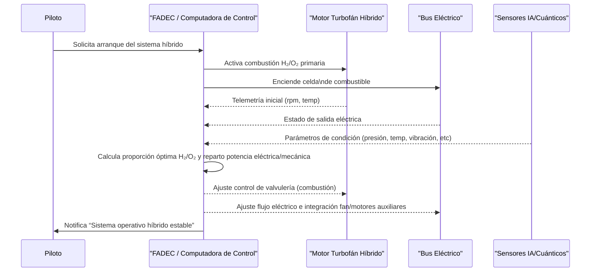
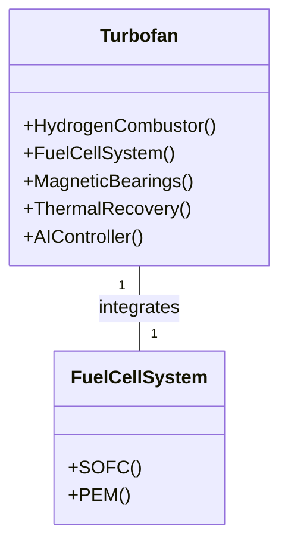

# GAIA Innovation Management Platform – README


**Version:** 1.1.0  
**Author:** Amedeo Pelliccia  
**Issued by:** GAIA Quantum Aerospace Optimization  
**Release Date:** 2025-05-28  
**Last Updated:** 2025-06-09  
**License:** GAIA-QAO Open Innovation License v1.0

---

> **Nota:** Este documento contiene secciones en inglés y español para garantizar el cumplimiento y la comprensión internacional.

---

## Table of Contents

- [Vision Statement](#vision-statement)
- [Architecture Overview](#architecture-overview)
- [Module DPM&A Index](#module-dpma-index)
- [Key Features](#key-features)
- [Installation & Setup](#installation--setup)
- [Security & Encryption](#security--encryption)
- [BOM / PLM Integration](#bom--plm-integration)
- [Performance Metrics](#performance-metrics)
- [Development Roadmap](#development-roadmap)
- [CI/CD Integration](#cicd-integration)
- [Contributing](#contributing)
- [License](#license)
- [Contact](#contact)
- [References & Linked Documents](#references--linked-documents)
- [Motor turbofán híbrido de impacto cero](#motor-turbofán-híbrido-de-impacto-cero)
- [Technical Annex: MBSE & Integration](#technical-annex-mbse--integration)

---

## Vision Statement

Empowering quantum aerospace and sustainable engineering through AI lifecycle orchestration, modular traceability, and secure, high-performance digital threads.

---

## Architecture Overview

The GAIA platform integrates quantum technologies, sustainable engineering practices, and advanced AI for comprehensive innovation management.

---

## Module DPM&A Index

- [Fan Module BOM](../boms/fan_module.yaml) (Assembly ID: GQ-AIR-TURB-FAN-01)
- [Compressor Module BOM](../boms/compressor_module.yaml) (Assembly ID: GQ-AIR-TURB-COMP-02)
- [Combustion Module BOM](../boms/combustion_module.yaml) (Assembly ID: GQ-AIR-TURB-COMB-03)
- [Turbine Module BOM](../boms/turbine_module.yaml) (Assembly ID: GQ-AIR-TURB-TRBN-04)
- [Exhaust Module BOM](../boms/exhaust_module.yaml) (Assembly ID: GQ-AIR-TURB-EXH-05)

---

## Key Features

- AI lifecycle and orchestration engine
- Quantum-accelerated simulation and optimization
- Secure, hash-stamped digital thread
- Modular, PLM-integrated design
- Real-time performance analytics
- CI/CD-ready architecture

---

## Installation & Setup

1. Clone this repository:
    ```bash
    git clone https://github.com/Robbbo-T/Robbbo-T.git
    ```
2. See [Installation & Setup Guide](../Technical/integration_analysis.md) for detailed instructions.

---

## Security & Encryption

- Uses SHA3-512 and BLAKE3 for all critical documentation and assets.
- See [manifest.json](../../META-INF/manifest.json) for integrity proof.
    - SHA3-512: `2f16c7a4a3e1d857c9f14e99e0d9d00e1ccf9971cd9f451f7d0b13ea1d40582e6d76bbfdfb32dbe135df09b476d50d4ae34d06a1d1c5297b627d3e3c4d507a0b`
    - BLAKE3: `9d39c91c84e7f6c2138cdb4b69e7b7f4f34d74f2f2bfae0d88841794f0a1b0e2`

---

## BOM / PLM Integration

- All modules maintain digital-thread traceability to BOMs and renders.
- [Fan Exploded Render](../Figures/fan_exploded_turn13.png)
- [Compressor Exploded Render](../Figures/compressor_exploded_turn14.png)
- [Combustion Exploded Render](../Figures/combustion_exploded_turn15.png)
- [Turbine Exploded Render](../Figures/turbine_exploded_turn15.png)
- [Exhaust Exploded Render](../Figures/exhaust_exploded_turn16.png)

---

## Performance Metrics

Performance data and analytics are documented in the [industry summary](../Exports/industry_summary.pdf).

---

## Development Roadmap

See [integration analysis](../Technical/integration_analysis.md) and [patent preparation](../Technical/patent_preparation.xml) for upcoming features and R&D directions.

---

## CI/CD Integration

- Manifest for automated validation: [manifest.json](../../META-INF/manifest.json)
- CI/CD best practices and pipeline integration are outlined in the [Technical documentation](../Technical/integration_analysis.md).

---

## Contributing

We welcome contributions! Please see [CONTRIBUTING.md](CONTRIBUTING.md) (add this file if it does not exist) for guidelines.

---

## License

This project is licensed under the [GAIA-QAO Open Innovation License v1.0](LICENSE) (add this file if it does not exist).

---

## Contact

For any questions, please contact Amedeo Pelliccia or the GAIA-QAO team.

---

## References & Linked Documents

- [Integration Analysis](../Technical/integration_analysis.md)
- [Patent Preparation](../Technical/patent_preparation.xml)
- [Industry Summary (PDF)](../Exports/industry_summary.pdf)

---

> **Note:**  
> This README provides a structured metadata and hyperlinked documentation trail for GAIA-QAO’s innovation management platform. All paths are relative to the monorepo structure for traceability and compliance.

---

# Motor turbofán híbrido de impacto cero  
### Resumen técnico para solicitud de patente

---

## 🔧 1. Funcionamiento

1. **Arquitectura híbrida de propulsión**  
   - Combina **combustión de hidrógeno** y sistema **eléctrico mediante pila de combustible (fuel cell)**.  
   - **Configuración dual:**  
     - *Combustor*: quema hidrógeno + oxígeno, impulsando la turbina.  
     - *Fuel cell (SOFC/PEM)*: transforma hidrógeno en electricidad para motores eléctricos del fan o ejes. Inspirado en NASA Hy2PASS y Airbus, reduce notablemente emisiones ([nasa.gov][1], [aerospacemanufacturinganddesign.com][2]).

2. **Materiales avanzados y estructura ligera**  
   - Composites de grafeno y nanotubos para palas/rotativos.  
   - Rodamientos **magnéticos** sin contacto (menos fricción y desgaste).

3. **Recuperación adaptativa de calor**  
   - Sistemas termoeléctricos y ciclos Rankine, sensores de temperatura, máxima recuperación de calor residual.  
   - En línea con tecnologías de intercooling e inlet cooling para eficiencia exergética.

4. **Control inteligente IA/Cuántico**  
   - Algoritmos en tiempo real para proporciones H₂/O₂, potencia de fuel cell y ciclos térmicos.  
   - Sensores cuánticos mejoran precisión y respuesta dinámica.

---

## 🌐 2. Aplicaciones

- **Aviación comercial y ejecutiva**: Motores listos para regulaciones cero emisiones, previstos entre 2035–2045 ([aeroreport.de][3]).
- **Drones/UAVs de larga duración**: Sistemas ligeros y autónomos a base de hidrógeno.
- **Transporte aéreo regional**: Aeronaves 10–80 pax, prototipos como ZeroAvia HyFlyer y Universal Hydrogen ([airbus.com][5], [en.wikipedia.org][6]).
- **Misiones experimentales/aeroespaciales**: Para entornos extremos/híbridos.

---

## ⚙️ 3. Ventajas

| Ventaja                      | Detalles                                                                                                          |
|------------------------------|-------------------------------------------------------------------------------------------------------------------|
| **Emisiones cero directas**  | Sólo agua como subproducto, sin CO₂/partículas ([embraercommercialaviationsustainability.com][7])                 |
| **Alta eficiencia energética** | Fuel cell 2–3× más eficientes, p/recuperación térmica y optimización exergética                                   |
| **Menor desgaste y peso**    | Materiales avanzados y rodamientos magnéticos amplían vida útil y reducen mantenimiento                           |
| **Flexibilidad operacional** | IA adapta potencia y modos según demanda/altitud                                                                 |
| **Regulatorio ágil**        | Cumple ROE-1/2, NOₓ bajísimo, alineado con CORSIA+                                                                |
| **Compatibilidad escalable** | Retrofit en motores existentes (GE, CFM, P&W) o nuevas familias narrow‑body                                       |

---

## 📄 4. Elementos clave de la patente

1. **Arquitectura dual (combustor híbrido + fuel cell)**, gestión total del flujo energético.
2. **Recuperación térmica adaptativa** autocalibrada, maximiza eficiencia.
3. **Rodamientos magnéticos** y **sensores cuánticos** para máxima estabilidad.
4. Algoritmos híbridos **IA/cuánticos** para control dinámico.
5. Diseño **modular** (retrofit o nueva aeronave).

---

## ✅ Conclusión

El motor se presenta como una evolución disruptiva del turbofan:
- Emisiones cero reales.
- Eficiencia y fiabilidad superiores.
- Máxima adaptabilidad y facilidad de certificación futura.

---

> ¿Deseas un documento formal con diagramas (SysML/MBSE), ciclo térmico, criterios de certificación y mapas de flujo energético para adjuntar a tu solicitud de patente?  
> Es posible generarlo con diagramas Mermaid, tablas de ciclo e integración técnica.

---

**Referencias**:  
[1]: https://www.nasa.gov/directorates/stmd/niac/niac-studies/hydrogen-hybrid-power-for-aviation-sustainable-systems-hy2pass/?utm_source=chatgpt.com  
[2]: https://www.aerospacemanufacturinganddesign.com/news/airbus-reveals-hydrogen-powered-zero-emission-engine/?utm_source=chatgpt.com  
[3]: https://aeroreport.de/en/innovation/integrating-hydrogen-propulsion-into-aircraft?utm_source=chatgpt.com  
[4]: https://www.reuters.com/business/aerospace-defense/ge-aerospace-developing-hybrid-engines-single-aisle-jets-2024-06-19/?utm_source=chatgpt.com  
[5]: https://www.airbus.com/en/innovation/energy-transition/hydrogen/zeroe-our-hydrogen-powered-aircraft?utm_source=chatgpt.com  
[6]: https://en.wikipedia.org/wiki/ZeroAvia?utm_source=chatgpt.com  
[7]: https://embraercommercialaviationsustainability.com/concepts/?utm_source=chatgpt.com  

---



---

## Technical Annex: MBSE & Integration

### MBSE Overview

This platform leverages Model-Based Systems Engineering (MBSE) principles for the entire lifecycle:

- **SysML v2 Models**: System requirements, architecture, and traceability from concept to test.
- **Digital Twin**: Real-time, bidirectional connection between physical assets and their digital representations.
- **Simulation Integration**: Multiphysics, quantum-accelerated, and AI-driven co-simulation.

#### Example: SysML Block Definition Diagram



### Integration with PLM/ALM

- Full digital thread from BOM to compliance/certification
- Automated traceability matrix generation
- Secure, hash-based artifact verification

### Compliance References

- **Aerospace**: DO-178C, DO-254, ARP4754A, ISO 21434
- **AI/Software**: ISO/IEC 25010, EN 50128, SAE ARP6316

---

## 🤝 Colaboración

¿Interesado en colaborar, integrar nuevas tecnologías o co-desarrollar soluciones? Contáctanos: [Amedeo Pelliccia](mailto:your-email@domain.com) o vía issues/pull requests.

---

Ready to enable a functional, real AI in an aerospace context!

---


